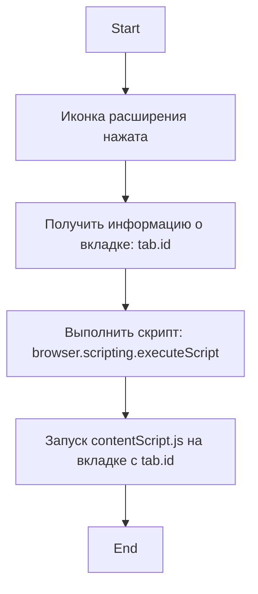

## АНАЛИЗ КОДА: `background.js`

### <алгоритм>

1.  **Слушаем событие клика на иконку расширения:**
    *   Браузер ожидает клика на иконку расширения, установленную для этого расширения.
    *   `browser.browserAction.onClicked.addListener` устанавливает слушатель, который будет вызван при клике.
2.  **Получаем информацию о вкладке:**
    *   При срабатывании события клика, слушатель получает объект `tab`, содержащий информацию о вкладке, на которой был произведен клик. Пример: `tab = {id: 123, url: 'https://example.com', ...}`.
3.  **Внедряем скрипт `contentScript.js`:**
    *   `browser.scripting.executeScript` запускает скрипт на указанной вкладке.
    *   `target: { tabId: tab.id }` - определяет вкладку, в которую необходимо внедрить скрипт. `tab.id` предоставляет идентификатор вкладки, на которой было произведено действие. Пример: `tab.id = 123`.
    *   `files: ["contentScript.js"]` - указывает путь к скрипту, который должен быть внедрен, в данном случае `contentScript.js`.
    *   В результате чего скрипт `contentScript.js` выполняется в контексте веб-страницы в указанной вкладке.

### <mermaid>



**Описание `mermaid` диаграммы:**

*   **Start**: Начало процесса.
*   **Clicked**: Событие клика на иконку расширения.
*   **GetTabInfo**: Получение информации о вкладке, включая `tab.id`, при помощи слушателя события `browser.browserAction.onClicked.addListener`.
*   **ExecuteScript**: Выполнение функции `browser.scripting.executeScript` для внедрения скрипта.
*   **ContentScript**: Запуск скрипта `contentScript.js` в контексте текущей веб-страницы.
*   **End**: Завершение процесса.

Диаграмма отображает последовательность действий, когда пользователь взаимодействует с расширением, кликая на его иконку.

### <объяснение>

*   **Импорты**:
    *   В данном коде нет явных импортов, так как используется API веб-браузера `browser`.
    *   `browser.browserAction` и `browser.scripting` являются частями API WebExtensions и предоставляются средой браузера, а не через импорт модулей.

*   **Классы**:
    *   В данном коде отсутствуют классы.

*   **Функции**:
    *   `browser.browserAction.onClicked.addListener(callback)`:
        *   **Аргументы**: Принимает функцию обратного вызова `callback`.
        *   **Возвращаемое значение**: Нет явного возвращаемого значения.
        *   **Назначение**: Устанавливает слушатель события клика на иконку расширения. Функция `callback` выполняется при каждом клике.
        *   **Пример:**

            ```javascript
            browser.browserAction.onClicked.addListener((tab) => {
              console.log('Клик на иконку на вкладке:', tab.id);
            });
            ```

    *   `browser.scripting.executeScript(options)`:
        *   **Аргументы**: Принимает объект `options`, который содержит:
            *   `target`: Объект, указывающий вкладку, в которую необходимо внедрить скрипт.
               *   `tabId`: Идентификатор вкладки.
            *   `files`: Массив строк, содержащих пути к скриптам, которые необходимо внедрить.
        *   **Возвращаемое значение**: Возвращает `Promise`, который разрешается после внедрения скрипта.
        *   **Назначение**: Внедряет скрипт в контекст указанной вкладки.
        *   **Пример:**

            ```javascript
            browser.scripting.executeScript({
              target: { tabId: 123 },
              files: ["contentScript.js"],
            }).then(() => console.log("Скрипт внедрен"));
            ```

*   **Переменные**:
    *   `tab`: Объект, передаваемый в функцию обратного вызова `browser.browserAction.onClicked.addListener`. Содержит информацию о вкладке, на которой был произведен клик (например, `tab.id`, `tab.url`).
    *   `tab.id`: Целое число, уникальный идентификатор вкладки, на которой был произведен клик.

**Потенциальные ошибки и области для улучшения**:

*   **Обработка ошибок**: В коде отсутствует обработка ошибок. Например, если скрипт не может быть внедрен, это не будет явно обработано. Рекомендуется добавить обработку ошибок (например, `Promise.catch()`) для отслеживания возможных проблем.
*   **Разграничение прав**: Код предполагает, что расширение имеет необходимые права для внедрения скрипта. Необходимо проверить манифест расширения на наличие необходимых разрешений.
*   **Использование Promises**: Код использует Promise, возвращаемый `browser.scripting.executeScript`, но явно не обрабатывает его результат (хотя в примере и указан then). Желательно добавить `.then` для обработки успешного внедрения и `.catch` для ошибок.

**Цепочка взаимосвязей с другими частями проекта**:

*   `background.js` взаимодействует с `contentScript.js`:  `background.js` внедряет `contentScript.js` на веб-страницу. Это является ключевым механизмом взаимодействия между расширением и контентом веб-страницы.
*   `contentScript.js` может взаимодействовать с DOM веб-страницы, выполнять операции, модифицировать элементы и т.д.
*   Взаимодействия с другими частями проекта (если таковые имеются) будут зависеть от логики `contentScript.js`.