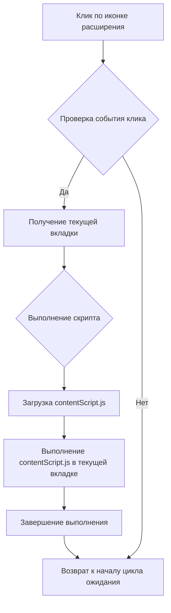
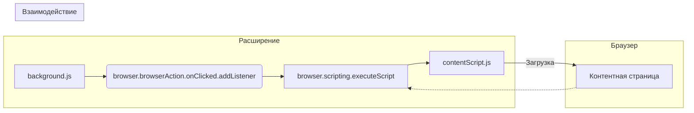

```MD
# Анализ кода background.js

**1. <input code>**

```javascript
// background.js

browser.browserAction.onClicked.addListener((tab) => {
    browser.scripting.executeScript({
        target: { tabId: tab.id },
        files: ["contentScript.js"],
    });
});
```

**2. <algorithm>**



**Пример:** Пользователь кликает по иконке расширения в браузере. Событие `browser.browserAction.onClicked` срабатывает.  Функция `addListener` обрабатывает это событие. Она получает информацию о текущей вкладке (`tab`).  Затем, с помощью `browser.scripting.executeScript`,  загружает и выполняет скрипт `contentScript.js` в контексте этой вкладки.

**3. <mermaid>**



**4. <explanation>**

* **Импорты:** Нет явных импортов. Код использует API браузера, которое предоставляет браузерный движок.

* **Классы:** Нет классов. Код состоит из функций.

* **Функции:**
    * `browser.browserAction.onClicked.addListener((tab) => { ... })`:  Функция-обработчик события клика по иконке расширения.
        * **Аргументы:** `tab` (объект, содержащий информацию о вкладке).
        * **Возвращаемое значение:** `undefined`.
        * **Назначение:** Запускает скрипт `contentScript.js` в текущей вкладке.
        * **Пример:** Если пользователь нажмет на иконку расширения во вкладке с URL `https://example.com`, `tab` будет содержать информацию об этой вкладке (например, `tab.id`).


    * `browser.scripting.executeScript({ ... })`:  Выполняет указанный скрипт в контексте текущей вкладки.
        * **Аргументы:** Объект с настройками:
            * `target`: Объект, описывающий целевой контекст выполнения (в данном случае, текущая вкладка).
            * `files`: Массив путей к файлам скриптов для загрузки и выполнения.
        * **Возвращаемое значение:** `undefined` (или промис, но в данном случае это не важно).
        * **Назначение:** Загружает и выполняет `contentScript.js`.
        * **Пример:**  `browser.scripting.executeScript({ target: { tabId: 123 }, files: ["contentScript.js"] })` выполнит `contentScript.js` во вкладке с ID 123.

* **Переменные:**  Нет явно объявленных переменных.  `tab` —  локальная переменная внутри обработчика события.


* **Возможные ошибки или области для улучшений:**

    * **Отсутствие обработки ошибок:** Код не обрабатывает возможные ошибки при выполнении скрипта `contentScript.js`.  Необходимо добавить обработчик ошибок (например, используя `catch`).
    * **Зависимость от `contentScript.js`:**  Функциональность расширения полностью зависит от `contentScript.js`.  Если `contentScript.js` не загрузится или содержит ошибку, расширение не сработает.  Рекомендуется добавить проверки.
    * **Отсутствие логирования:** Для отладки и мониторинга полезно добавить логирование (например, `console.log`).

**Цепочка взаимосвязей:**

Расширение (background.js) взаимодействует с контентной страницей (contentScript.js) через API браузера (browser.scripting).  Background.js отвечает за инициацию выполнения `contentScript.js`.  `contentScript.js`  выполняется на стороне страницы и может взаимодействовать с ней.


```