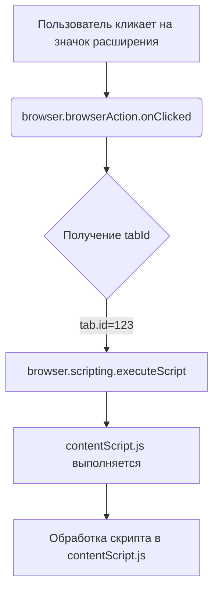

```MD
# Анализ кода background.js

**1. <input code>**

```javascript
// background.js

browser.browserAction.onClicked.addListener((tab) => {
    browser.scripting.executeScript({
        target: { tabId: tab.id },
        files: ["contentScript.js"],
    });
});
```

**2. <algorithm>**

Алгоритм работы кода:

1. **Прослушивание события `browserAction.onClicked`:**  Код регистрирует обработчик события `browserAction.onClicked`. Это событие срабатывает, когда пользователь нажимает на значок расширения в адресной строке браузера.

   * **Пример:** Пользователь кликает на значок расширения на странице.

2. **Получение `tabId`:** При срабатывании события, функция-обработчик получает объект `tab`, содержащий информацию о текущей открытой вкладке. Из этого объекта извлекается `tab.id`.

   * **Пример:** `tab` содержит информацию о вкладке, например `{id: 123, url: "https://example.com"}`. `tab.id` равно 123.


3. **Выполнение скрипта в текущей вкладке:** Используя функцию `browser.scripting.executeScript()`, код выполняет скрипт `contentScript.js` в указанной вкладке.

   * **Пример:** Код `contentScript.js` выполняется внутри вкладки с `id` 123.

**3. <mermaid>**



**Зависимости:**

Код использует API браузера для взаимодействия с вкладками и выполнения скриптов.  Эти зависимости предоставляются браузерной платформой (например, Chromium).  Отсутствуют прямые зависимости от других модулей проекта.


**4. <explanation>**

* **Импорты:** Нет импортов. Код использует встроенные функции браузера.


* **Классы:** Нет классов.


* **Функции:**
    * `browser.browserAction.onClicked.addListener((tab) => { ... });`:  Это функция-обработчик события `browserAction.onClicked`.  Она получает объект `tab` как аргумент.
    * `browser.scripting.executeScript({...});`: Эта функция выполняет скрипт `contentScript.js` в указанной вкладке.  Она получает объект конфигурации, содержащий `target` (свойство `tabId`) и массив `files` с именами файлов.


* **Переменные:**
    * `tab`: Переменная, содержащая информацию о вкладке. Она передаётся как параметр в функцию-обработчик.  Её тип - объект.
    * `tab.id`: Целое число, представляющее идентификатор вкладки.


* **Возможные ошибки или области для улучшений:**

    * **Отсутствует обработка ошибок:**  Код не проверяет, произошла ли какая-либо ошибка при выполнении скрипта `contentScript.js`.  Это нужно исправить, чтобы расширение было более надежным.  Например, можно добавить обработку `try...catch` внутри обработчика.
    * **Отсутствие информации о успехе/неуспехе:** Код не возвращает информацию о результате выполнения скрипта.  Рекомендуется использовать `browser.scripting.executeScript` с опцией `function` или возвращаемым значением, для получения данных из скрипта.
    * **Локализация:** Если расширение нуждается в локализации, то лучше использовать методы для перевода.


**Цепочка взаимосвязей с другими частями проекта:**

Код `background.js` взаимодействует со скриптом `contentScript.js`.  `contentScript.js` отвечает за выполнение действий на страницах вкладок, на которые воздействует расширение. В свою очередь, `manifest.json` определяет, какие функции и скрипты должны быть доступны расширению.  `manifest.json`  является основным метаданными для расширения.