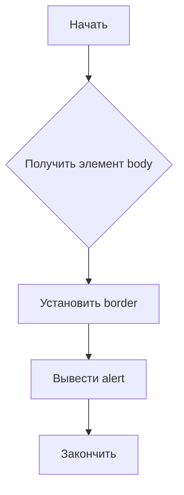

```MD
# Анализ кода borderify.js

**1. <input code>**

```javascript
document.body.style.border = "5px solid red";
alert();
```

**2. <algorithm>**



**Пример:**

- **B:** Получается DOM-элемент `document.body`.
- **C:** Свойству `border` элемента `body` устанавливается значение `5px solid red`.
- **D:** Вызывается системное диалоговое окно alert, останавливая выполнение скрипта до его закрытия.

**Передача данных:**  Данные не перемещаются между функциями или классами, код представляет собой последовательность простых операций.

**3. <mermaid>**

```mermaid
graph TD
    A[document] --> B(body);
    B --> C{style.border};
    C -- "5px solid red" --> D[alert()];
```

**Объяснение диаграммы:**

*   `document` – глобальный объект, представляющий DOM-дерево страницы.
*   `body` – элемент, представляющий основное содержимое страницы.
*   `style.border` – свойство CSS элемента `body`, которое устанавливает рамку.
*   `alert()` – встроенная функция JavaScript, которая отображает диалоговое окно.


**4. <explanation>**

* **Импорты:** Нет импортов. Код использует только встроенные объекты и функции JavaScript.
* **Классы:** Нет классов.
* **Функции:** Нет функций, кроме встроенной alert.
* **Переменные:** Нет определенных переменных.

**Функциональность:**

Этот код устанавливает красную рамку шириной 5 пикселей вокруг всего содержимого веб-страницы, а затем отображает диалоговое окно alert.


**Возможные ошибки/улучшения:**

* **Отсутствие обработки ошибок:** Код не содержит обработку ошибок. Если доступ к `document.body` невозможен (например, если страница еще не загрузилась полностью), может произойти ошибка.
* **Неясный контекст:**  Код предназначен для работы непосредственно в контексте страницы, не предназначен для повторного использования.
* **Непосредственное изменение DOM:**  Напрямую устанавливать стили через `document.body.style` может быть нежелательным в более сложных приложениях, где желательно управлять стилями через CSS-файлы.

**Взаимосвязи с другими частями проекта:**

Код находится в отдельном файле, использующем встроенные средства языка. Связи с другими компонентами проекта отсутствуют. Этот скрипт может быть использован как часть более сложного приложения, например, для создания визуальной индикации в расширении браузера или компоненте, который устанавливает стили на странице.  Для этого он должен быть вызван из другой функции или обработчика событий, которые отвечают за логику приложения.


**Вывод:**

Код представляет собой простую последовательность действий для изменения визуального оформления веб-страницы и отображения диалогового окна. Он демонстрирует базовые возможности JavaScript для взаимодействия с DOM и отображения пользовательских сообщений, но не является частью сложного приложения и не имеет сложной логики.