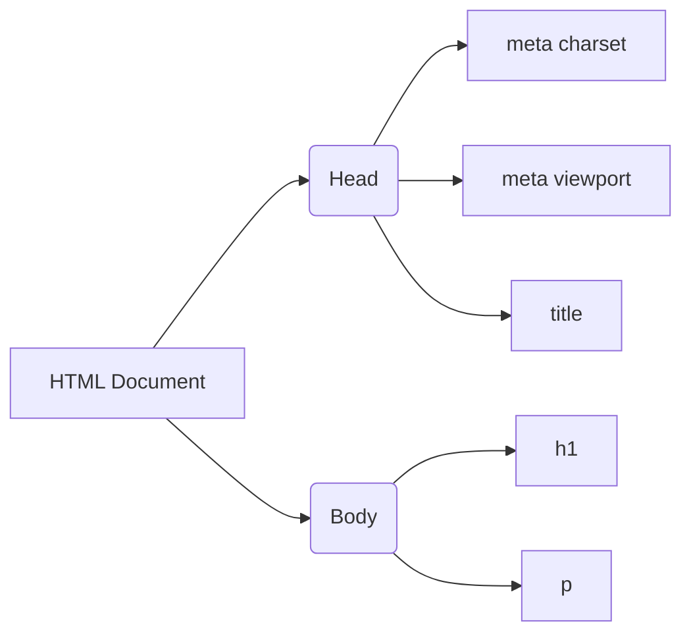
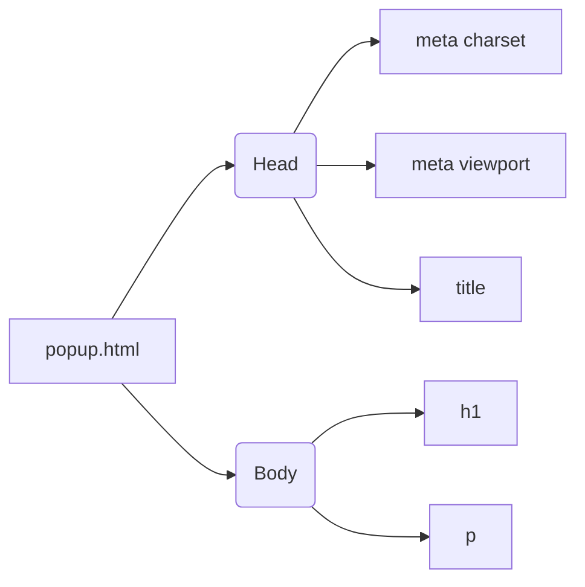

```MD
# Анализ кода popup.html

## <input code>

```html
## \file hypotez/src/webdriver/firefox/extentions/test_extention/html/popup.html
# -*- coding: utf-8 -*-\
#! venv/Scripts/python.exe

""" module: src.webdriver.firefox.extentions.test_extention.html """
MODE = 'debug'
<!DOCTYPE html>
<html lang="en">
<head>
    <meta charset="UTF-8">
    <meta name="viewport" content="width=device-width, initial-scale=1.0">
    <title>Hypotez</title>
</head>
<body>
    <h1>Hypotez</h1>
    <p>Привет, Это Давидка. Я обучаю модель</p>
</body>
</html>
```

## <algorithm>

Этот код представляет собой HTML-документ, описывающий структуру веб-страницы.  Алгоритма в классическом смысле здесь нет.  Код просто формирует содержимое страницы.



В данном примере данные (текстовые строки) передаются напрямую в HTML-теги для формирования содержимого страницы.


## <mermaid>



## <explanation>

Этот файл `popup.html` - это HTML-шаблон, который, вероятно, будет использоваться расширением браузера Firefox. Он определяет структуру и содержимое всплывающего окна (popup).

**Импорты:**

Файл не содержит импортов в традиционном смысле, так как это HTML-файл.

**Классы:**

В коде нет определений классов.

**Функции:**

Нет функций.

**Переменные:**

`MODE = 'debug'`:  Эта строковая константа определяет режим работы приложения (в данном случае, 'debug').  Она скорее всего будет использоваться в другом коде для логирования или управления конфигурацией.  Она хранится вне тела HTML.

**Комментарии:**

Документационные комментарии (`""" module: ... """`) описывают назначение модуля/файла.

**Возможности улучшения:**

* **Добавление JS:** Для большей функциональности (например, взаимодействие с пользователем, сбор данных), в этом файле необходим скрипт JavaScript.
* **Конкретика:**  Если `src.webdriver` это часть фреймворка для управления браузером, то целесообразно описать в документации цель использования этой страницы. Например: "Всплывающее окно для отображения приветственного сообщения пользователю".
* **Структура проекта:**  Без контекста других файлов проекта, сложно оценить полный смысл `MODE` и его использование.


**Взаимосвязи с другими частями проекта:**

`popup.html`, скорее всего,  включен в состав расширения Firefox. Вероятно, существуют файлы JavaScript, которые обрабатывают события, взаимодействуют с расширением, и отвечают за логику, связанную с этим всплывающим окном. Файл `popup.html` определяет только визуальную составляющую.


**Заключение:**

Код представляет собой простой HTML-документ, создающий всплывающее окно (popup) с заголовком и текстом.  Для полноценной функциональности расширения Firefox необходим JavaScript-код, который, вероятно, обращается к этому файлу для отображения и реагирования на пользовательские действия.