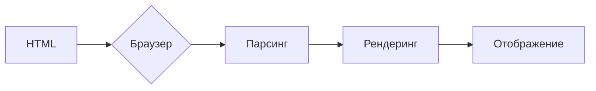

```MD
# Анализ кода popup.html

## <input code>

```html
<!DOCTYPE html>
<html lang="en">
<head>
    <meta charset="UTF-8">
    <meta name="viewport" content="width=device-width, initial-scale=1.0">
    <title>Hypotez</title>
</head>
<body>
    <h1>Hypotez</h1>
    <p>Привет, Это Давидка. Я обучаю модель</p>
</body>
</html>
```

## <algorithm>

Поскольку код представляет собой HTML-документ, алгоритм его работы - это интерпретация браузером.  Браузер, получив этот документ, отображает его структуру:

1. **Парсинг HTML:** Браузер анализирует HTML-код, определяя теги, атрибуты и их содержимое.
2. **Рендеринг:** Браузер использует правила рендеринга для визуального отображения страницы, интерпретируя HTML-структуру в визуальный формат.
3. **Отображение:** Результирующая визуализация (заголовок, параграф) отображается пользователю.

Пример: Когда пользователь открывает страницу, браузер интерпретирует `<html>`, `<head>`, `<body>`, `<h1>`, `<p>` и другие теги, создавая структурированную веб-страницу с заголовком "Hypotez" и текстом "Привет, Это Давидка. Я обучаю модель".


## <mermaid>



## <explanation>

Этот файл `popup.html` — это просто HTML-шаблон, предназначенный для отображения в всплывающем окне (popup) расширения браузера Firefox.  Он не содержит скриптов JavaScript и не выполняет никаких действий за пределами визуального отображения.

**Импорты:** Нет импортов, так как это просто статический HTML-файл.

**Классы:** Нет классов.

**Функции:** Нет функций.

**Переменные:**  `MODE = 'debug'` — это переменная, которая определяет режим работы (в данном случае, 'debug').  Эта переменная, вероятно, используется для конфигурации, которую обрабатывают другие части проекта, например, для включения или выключения отладочных сообщений. Но ее значение никак не используется в этом конкретном файле.

**Возможные ошибки и улучшения:**

* **Нет взаимодействия с расширением:**  Этот файл не содержит JavaScript-кода, поэтому он не может взаимодействовать с кодом расширения (например, обрабатывать данные, передавать данные между вкладками, управлять действиями расширения). Для этого потребуется JavaScript.
* **Неясная роль в проекте:**  Без контекста других файлов проекта трудно понять, как используется эта HTML-страница.  Нужно посмотреть, как этот файл связан с другими частями проекта (например, через JavaScript-код в файлах `*.js`).

**Связи с другими частями проекта:**

Этот файл `popup.html` вероятно используется в рамках проекта, который создаёт веб-расширение для браузера Firefox.  Связь с другими частями проекта происходит через JavaScript-код, который может быть вложен в теги `<script>` HTML-файла, а также через API расширения браузера.  Этот JS-код будет взаимодействовать с кодом, обрабатывающим события расширения и возможно, обращаться к данным, хранящимся в других частях проекта.

**Заключение:**

Файл `popup.html` — это обычный HTML-файл, используемый для отображения интерфейса в всплывающем окне расширения.  Без JavaScript-кода этот файл не взаимодействует с другими частями проекта и просто выводит статическую информацию.