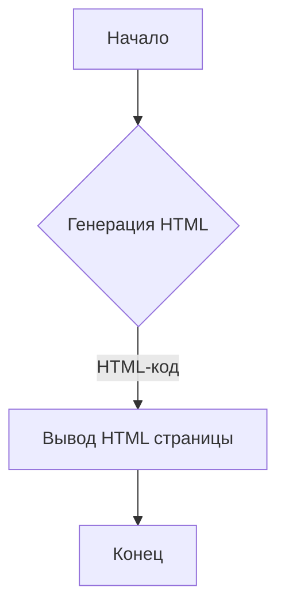

```MD
# Анализ кода popup.html

## <input code>

```html
## \file hypotez/src/webdriver/firefox/extentions/test_extention/html/popup.html
# -*- coding: utf-8 -*-
#! venv/Scripts/python.exe

""" module: src.webdriver.firefox.extentions.test_extention.html """
MODE = 'debug'
<!DOCTYPE html>
<html lang="en">
<head>
    <meta charset="UTF-8">
    <meta name="viewport" content="width=device-width, initial-scale=1.0">
    <title>Hypotez</title>
</head>
<body>
    <h1>Hypotez</h1>
    <p>Привет, Это Давидка. Я обучаю модель</p>
</body>
</html>
```

## <algorithm>

Алгоритм работы кода - это **отображение HTML страницы**.  В данном случае нет никакого алгоритма в традиционном смысле слова.  Код генерирует простую HTML страницу.

**Пошаговая блок-схема:**



* **A (Начало):**  Процесс запускается.
* **B (Генерация HTML):** Создается HTML-код с заголовком, тегом `<html>`, `<head>`, `<body>`, заголовком `<h1>` и абзацем `<p>`.
* **C (Вывод HTML страницы):** HTML-код выводится в браузер.
* **D (Конец):** Процесс завершен.


## <mermaid>


* **popup.html:**  Файл HTML, содержащий код страницы.
* **HTML rendering:**  Процесс интерпретации и рендеринга HTML-кода браузером.
* **Browser display:**  Браузер отображает отрендеренную страницу пользователю.


## <explanation>

Этот файл `popup.html` - это HTML-документ, который, скорее всего, используется как всплывающее окно (popup) расширения для браузера Firefox. Он не содержит какого-либо JavaScript-кода, который бы мог управлять поведением или взаимодействием с другими частями приложения.

* **Импорты:** Нет импортов в классическом смысле. Файл представляет собой простой HTML.
* **Классы:** Нет классов.
* **Функции:** Нет функций.
* **Переменные:**
    * `MODE = 'debug'`:  Символьная константа, вероятно, используется для настройки поведения приложения (например, для отладки). В данном контексте она не используется в HTML.
* **Возможные ошибки/улучшения:**
    * **Отсутствует логика:** Код не выполняет никаких действий, кроме отображения статичной HTML страницы. Для настоящего расширения потребуется JavaScript-код, чтобы оно взаимодействовало с браузером и выполняло функциональность.
    * **Отсутствие связи с другими частями проекта:**  Нельзя определить зависимость от других частей проекта, так как нет кода.


**Цепочка взаимосвязей:**

Этот файл `popup.html` является частью проекта расширения Firefox `test_extention`.  Логика, обработка событий, и взаимодействие с другими частями расширения должны происходить в файлах с JavaScript-кодом (например, в файлах `.js`), которые связаны с этим HTML-файлом.  Возможно, существуют файлы `manifest.json` или другие файлы JavaScript, которые управляют работой всего расширения, но сами по себе они не представлены в предоставленном коде.