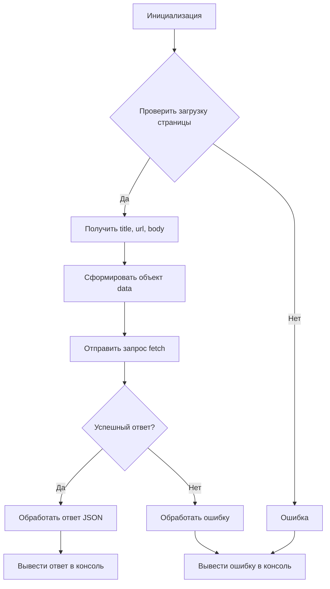

```MD
# Анализ кода send_data.js

## <input code>

```javascript
// Создаем обработчик события для загрузки страницы
function onPageLoad() {
    // Собираем информацию о странице
    var title = document.title;
    var url = window.location.href;
    var body = document.body.innerHTML;

    // Формируем объект с данными для отправки
    var data = {
        title: title,
        url: url,
        body: body
    };

    // Отправляем данные на указанный адрес
    fetch('http://127.0.0.1/hypotez.online/api/', {
        method: 'POST',
        headers: {
            'Content-Type': 'application/json'
        },
        body: JSON.stringify(data)
    })
        .then(response => {
            if (!response.ok) {
                throw new Error('Network response was not ok');
            }
            return response.json();
        })
        .then(json => {
            console.log('Response:', json);
        })
        .catch(error => {
            console.error('Error:', error);
        });
}

// Добавляем обработчик события для загрузки страницы
window.addEventListener('load', onPageLoad);
```

## <algorithm>

**Блок-схема:**



**Примеры:**

* **A:** Инициализируется функция `onPageLoad`.
* **B:** Проверяется загрузка страницы. Пример: Если страница загружена, `window.addEventListener` срабатывает и переходит в блок `C`.
* **C:** Извлекается информация: `title`, `url`, `body`. Пример: `title` = "Моя страница", `url` = "https://example.com", `body` = "<h1>Заголовок</h1>".
* **D:** Формируется объект `data` для отправки: `data = {title: "Моя страница", url: "https://example.com", body: "<h1>Заголовок</h1>"}`.
* **F:** Отправляется запрос `fetch` на сервер: `http://127.0.0.1/hypotez.online/api/` с данными.
* **G:** Проверяется статус ответа. Пример: Если статус ответа 200, то `response.ok` будет `true` и переходит в блок `H`.
* **H:** JSON ответ обрабатывается и выводится в консоль. Пример: `Response: {message: "Данные успешно получены"}`
* **I:** Обрабатывается ошибка при запросе или серверном ответе. Пример: Выводится сообщение об ошибке в консоль `Error: Network response was not ok`.
* **K:** При ошибке в любом из блоков (B, I, F) выводится ошибка в консоль.

## <mermaid>

```mermaid
graph LR
    A[send_data.js] --> B(onPageLoad);
    B --> C{document.title};
    B --> D{window.location.href};
    B --> E{document.body.innerHTML};
    B --> F[data object];
    F --> G(fetch);
    G --> H{response.ok};
    H -- yes --> I[response.json()];
    I --> J[console.log];
    H -- no --> K[throw error];
    K --> L[console.error];
```

**Объяснение зависимостей:**

Код напрямую зависит от встроенных JavaScript функций (`document`, `window`, `fetch`) и работает в контексте браузера.  Есть внешняя зависимость от сервера `http://127.0.0.1/hypotez.online/api/`, который должен принимать POST запросы с JSON данными.  Отсутствие сервера или неверная обработка запроса приведет к ошибке.


## <explanation>

**Импорты:**

Нет импортируемых модулей, используются встроенные объекты JavaScript.

**Классы:**

Нет классов.

**Функции:**

* **`onPageLoad()`**: Эта функция собирает данные с текущей страницы (`document.title`, `window.location.href`, `document.body.innerHTML`) и отправляет их на сервер с помощью `fetch`.  Она является обработчиком события `load`, запускающимся при полной загрузке страницы.
* **`fetch`**: Стандартный JavaScript API, используемый для отправки HTTP запросов.  В данном случае `POST` запрос к серверу.

**Переменные:**

* `title`, `url`, `body`: Строковые переменные, хранящие заголовок, URL и содержимое страницы.
* `data`: Объект JavaScript, содержащий собранные данные.
* `response`: Объект, возвращаемый `fetch`, содержащий данные о ответе сервера.
* `json`: Объект JavaScript, содержащий десериализированные данные из JSON ответа сервера.
* `error`: Переменная, содержащая данные об ошибке, если запрос не удался.


**Возможные ошибки и улучшения:**

* **Обработка ошибок**: Проверка ответа сервера (`response.ok`) — важный элемент.  Можно добавить более подробные проверки статуса HTTP кода (например, 404, 500).
* **Проверка сети**: Проверка наличия интернета или подключения к серверу, прежде чем выполнять запрос.
* **Время ожидания**: Добавление таймаута или проверки состояния выполнения запроса для предотвращения зависания браузера, если запрос задерживается.
* **Локализация ошибок**: Вместо `'Network response was not ok'` можно возвращать более информативные сообщения об ошибках, извлекаемые из ответа сервера.
* **Детализация данных**: Возможно, целесообразно отправить больше данных о текущей странице (например, `user-agent`, `cookies`).


**Взаимосвязь с другими частями проекта:**

Код `send_data.js` напрямую взаимодействует с сервером `http://127.0.0.1/hypotez.online/api/`.  Этот сервер должен быть частью приложения, обрабатывающим поступающие POST запросы и возвращающим JSON ответ.  Поэтому, работа кода зависит от корректной реализации API на серверной стороне.