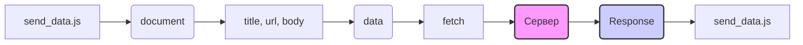

```MD
# Анализ кода send_data.js

**1. <input code>**

```javascript
// Создаем обработчик события для загрузки страницы
function onPageLoad() {
    // Собираем информацию о странице
    var title = document.title;
    var url = window.location.href;
    var body = document.body.innerHTML;

    // Формируем объект с данными для отправки
    var data = {
        title: title,
        url: url,
        body: body
    };

    // Отправляем данные на указанный адрес
    fetch('http://127.0.0.1/hypotez.online/api/', {
        method: 'POST',
        headers: {
            'Content-Type': 'application/json'
        },
        body: JSON.stringify(data)
    })
        .then(response => {
            if (!response.ok) {
                throw new Error('Network response was not ok');
            }
            return response.json();
        })
        .then(json => {
            console.log('Response:', json);
        })
        .catch(error => {
            console.error('Error:', error);
        });
}

// Добавляем обработчик события для загрузки страницы
window.addEventListener('load', onPageLoad);
```

**2. <algorithm>**

```mermaid
graph TD
    A[Начало] --> B{Загрузка страницы?};
    B -- Да --> C[onPageLoad()];
    B -- Нет --> D[Ожидание загрузки];
    C --> E[Получить title];
    C --> F[Получить url];
    C --> G[Получить body];
    E --> H[Создать data];
    F --> H;
    G --> H;
    H --> I[fetch];
    I --> J{Успешный ответ?};
    J -- Да --> K[Обработать JSON];
    K --> L[console.log];
    J -- Нет --> M[Обработать ошибку];
    M --> N[console.error];
    I --> O{Ошибка во время fetch?};
    O -- Да --> M;
    O -- Нет --> J;
    L --> P[Конец];
    N --> P;
    D --> B;
```

**Пример данных:**

* `title`: "Моя страница"
* `url`: "http://example.com"
* `body`: "<p>Привет, мир!</p>"

**Передача данных:**
Данные собираются в JavaScript-объект `data` и передаются в функцию `fetch`. `fetch` отправляет данные в виде JSON на сервер. Сервер обрабатывает запрос и возвращает JSON ответ.  Ответ обрабатывается в `then` блоке.


**3. <mermaid>**



**4. <explanation>**

* **Импорты:** Нет импортов. Код полностью self-contained.
* **Классы:** Нет классов.
* **Функции:**
    * `onPageLoad()`: Обрабатывает событие загрузки страницы. Собрана информация о странице (title, url, body). Данные сформированы в объекте `data`.  Данные отправлены на сервер через `fetch`.  Важный момент - обработка успешного и неуспешного ответов.
* **Переменные:**
    * `title`, `url`, `body`: Строковые переменные, содержащие информацию о странице.
    * `data`: Объект JavaScript, содержащий собранные данные для отправки.
* **Возможные ошибки и улучшения:**
    * Нет проверки на пустой `document.body`.
    * Нет обработки возможных ошибок на стороне сервера.
    * Возможно, стоит использовать более точную спецификацию для заголовков  `fetch` (например, `'application/x-www-form-urlencoded'`).

**Цепочка взаимосвязей:**

Этот скрипт взаимодействует с сервером на `http://127.0.0.1/hypotez.online/api/` для отправки данных о загрузке страницы.  Предполагается, что серверная часть (`hypotez.online/api/`) обрабатывает эти данные и, вероятно, сохраняет их или использует для каких-то других целей.  Без доступа к коду сервера невозможно точно определить эту связь.


**Дополнительные замечания:**

Код демонстрирует хороший пример асинхронного запроса с использованием `fetch`,  `then`, и `catch`. Это улучшает читаемость и структуру кода, позволяя обрабатывать как успешный, так и неуспешный ответ сервера.