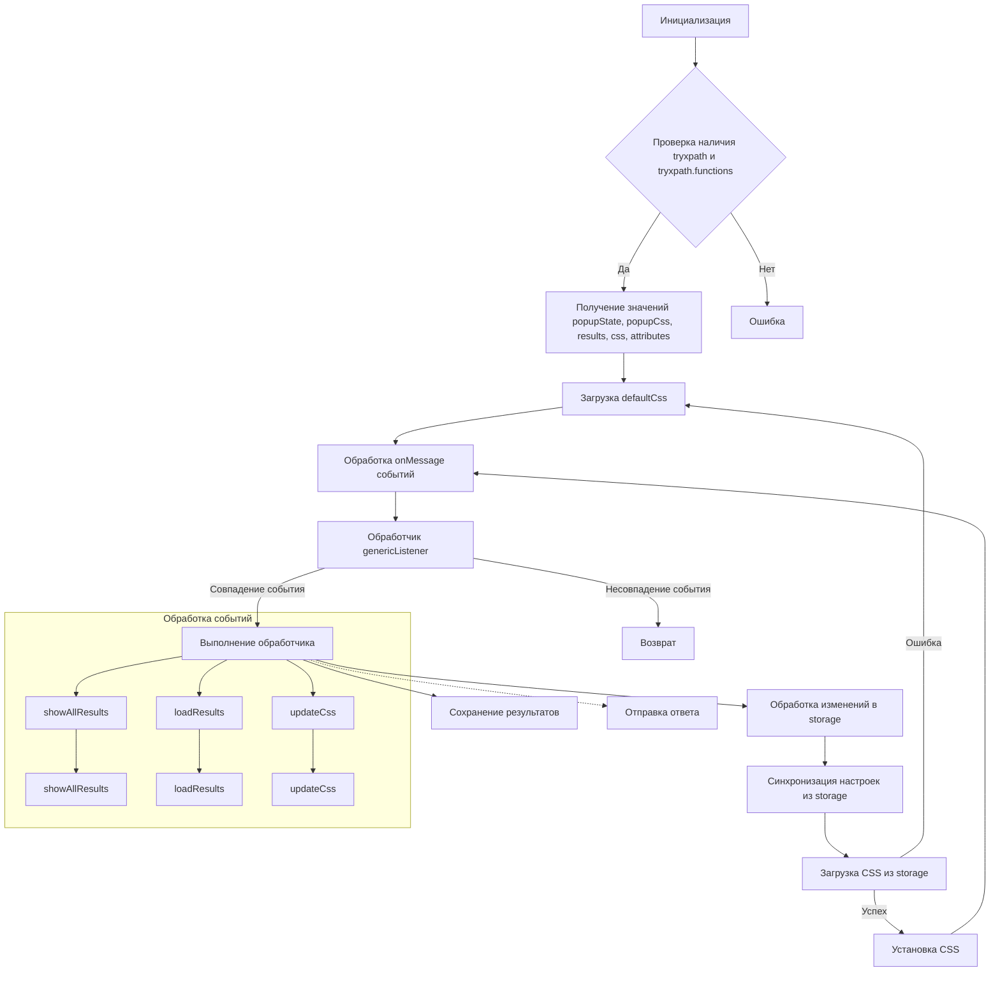
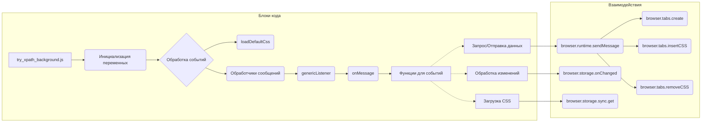

# Анализ кода try_xpath_background.js

## <input code>

```javascript
/* This Source Code Form is subject to the terms of the Mozilla Public
 * License, v. 2.0. If a copy of the MPL was not distributed with this
 * file, You can obtain one at http://mozilla.org/MPL/2.0/. */

(function (window, undefined) {
    "use strict";

    // alias
    var tx = tryxpath;
    var fu = tryxpath.functions;

    var popupState = null;
    var popupCss = "body{width:367px;height:auto;}";
    var results = {};
    var css = "";
    var attributes = {
        // ... (атрибуты)
    };

    function loadDefaultCss() {
        // ... (загрузка CSS)
    }

    function genericListener(message, sender, sendResponse) {
        // ... (обработчик сообщений)
    };
    genericListener.listeners = Object.create(null);
    browser.runtime.onMessage.addListener(genericListener);

    // ... (остальные обработчики событий)
});
```

## <algorithm>



Пример: Пользователь кликает на кнопку в расширении. Это событие обрабатывается как `genericListener`. Сообщение отправляется.  `genericListener` находит соответствующий обработчик `showAllResults` (соответствует нужному событию), обрабатывает это сообщение и отправляет ответ.  После этого, `results` обновляется, а браузер создает новую вкладку.


## <mermaid>




## <explanation>

**Импорты:**

Код использует алиасы `tx` и `fu`, которые указывают на переменные `tryxpath` и `tryxpath.functions`.  Это предположительно локальные переменные или импорты из другого модуля (например, из `tryxpath.js` в папке `src/webdriver/firefox/extentions/try_path_1.3.5/`).

**Классы:**

Нет явных классов.  Код использует функции для обработки событий и данных.


**Функции:**

* **`loadDefaultCss()`:** Загружает CSS из файла `/css/try_xpath_insert.css`.  Возвращает Promise с загруженным CSS.
* **`genericListener()`:**  Слушает сообщения от других частей приложения (вероятно, popup или content script).  Обрабатывает сообщение, используя массив обработчиков (`genericListener.listeners`). Важно, что это функция-заглушка, она просто направляет обработку на конкретный обработчик.
* **`genericListener.listeners.<event>`:**  Функции-обработчики для различных событий. (например, `showAllResults`, `loadResults`, `updateCss`, `loadOptions`, `requestSetContentInfo`, `storePopupState`, `requestRestorePopupState`, `requestInsertStyleToPopup`).

**Переменные:**

* `popupState`, `popupCss`, `results`, `css`, `attributes`: Хранят данные, необходимые для работы расширения, например, состояние popup, стили, результаты поиска.


**Возможные ошибки и улучшения:**

* Отсутствие обработки ошибок при загрузке CSS (`loadDefaultCss`) - если файл не найден или произошла ошибка сети, код не обрабатывает это. Нужно добавить обработчик ошибки в Promise.
* Некритичная обработка ошибок в `.then` (например,  `catch(fu.onError)`). Необходимо более детально логировать ошибки.


**Цепочка взаимосвязей:**

Расширение (`try_xpath_background.js`) общается с `tryxpath.js` (возможно, содержит функции для работы с XPath),  `show_all_results.html` (для отображения результатов), и `try_xpath_insert.css` (стили).  Общение происходит через `browser.runtime.sendMessage` и `browser.tabs.sendMessage`.
Обновление настроек (`attributes`, `css`, `popupCss`) происходит из хранилища (`browser.storage`).

**Итог:** Код реализует фоновый процесс расширения браузера, который слушает сообщения от других частей расширения, загружает CSS, сохраняет и предоставляет результаты поиска, и управляет обновлениями настроек.