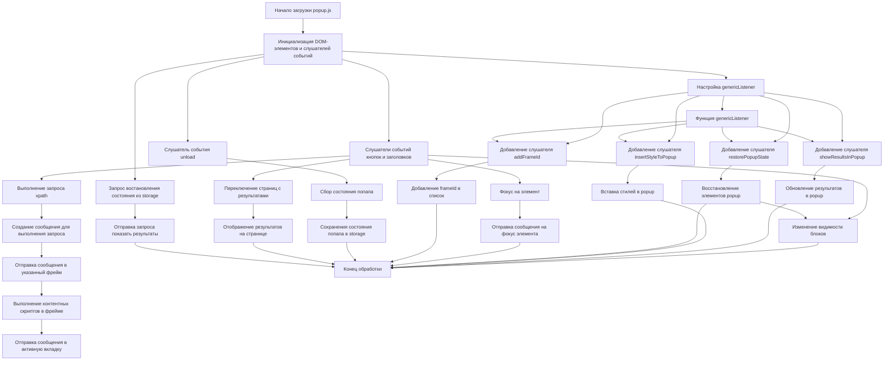

## <алгоритм>

1.  **Инициализация:**
    *   При загрузке страницы (`window.addEventListener("load", ...)`):
        *   Получение элементов DOM (кнопки, текстовые поля, выпадающие списки, чекбоксы, таблицы) и их привязка к переменным.
        *   Установка слушателей событий:
            *   Клик на заголовки секций (например, `contextHeader`, `resolverHeader` и т.д.) для переключения видимости соответствующих разделов (`contextBody`, `resolverBody` и т.д.)
            *   Клик на кнопки (например, "Выполнить", "Фокус")
            *   Нажатие клавиши "Enter" в текстовых полях
            *   Клик на кнопки переключения страниц с результатами.
            *   Событие `unload` окна для сохранения состояния.
        *   Создание заголовков таблиц.
        *   Отправка сообщений для вставки стилей и восстановления состояния попапа.
2.  **Управление видимостью разделов:**
    *   Функции `changeContextVisible`, `changeResolverVisible`, `changeFrameIdVisible`, `changeFrameDesignationVisible` и `changeHelpVisible` добавляют или удаляют класс `none` у соответствующих элементов, в зависимости от состояния чекбоксов.
    *   **Пример:** Если `contextCheckbox` установлен, `contextBody` отображается, иначе - скрыт.
3.  **Сбор данных:**
    *   Функция `collectPopupState` собирает данные из элементов формы (состояние чекбоксов, индексы выбранных элементов, значения полей ввода) и сохраняет их в объект `state`.
    *   **Пример:**  `state.mainExpressionValue` содержит значение поля ввода основного выражения.
4.  **Отправка сообщений:**
    *   Функция `sendToActiveTab` отправляет сообщение активной вкладке.
    *   Функция `sendToSpecifiedFrame` отправляет сообщение в конкретный фрейм, предварительно убедившись, что скрипты `try_xpath_check_frame.js`, `try_xpath_functions.js` и `try_xpath_content.js` выполнены в этом фрейме.
    *   **Пример:** `sendToActiveTab({"event": "initializeBlankWindows"})` иницилизирует фреймы.
    *   Функция `makeExecuteMessage` создает сообщение для выполнения XPath-запроса, включая основное выражение, контекстное выражение (если выбрано), и выражение для фрейма.
5.  **Обработка событий:**
    *   Функция `handleExprEnter` вызывает `sendExecute` при нажатии Enter в текстовом поле (и не shift+enter).
    *   Функция `sendExecute` отправляет сообщение в контентный скрипт.
    *   Функция `genericListener` является общим слушателем для сообщений от контентного скрипта и вызывает конкретный обработчик, основываясь на значении свойства `event` сообщения:
        *   `showResultsInPopup`: отображает результаты выполнения запроса.
        *   `restorePopupState`: восстанавливает состояние попапа.
        *   `insertStyleToPopup`: вставляет стили в попап.
        *   `addFrameId`: добавляет `frameId` в список.
    *   При клике на элементы в таблицах результатов, происходит отправка сообщения контентному скрипту с запросом на фокус на элементе.
    *   При закрытии попапа (`window.addEventListener("unload", ...)`), текущее состояние сохраняется в `browser.storage`.
6. **Отображение результатов:**
    *   Функция `showDetailsPage` отображает результаты на странице. Результаты разбиты на страницы, по 50 элементов на каждой.
    *   Функция `showError` показывает сообщение об ошибке в попапе.
7.  **Работа с фреймами:**
    *   Функция `getSpecifiedFrameId` получает идентификатор фрейма, на котором нужно выполнить запрос, или 0, если фрейм не выбран или `frameId` не валидный.

## <mermaid>

### Зависимости mermaid

*   **Start**: Начало выполнения скрипта `popup.js`.
*   **Init**: Инициализация DOM элементов и установка слушателей событий. Важнейший этап, подготавливающий popup к работе.
*   **GenericListenerSetup**: Настройка слушателя `genericListener`, позволяющего popup взаимодействовать с контентными скриптами.
*   **AddFrameIdListener, InsertStyleToPopupListener, RestorePopupStateListener, ShowResultsInPopupListener**:  Слушатели для обработки входящих сообщений от контентных скриптов.
*   **RestoreState**: Запрос на восстановление состояния из локального хранилища, если оно есть.
*    **SendRequestToShowResults**: Отправка запроса на показ результатов, если состояние восстановилось.
*   **HandleClickEvents**: Обработчик кликов на кнопки и заголовки, запускающий соответствующую логику.
*    **ChangeVisibility**: Изменение видимости элементов popup (например, контекстной секции).
*    **ExecuteExpression**: Выполнение запроса, в частности генерация сообщения для отправки в контентные скрипты.
*   **MakeExecuteMessage**:  Создание объекта сообщения с параметрами запроса.
*   **SendToSpecifiedFrame**: Отправка сообщения в определенный фрейм.
*   **ExecContentScript**:  Выполнение контентных скриптов во фрейме.
*   **SendToActiveTab**: Отправка сообщения в активную вкладку.
*   **FocusItem**:  Обработка клика по результатам, для фокуса на элемент в контенте.
*   **SendFocusItemMessage**: Отправка сообщения на контент для фокуса на элемент.
*   **ChangeDetailsPage**: Обработка клика по кнопкам смены страниц результатов.
*   **ShowDetailsPage**: Функция для отображения нужной страницы результатов.
*   **HandleUnload**: Обработка события закрытия окна popup для сохранения его состояния.
*   **CollectPopupState**: Функция для сбора состояния элементов popup.
*   **StoreState**: Сохранение собранного состояния popup в локальное хранилище.
*    **GenericListenerFunction**: Функция-обработчик всех входящих сообщений, запускающая нужную реакцию.
*   **UpdateResults**: Обновление таблицы результатов в popup.
*    **InsertStyle**: Вставка стилей в popup.
*    **RestoreElements**: Восстановление элементов popup, таких как чекбоксы, текстовые поля, и тд.
*   **AddFrameIdToList**: Добавление ID фрейма в список.
*   **End**: Конец обработки.

## <объяснение>

### Импорты

В данном коде нет явных импортов, так как он является частью расширения браузера и работает в контексте popup-страницы. Все необходимые функции и переменные (например, `tryxpath`, `browser`) предоставляются средой браузера и глобально доступны. Но можно сказать, что в самом расширении есть импорт из `src`, где есть `gs` (global settings).
*   `tryxpath`: Это объект, предоставляемый расширением, который содержит функции для работы с XPath.
    *   `tryxpath.functions`:  Объект, содержащий утилиты для работы с DOM и результатами.

### Классы

В данном коде нет явно определенных классов. Используются объекты, созданные с помощью `Object.create(null)` для хранения данных и состояний.

### Функции

*   **`sendToActiveTab(msg, opts)`**:
    *   **Аргументы**: `msg` - объект сообщения, `opts` - дополнительные параметры.
    *   **Возвращаемое значение**: `Promise`, который резолвится, когда сообщение отправлено.
    *   **Назначение**: Отправляет сообщение активной вкладке браузера.
    *   **Пример:** `sendToActiveTab({ "event": "execute", "xpath": "//body" })` отправит сообщение с событием "execute" и XPath-выражением.
*   **`sendToSpecifiedFrame(msg)`**:
    *   **Аргументы**: `msg` - объект сообщения.
    *   **Возвращаемое значение**: `Promise`, который резолвится, когда сообщение отправлено или если происходит ошибка.
    *   **Назначение**: Отправляет сообщение в конкретный фрейм (или в основной фрейм, если не выбран), предварительно иницилизировав окружение скриптами `try_xpath_check_frame.js`, `try_xpath_functions.js`, `try_xpath_content.js`.
    *   **Пример:** `sendToSpecifiedFrame({ "event": "focus", "element": "button" })` отправит сообщение для фокуса на кнопку в указанном фрейме.
*   **`collectPopupState()`**:
    *   **Аргументы**: Нет.
    *   **Возвращаемое значение**: Объект с текущим состоянием попапа.
    *   **Назначение**: Собирает значения всех полей, чекбоксов и других элементов управления и сохраняет в объект `state`, который затем сохраняется в `storage`.
    *   **Пример:** Возвращает `{ helpCheckboxChecked: true, mainWayIndex: 0, ... }`.
*   **`changeContextVisible()`, `changeResolverVisible()`, `changeFrameIdVisible()`, `changeFrameDesignationVisible()`, `changeHelpVisible()`**:
    *   **Аргументы**: Нет.
    *   **Возвращаемое значение**: Нет.
    *   **Назначение**: Управляют видимостью соответствующих разделов попапа в зависимости от состояния чекбоксов.
*   **`makeExecuteMessage()`**:
    *   **Аргументы**: Нет.
    *   **Возвращаемое значение**: Объект сообщения для выполнения XPath-запроса.
    *   **Назначение**: Создает сообщение, содержащее параметры для выполнения запроса, включая выражения, методы и т.д.
    *   **Пример:**  Возвращает `{ event: "execute", main: { expression: "//div", method: "evaluate", resultType: "snapshot" } }`.
*  **`getSpecifiedFrameId()`**:
    *   **Аргументы**: Нет.
    *   **Возвращаемое значение**: `Number` ID фрейма.
    *   **Назначение**: Возвращает frameId из списка или поля ввода.
    *   **Пример:** Возвращает `0`, если не выбран фрейм, иначе возвращает ID фрейма.
*   **`execContentScript()`**:
    *   **Аргументы**: Нет.
    *   **Возвращаемое значение**: `Promise`, который разрешается, когда скрипты выполнены.
    *   **Назначение**: Выполняет контентные скрипты (`try_xpath_functions.js`, `try_xpath_content.js`) во всех фреймах текущей вкладки, для обеспечения работоспособности скрипта.
*   **`sendExecute()`**:
    *   **Аргументы**: Нет.
    *   **Возвращаемое значение**: Нет.
    *   **Назначение**: Отправляет сообщение для выполнения XPath-запроса в выбранном фрейме.
*   **`handleExprEnter(event)`**:
    *   **Аргументы**: `event` - событие keypress.
    *   **Возвращаемое значение**: Нет.
    *   **Назначение**: Обрабатывает нажатие Enter в текстовых полях, вызывая `sendExecute`.
*   **`showDetailsPage(index)`**:
    *   **Аргументы**: `index` - номер страницы.
    *   **Возвращаемое значение**: Нет.
    *   **Назначение**: Отображает результаты в таблице по страницам.
*   **`showError(message, frameId)`**:
    *   **Аргументы**: `message` - сообщение об ошибке, `frameId` - id фрейма, где произошла ошибка.
    *   **Возвращаемое значение**: Нет.
    *   **Назначение**: Отображает сообщение об ошибке в попапе.
*   **`genericListener(message, sender, sendResponse)`**:
    *   **Аргументы**: `message` - сообщение, `sender` - отправитель сообщения, `sendResponse` - функция обратного вызова.
    *   **Возвращаемое значение**: Нет.
    *   **Назначение**: Слушает сообщения из контентного скрипта и вызывает соответствующую функцию обработчик.
*  **genericListener.listeners.showResultsInPopup(message, sender)**:
    *   **Аргументы**: `message` - сообщение, `sender` - отправитель сообщения.
    *   **Возвращаемое значение**: Нет.
    *   **Назначение**: Обрабатывает сообщение от контентного скрипта, содержащего результаты выполнения xpath запроса, и отображает их в popup.
*   **`genericListener.listeners.restorePopupState(message)`**:
    *   **Аргументы**: `message` - сообщение, содержащее состояние попапа.
    *   **Возвращаемое значение**: Нет.
    *   **Назначение**:  Восстанавливает состояние попапа из сохраненных данных.
*   **`genericListener.listeners.insertStyleToPopup(message)`**:
     *   **Аргументы**: `message` - сообщение, содержащее стили.
    *   **Возвращаемое значение**: Нет.
    *   **Назначение**:  Добавляет стили в попап.
*   **`genericListener.listeners.addFrameId(message, sender)`**:
    *   **Аргументы**: `message` - сообщение, `sender` - отправитель сообщения.
    *   **Возвращаемое значение**: Нет.
    *   **Назначение**: Добавляет `frameId` в список.

### Переменные

*   `tx`, `fu`: Алиасы для `tryxpath` и `tryxpath.functions`
*   `document`: Ссылка на объект `document` текущей страницы.
*   `noneClass`, `helpClass`: Строковые константы для классов CSS.
*   `invalidTabId`, `invalidExecutionId`, `invalidFrameId`: Константы для обозначения невалидных идентификаторов.
*   `mainWay`, `mainExpression`, ..., `helpCheckbox`: Переменные, которые содержат ссылки на соответствующие DOM-элементы.
*   `relatedTabId`, `relatedFrameId`, `executionId`: Переменные для хранения идентификаторов связанной вкладки, фрейма и выполнения.
*   `resultedDetails`: Массив, хранящий результаты выполнения запросов.
*   `detailsPageSize`, `detailsPageIndex`: Параметры для пагинации результатов.

### Потенциальные ошибки и области для улучшения

*   **Обработка ошибок**:
    *   Обработка ошибок в `sendToSpecifiedFrame` и `genericListener`  достаточно базовая.
    *   Нужно более подробное журналирование и информирование пользователя о проблемах.
    *   Необходимо предусмотреть обработку ошибок, связанных с некорректным форматом выражений или неправильной работой расширения.
*   **Производительность**:
    *   Большое количество вызовов `executeScript` может замедлить работу.
    *   Нужно оптимизировать скрипты для более быстрой загрузки и обработки.
*   **Управление состоянием**:
    *   Хранение состояния в `browser.storage` может быть не самым эффективным подходом.
    *   Возможно, стоит рассмотреть использование более эффективных способов хранения состояния, например, с помощью indexedDB или другого хранилища.
*   **Безопасность**:
    *   Следует убедиться, что передаваемые сообщения и выполняемые скрипты не создают уязвимостей в системе безопасности.
*   **UI/UX**:
    *   Улучшение пользовательского интерфейса и опыта взаимодействия:
        *   Добавить индикаторы загрузки и состояния.
        *   Сделать отображение ошибок более информативным.
        *   Улучшить навигацию по страницам результатов.

### Взаимосвязь с другими частями проекта

Этот файл (popup.js) является частью расширения tryXPath и взаимодействует со следующими частями:

*   **Контентные скрипты (`try_xpath_content.js`, `try_xpath_functions.js`, `try_xpath_check_frame.js`)**:
    *   popup.js отправляет сообщения контентным скриптам для выполнения XPath-запросов и получения результатов.
    *   Контентные скрипты выполняются в контексте веб-страниц и предоставляют доступ к DOM.
*   **Фоновые скрипты (`background.js`)**:
    *   Хранит глобальное состояние.
    *   Управляет жизненным циклом расширения.
    *   Обменивается данными с другими частями расширения.
*   **Страница опций (`options.html`, `options.js`)**:
    *   Позволяет пользователю настраивать параметры расширения.
    *   popup.js открывает эту страницу по клику на соответствующую кнопку.
*   **Браузерное API (`browser`)**:
    *   popup.js использует API `browser` для отправки сообщений, выполнения скриптов, открытия вкладок, сохранения состояния.

Данный код является ключевой частью расширения tryXPath, предоставляя интерфейс для взаимодействия с веб-страницами через XPath-запросы.