## ИНСТРУКЦИЯ:

Анализируй предоставленный код подробно и объясни его функциональность. Ответ должен включать три раздела:  

1.  **<алгоритм>**: Опиши рабочий процесс в виде пошаговой блок-схемы, включая примеры для каждого логического блока, и проиллюстрируй поток данных между функциями, классами или методами.  
2.  **<mermaid>**: Напиши код для диаграммы в формате `mermaid`, проанализируй и объясни все зависимости, 
    которые импортируются при создании диаграммы. 
    **ВАЖНО!** Убедитесь, что все имена переменных, используемые в диаграмме `mermaid`, 
    имеют осмысленные и описательные имена. Имена переменных вроде `A`, `B`, `C`, и т.д., не допускаются!  
    
    **Дополнительно**: Если в коде есть импорт `import header`, добавьте блок `mermaid` flowchart, объясняющий `header.py`:\
    ```mermaid
    flowchart TD
        Start --> Header[<code>header.py</code><br> Determine Project Root]
    
        Header --> import[Import Global Settings: <br><code>from src import gs</code>] 
    ```

3.  **<объяснение>**: Предоставьте подробные объяснения:  
    - **Импорты**: Их назначение и взаимосвязь с другими пакетами `src.`.  
    - **Классы**: Их роль, атрибуты, методы и взаимодействие с другими компонентами проекта.  
    - **Функции**: Их аргументы, возвращаемые значения, назначение и примеры.  
    - **Переменные**: Их типы и использование.  
    - Выделите потенциальные ошибки или области для улучшения.  

Дополнительно, постройте цепочку взаимосвязей с другими частями проекта (если применимо).  

Это обеспечивает всесторонний и структурированный анализ кода.
## Формат ответа: `.md` (markdown)
**КОНЕЦ ИНСТРУКЦИИ**

## <алгоритм>

1.  **Инициализация:**
    *   Устанавливаются константы и переменные, включая `invalidTabId`, `invalidExecutionId`, `noneClass`, `helpClass`, и др.
    *   Получаются ссылки на HTML-элементы popup, такие как кнопки, поля ввода и таблицы.
    *   Устанавливаются начальные значения переменных для отслеживания состояния popup, таких как `relatedTabId`, `executionId`, `resultedDetails`, `detailsPageIndex`.
    *   Регистрируются обработчики событий для загрузки окна (`load`) и выгрузки (`unload`).

2.  **`sendToActiveTab(msg, opts)`**:
    *   Принимает `msg` (сообщение) и `opts` (опции) в качестве параметров.
    *   Запрашивает активную вкладку браузера.
    *   Отправляет `msg` на активную вкладку с `opts`.

    *   Пример: `sendToActiveTab({ "event": "setStyle" }, { "frameId": 0 })` - отправить сообщение "setStyle" в активную вкладку.

3.  **`sendToSpecifiedFrame(msg)`**:
    *   Получает `frameId` через `getSpecifiedFrameId()`.
    *   Выполняет скрипт `try_xpath_check_frame.js` в указанном фрейме. Если скрипт уже есть, то выполняет `execContentScript`.
    *   Отправляет сообщение `initializeBlankWindows`.
    *   Отправляет сообщение `msg` в указанный фрейм.
    *   Обрабатывает ошибки, если фрейм не найден или происходит другая ошибка.

    *   Пример: `sendToSpecifiedFrame({ "event": "focusFrame", "frameDesignation": "//div" })` - отправить сообщение "focusFrame" в указанный фрейм.

4.  **`collectPopupState()`**:
    *   Собирает состояние всех элементов popup (выбранные значения, состояние чекбоксов и т.д.) в объект `state`.
    *   Возвращает объект `state`.

5.  **`changeContextVisible()`/`changeResolverVisible()`/`changeFrameIdVisible()`/`changeFrameDesignationVisible()`/`changeHelpVisible()`**:
    *   Обрабатывают изменения состояний чекбоксов (`contextCheckbox`, `resolverCheckbox`, `frameIdCheckbox`, `frameDesignationCheckbox`, `helpCheckbox`).
    *   Показывают/скрывают соответствующие области popup (`contextBody`, `resolverBody`, `frameIdBody`, `frameDesignationBody`, `help`).

    *   Пример: Если `contextCheckbox.checked` становится `true`, то `contextBody` будет отображаться.

6.  **`makeExecuteMessage()`**:
    *   Создает объект сообщения `msg` с информацией для выполнения XPath-выражений.
    *   Включает выражения из полей ввода `mainExpression`, `contextExpression`, `resolverExpression`, `frameDesignationExpression` и соответствующие выбранные методы из элементов select.

    *   Пример: `msg = { event: "execute", main: { expression: "//div", method: "querySelector", resultType: "element", resolver: null }, context: { expression: "//p", method: "querySelectorAll", resultType: "array", resolver: null }, frameDesignation: "frame_name" }`

7.  **`getSpecifiedFrameId()`**:
    *   Определяет ID фрейма, выбранного пользователем, либо из списка, либо из текстового поля `frameIdExpression`.

8.  **`execContentScript()`**:
    *   Выполняет скрипты `try_xpath_functions.js` и `try_xpath_content.js` во всех фреймах страницы.

9.  **`sendExecute()`**:
    *   Вызывает `makeExecuteMessage()` и `sendToSpecifiedFrame()` для отправки сообщения о выполнении XPath.

10. **`handleExprEnter(event)`**:
    *   Обрабатывает нажатие клавиши Enter в текстовых полях. Вызывает `sendExecute()`, если Enter был нажат без Shift.

11. **`showDetailsPage(index)`**:
    *   Отображает часть данных из массива `resultedDetails` в таблице `resultsTbody` с пагинацией.

12. **`showError(message, frameId)`**:
    *   Отображает сообщение об ошибке в popup.

13. **`genericListener(message, sender, sendResponse)`**:
    *   Слушает входящие сообщения от других скриптов и вызывает соответствующий обработчик на основе `message.event`.

14. **`genericListener.listeners.showResultsInPopup(message, sender)`**:
    *   Обрабатывает сообщения с результатами выполнения XPath, полученными от контент-скрипта. Обновляет таблицу результатов в popup.

15. **`genericListener.listeners.restorePopupState(message)`**:
    *   Восстанавливает состояние popup из сохраненного объекта `state`.

16. **`genericListener.listeners.insertStyleToPopup(message)`**:
    *   Вставляет стили `css` в popup.

17. **`genericListener.listeners.addFrameId(message, sender)`**:
    *   Добавляет ID нового фрейма в список `frameIdList`.

18. **`window.addEventListener("load", ...)`**:
    *   Обработчик события `load`, выполняющий начальную инициализацию:
        *   Находит все HTML-элементы.
        *   Добавляет обработчики событий для элементов управления popup.
        *   Запрашивает вставку стилей и восстановление состояния popup.

19. **`window.addEventListener("unload", ...)`**:
    *   Обработчик события `unload`, сохраняющий состояние popup перед закрытием.

20. **Работа с таблицами результатов**:
    *   Используется функция `fu.updateDetailsTable` для обновления отображения результатов в таблицах `resultsTbody` и `contextTbody`.
    *   Добавляются заголовки таблиц с помощью `fu.createDetailTableHeader`.
    *   Добавлены слушатели событий на строки таблиц.

```mermaid
flowchart TD
    subgraph Popup Script
        Start[Start: Initialization]
        Start --> LoadEvent[Load Event Listener]
        LoadEvent --> GetHTMLElements[Get HTML Elements]
        GetHTMLElements --> SetEventListeners[Set Event Listeners]
        SetEventListeners --> RestorePopupState[Request Restore Popup State]
        SetEventListeners --> InsertStyleToPopup[Request Insert Style To Popup]
        RestorePopupState --> ChangeVisibility[Initial Visibility Changes]

        ChangeVisibility --> ListenForMessages[Start Listening for Messages]
        ListenForMessages --> GenericListener[Generic Listener]
        GenericListener -- "showResultsInPopup" --> ShowResults[Update results in table]
        GenericListener -- "restorePopupState" --> ApplyPopupState[Apply stored state to UI]
        GenericListener -- "insertStyleToPopup" --> InsertStyle[Insert CSS style]
        GenericListener -- "addFrameId" --> AddFrameIdToList[Add frame id to list]
        GenericListener --> HandleMessage[Other Message]
        
        
        subgraph UI Events
            ClickExecuteButton[Click Execute Button]
            ClickExecuteButton --> MakeExecuteMessage[Make Execute Message]
            MakeExecuteMessage --> SendExecuteMessage[Send execute message to frame]
            
            KeyPressInTextField[KeyPress In TextField]
            KeyPressInTextField --> HandleEnterKey[Handle Enter Key]
            HandleEnterKey --> SendExecuteMessage

            ClickContextHeader[Click Context Header]
            ClickContextHeader --> ChangeContextVisibility[Change context body visibility]

            ClickResolverHeader[Click Resolver Header]
            ClickResolverHeader --> ChangeResolverVisibility[Change resolver body visibility]

            ClickFrameDesignationHeader[Click Frame Designation Header]
            ClickFrameDesignationHeader --> ChangeFrameDesignationVisibility[Change frame designation body visibility]
            
            ClickFrameIdHeader[Click Frame ID Header]
            ClickFrameIdHeader --> ChangeFrameIdVisibility[Change frame id body visibility]
            
            ClickHelpHeader[Click Help Header]
            ClickHelpHeader --> ChangeHelpVisibility[Change help body visibility]
            
            
           ClickGetFrameIdsButton[Click Get All Frame IDs Button]
           ClickGetFrameIdsButton --> RequestFrameIds[Request all frame ids]

           ClickFocusFrameButton[Click Focus Frame Button]
           ClickFocusFrameButton --> SendFocusFrameMessage[Send focus frame message]
           
           ClickFocusDesignatedFrameButton[Click Focus Designated Frame Button]
           ClickFocusDesignatedFrameButton --> SendFocusDesignatedFrameMessage[Send focus designated frame message]


           ClickShowPreviousResults[Click Show Previous Results Button]
           ClickShowPreviousResults --> SendRequestShowResultsMessage[Send request show results message]

           ClickShowAllResultsButton[Click Show All Results Button]
           ClickShowAllResultsButton --> SendRequestShowAllResultsMessage[Send request show all results message]
           
           ClickOpenOptionsButton[Click Open Options Button]
           ClickOpenOptionsButton --> OpenOptionsPage[Open Options Page]

           ClickSetStyleButton[Click Set Style Button]
           ClickSetStyleButton --> SendSetStyleMessage[Send set style message]
           
           ClickResetStyleButton[Click Reset Style Button]
           ClickResetStyleButton --> SendResetStyleMessage[Send reset style message]
           
           ClickSetAllStyleButton[Click Set All Style Button]
           ClickSetAllStyleButton --> SendSetAllStyleMessage[Send set style message to all frames]
           
           ClickResetAllStyleButton[Click Reset All Style Button]
           ClickResetAllStyleButton --> SendResetAllStyleMessage[Send reset style message to all frames]

           ClickPreviousDetailsPage[Click Previous Details Page Button]
           ClickPreviousDetailsPage --> ShowPreviousDetailsPage[Show Previous Details Page]

           ClickMoveDetailsPage[Click Move Details Page Button]
           ClickMoveDetailsPage --> ShowSelectedDetailsPage[Show Selected Details Page]
           
           ClickNextDetailsPage[Click Next Details Page Button]
           ClickNextDetailsPage --> ShowNextDetailsPage[Show Next Details Page]

           ClickTableRow[Click Table Row]
           ClickTableRow --> SendFocusItemMessage[Send focus item message]
           
        end
        
        subgraph Window Events
             UnloadEvent[Unload Event]
             UnloadEvent --> CollectPopupState[Collect Popup State]
             CollectPopupState --> SendStoreStateMessage[Send store state message]
        end
        
        SendExecuteMessage --> SendMessageToFrame[Send message to specified frame]
        SendFocusFrameMessage --> SendMessageToFrame
        SendFocusDesignatedFrameMessage --> SendMessageToFrame
        SendRequestShowResultsMessage --> SendMessageToFrame
        SendRequestShowAllResultsMessage --> SendMessageToFrame
        SendSetStyleMessage --> SendMessageToFrame
        SendResetStyleMessage --> SendMessageToFrame
        SendSetAllStyleMessage --> SendMessageToActiveTab
        SendResetAllStyleMessage --> SendMessageToActiveTab

       
        ChangeContextVisibility --> UpdateUI[Update UI]
        ChangeResolverVisibility --> UpdateUI
        ChangeFrameDesignationVisibility --> UpdateUI
        ChangeFrameIdVisibility --> UpdateUI
        ChangeHelpVisibility --> UpdateUI
       
       
        
        SendMessageToFrame --> FrameScriptExecution[Execute content script]
        SendMessageToFrame --> SendMessageToActiveTab
    end
    
    subgraph Content Script
        SendMessageToFrame -- "execute" --> ExecuteXPath[Execute XPath]
        ExecuteXPath --> SendResultsToPopup[Send results to popup]
        SendMessageToFrame -- "focusFrame" --> FocusFrame[Focus Frame]
        SendMessageToFrame -- "focusDesignatedFrame" --> FocusDesignatedFrame[Focus Designated Frame]
        SendMessageToFrame -- "requestShowResultsInPopup" --> SendResultsToPopup
        SendMessageToFrame -- "requestShowAllResults" --> SendAllResultsToPopup[Send all results to popup]
        SendMessageToFrame -- "setStyle" --> SetStyle[Set Style]
        SendMessageToFrame -- "resetStyle" --> ResetStyle[Reset Style]
        SendMessageToFrame -- "initializeBlankWindows" --> InitializeBlankWindows[Initialize Blank Windows]

        SendResultsToPopup -- "showResultsInPopup"--> GenericListener
        SendAllResultsToPopup -- "showResultsInPopup"--> GenericListener
    end
    
    FrameScriptExecution -- "try_xpath_check_frame.js" --> checkFrameScript[Check for frame script]
    checkFrameScript -- "exists" --> SendMessageToFrame
    checkFrameScript -- "not exists" --> FrameScriptExecution

    SendMessageToActiveTab -- "set-all-style" --> SetStyleToAllFrames[Set Style To All Frames]
    SendMessageToActiveTab -- "reset-all-style" --> ResetStyleToAllFrames[Reset Style To All Frames]


```

## <mermaid>



## <объяснение>

### Импорты
*   **`tryxpath`**: Это объект, предположительно содержащий основные функции для работы с XPath, такие как `tryxpath.functions`. Он используется для вызова методов, например, `fu.updateDetailsTable` и `fu.onError`.

### Переменные
*   **`tx`**: Псевдоним для `tryxpath`.
*   **`fu`**: Псевдоним для `tryxpath.functions`.
*   **`document`**: Ссылка на объект `document` текущего окна popup.
*   **`noneClass`**: Строка `"none"`, используется для скрытия элементов через CSS-класс.
*   **`helpClass`**: Строка `"help"`, CSS-класс для элементов справки.
*   **`invalidTabId`**: Константа `browser.tabs.TAB_ID_NONE` (значение -1), представляющая недействительный ID вкладки.
*   **`invalidExecutionId`**: Константа `NaN`, представляющая недействительный ID выполнения.
*    **`invalidFrameId`**: Константа `-1`, представляющая недействительный ID фрейма.
*   Переменные, представляющие HTML-элементы:
    *   `mainWay`, `mainExpression`, `contextCheckbox`, `contextHeader`, `contextBody`, `contextWay`, `contextExpression`, `resolverHeader`, `resolverBody`, `resolverCheckbox`, `resolverExpression`, `frameDesignationHeader`, `frameDesignationCheckbox`, `frameDesignationBody`, `frameDesignationExpression`, `frameIdHeader`, `frameIdCheckbox`, `frameIdBody`, `frameIdList`, `frameIdExpression`, `resultsMessage`, `resultsTbody`, `contextTbody`, `resultsCount`, `resultsFrameId`, `detailsPageCount`, `helpBody`, `helpCheckbox`.
*   **`relatedTabId`**: ID вкладки, с которой связаны результаты.
*   **`relatedFrameId`**: ID фрейма, с которого пришли результаты.
*   **`executionId`**: ID текущего выполнения запроса.
*   **`resultedDetails`**: Массив, хранящий детали результатов выполнения XPath.
*   **`detailsPageSize`**: Размер страницы для отображения деталей в таблице.
*   **`detailsPageIndex`**: Индекс текущей страницы деталей.

### Функции
*   **`sendToActiveTab(msg, opts)`**: Отправляет сообщение `msg` на активную вкладку браузера с опциями `opts`. Используется для отправки запросов контент-скрипту.
*   **`sendToSpecifiedFrame(msg)`**: Отправляет сообщение `msg` в указанный фрейм, предварительно проверяя наличие скрипта и при необходимости загружая его.
*   **`collectPopupState()`**: Собирает состояние всех управляющих элементов popup для сохранения.
*   **`changeContextVisible()`, `changeResolverVisible()`, `changeFrameIdVisible()`, `changeFrameDesignationVisible()`, `changeHelpVisible()`**: Переключают видимость соответствующих частей popup в зависимости от состояния чекбоксов.
*   **`makeExecuteMessage()`**: Создает объект сообщения для выполнения XPath, включая все необходимые параметры (выражение, метод, тип результата, резолвер, и т.д.).
*   **`getSpecifiedFrameId()`**: Возвращает ID фрейма, выбранного пользователем.
*   **`execContentScript()`**: Выполняет контент-скрипты в текущей вкладке.
*   **`sendExecute()`**: Отправляет команду на выполнение XPath в текущем фрейме.
*   **`handleExprEnter(event)`**: Обрабатывает нажатие Enter в текстовых полях.
*   **`showDetailsPage(index)`**: Показывает страницу с деталями результатов в таблице.
*   **`showError(message, frameId)`**: Показывает сообщение об ошибке в popup.
*   **`genericListener(message, sender, sendResponse)`**: Обработчик всех входящих сообщений, который вызывает специфический обработчик в зависимости от типа события.
*   **`genericListener.listeners.showResultsInPopup(message, sender)`**: Обновляет popup с полученными результатами выполнения XPath.
*   **`genericListener.listeners.restorePopupState(message)`**: Восстанавливает состояние popup из сохраненных данных.
*   **`genericListener.listeners.insertStyleToPopup(message)`**: Вставляет стили CSS в popup.
*   **`genericListener.listeners.addFrameId(message, sender)`**: Добавляет ID фрейма в список.

### Объяснения

*   **Функциональность**: Код представляет собой скрипт для popup браузерного расширения, предназначенного для выполнения XPath-выражений на веб-страницах. Он позволяет пользователю задавать XPath-выражения, контекст, резолверы, а также выбирать фрейм, в котором будет выполнено выражение. Скрипт также отображает результаты выполнения в виде таблицы.

*   **Взаимодействие с другими частями проекта**:
    *   Скрипт взаимодействует с контент-скриптами (`try_xpath_content.js`, `try_xpath_functions.js`, `try_xpath_check_frame.js`), отправляя им сообщения и получая результаты.
    *   Он также использует `browser.runtime.sendMessage` для отправки и получения сообщений от фонового скрипта. Это обеспечивает сохранение состояния popup и обмен данными между различными частями расширения.

*   **Возможные ошибки и области для улучшения**:
    *   Код не обрабатывает некоторые типы ошибок, такие как некорректный XPath или проблемы с сетью.
    *   Можно добавить валидацию введенных данных пользователем (например, проверку правильности XPath-выражений).
    *   Возможно улучшение пользовательского интерфейса, например, добавление автозаполнения для XPath-выражений.
    *   Стоит пересмотреть использование `Promise.resolve().then()` когда это можно заменить на прямое `then()`.
    *   Можно использовать более строгую типизацию, например, TypeScript, чтобы избежать ошибок типов.
    *   Можно избавиться от дублирования кода в обработчиках событий, вынеся общую логику в отдельную функцию.
    *   Возможно, стоит реализовать более гибкую систему пагинации, например, с возможностью выбора размера страницы.

### Цепочка взаимосвязей

1.  **Popup script**: Пользователь взаимодействует с popup, вводя данные и нажимая кнопки.
2.  **Popup script -> Content script**: Popup отправляет сообщения контент-скрипту для выполнения XPath.
3.  **Content script**: Выполняет XPath и возвращает результаты popup.
4.  **Popup script**: Отображает результаты и сохраняет состояние.
5.  **Popup script <-> Background script**: Popup взаимодействует с фоновым скриптом для сохранения и восстановления своего состояния.

Этот анализ предоставляет подробное понимание функциональности кода, его взаимосвязей и возможных улучшений.