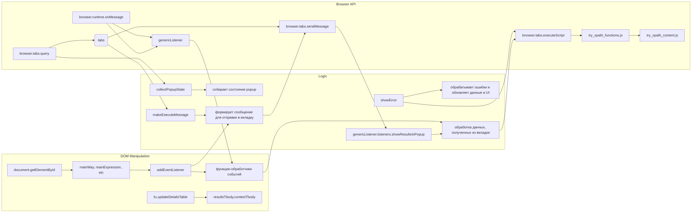

# Анализ кода popup.js

```
/* This Source Code Form is subject to the terms of the Mozilla Public
 * License, v. 2.0. If a copy of the MPL was not distributed with this
 * file, You can obtain one at http://mozilla.org/MPL/2.0/. */

(function (window) {
    "use strict";

    // alias
    var tx = tryxpath;
    var fu = tryxpath.functions;

    var document = window.document;

    const noneClass = "none";
    const helpClass = "help";
    const invalidTabId = browser.tabs.TAB_ID_NONE;
    const invalidExecutionId = NaN;
    const invalidFrameId = -1;

    var mainWay, mainExpression, contextCheckbox, contextHeader, contextBody,
        contextWay, contextExpression, resolverHeader, resolverBody,
        resolverCheckbox, resolverExpression, frameDesignationHeader,
        frameDesignationCheckbox, frameDesignationBody,
        frameDesignationExpression, frameIdHeader, frameIdCheckbox,
        frameIdBody, frameIdList, frameIdExpression, resultsMessage,
        resultsTbody, contextTbody, resultsCount, resultsFrameId,
        detailsPageCount, helpBody, helpCheckbox;

    var relatedTabId = invalidTabId;
    var relatedFrameId = invalidFrameId;
    var executionId = invalidExecutionId;
    var resultedDetails = [];
    const detailsPageSize = 50;
    var detailsPageIndex = 0;

    // ... (остальной код)
});
```

## <algorithm>

```mermaid
graph TD
    A[Инициализация] --> B{Получение элементов DOM};
    B --> C[Обработка событий кликов];
    C --> D[Отправка запросов в активную вкладку];
    D --> E[Обработка ответов];
    E --> F[Обновление результатов];
    F --> G[Сохранение состояния];
    G --> H[Завершение];

    subgraph Обработка запросов
        D --> I[sendToActiveTab(msg)];
        I --> J[sendToSpecifiedFrame(msg)];
        J --> K[execContentScript()];
        K --> L[Обработка ответа от скрипта];
        L --> I;
    end
    
    subgraph Сохранение состояния
        G --> M[collectPopupState()];
        M --> N[Сохранение в обьект state];
        N --> G;
    end
```

**Пример:** Пользователь кликает по кнопке "Выполнить".
1. Функция `sendExecute()` вызывается.
2. `sendToSpecifiedFrame()` отправляет сообщение в активную вкладку с запрошенными данными.
3. Соответствующий скрипт (try_xpath_check_frame.js) в активной вкладке обрабатывает запрос.
4. После получения результата в `sendToSpecifiedFrame()`, ответ отправляется на страницу с помощью `sendToActiveTab()`.
5. Полученные данные обрабатываются и выводятся на странице popup.
6. Состояние страницы (введенные данные, состояние чекбоксов) сохраняется.


## <mermaid>


**Объяснение подключаемых зависимостей:**

* **`browser` API:**  Обеспечивает взаимодействие с браузером (например, отправка сообщений между вкладками, получение текущей активной вкладки).
* **`tryxpath`:** Вероятно, собственная библиотека или пакет, содержащий функции для работы с XPath выражениями.
* **`tryxpath.functions`:**  Возможно, содержит вспомогательные функции, например, для работы с HTML таблицами (fu.updateDetailsTable, fu.onError).

## <explanation>

**Импорты:**

* `tryxpath` и `tryxpath.functions`:  Эти импорты предполагают, что используется внешний модуль, `tryxpath`, предоставляющий функции для работы с XPath. `tryxpath.functions` - вероятно, подмодуль `tryxpath`, содержащий полезные вспомогательные функции, такие как `updateDetailsTable` и `onError`.

**Классы:**

В коде нет классов в классическом ООП смысле. Все основные функции и методы созданы непосредственно в глобальном пространстве имен.

**Функции:**

* `sendToActiveTab(msg, opts)`: Отправляет сообщение в активную вкладку.  `msg` - сообщение, `opts` - опциональные параметры (например, `frameId` для отправки в конкретный фрейм). Возвращает промис, разрешаемый в зависимости от результата отправки сообщения.
* `sendToSpecifiedFrame(msg)`: Отправляет сообщение в указанный фрейм в активной вкладке.  Обрабатывает потенциальные ошибки и предоставляет механизм для показа сообщений об ошибках пользователю.  Возвращает промис.
* `collectPopupState()`: Собирает текущее состояние элементов пользовательского интерфейса popup.
* `changeContextVisible()`, `changeResolverVisible()`, `changeFrameIdVisible()`, `changeFrameDesignationVisible()`, `changeHelpVisible()`: Управляют видимостью различных секций popup, скрывая или показывая их в зависимости от состояния чекбоксов.
* `makeExecuteMessage()`: Собирает информацию из полей ввода для создания сообщения, которое отправляется в активную вкладку, содержащую код для выполнения XPath выражения.
* `getSpecifiedFrameId()`: Возвращает id указанного фрейма.
* `execContentScript()`: Выполняет скрипты в контексте контента активной вкладки.
* `sendExecute()`: Инициализирует выполнение XPath выражения.
* `showDetailsPage(index)`:  Показывает страницу с результатами, обрабатывает постраничный вывод данных в таблицу.
* `showError(message, frameId)`:  Выводит сообщения об ошибках пользователю, сбрасывая состояние отображения результатов, очищая таблицы результатов.
* `genericListener(message, sender, sendResponse)`:  Слушает сообщения, отправленные из других частей приложения или вкладок.  Предположительно, работает как обработчик сообщений.

**Переменные:**

Переменные `relatedTabId`, `relatedFrameId`, `executionId` хранят информацию о текущей вкладке и выполнении. `resultedDetails` хранит результат выполнения.

**Возможные ошибки или области для улучшений:**

* **Обработка ошибок:**  Обработка ошибок в `sendToSpecifiedFrame` и `execContentScript` могли бы быть более полными и информативными.
* **Управление состояниями:** Использование промисов и `async/await` могло бы улучшить структуру кода.
* **Возможность повторного использования кода:** Функции для работы с отображением элементов (изменение видимости, добавление/удаление классов) могли бы быть объединены в более общие функции.
* **Внутренняя документация:** Добавление комментариев внутри функций может повысить читаемость кода.

**Цепочка взаимосвязей:**

Приложение (вероятно, `try_xpath`) отправляет сообщения в popup.  Popup обрабатывает эти сообщения, собирает данные, отправляет запросы в активную вкладку, обрабатывает полученные результаты, выводит данные в UI и сохраняет состояние.  Взаимодействие осуществляется через API браузера.  В popup вызываются функции из `tryxpath.functions` для работы с HTML таблицами.


**Вывод:**

Код выполняет функцию расширения браузера, позволяющего осуществлять поиск данных с помощью XPath в активной вкладке.  При этом расширение обеспечивает постраничную навигацию по результатам, отображение контекста и других деталей. Код довольно хорошо структурирован, но потенциально может быть улучшен за счёт более расширенной обработки ошибок и использования современных JavaScript технологий.