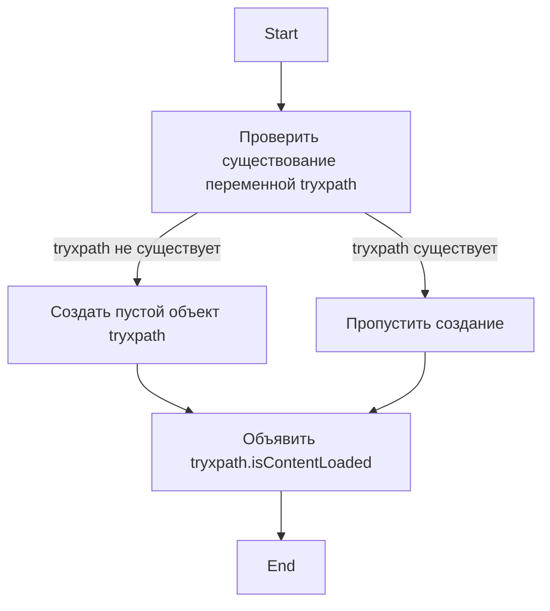

## АНАЛИЗ КОДА

### 1. <алгоритм>

1.  **Проверка существования `tryxpath`:**
    *   Проверяется, существует ли уже глобальная переменная `tryxpath`.
    *   **Пример:** Если `tryxpath` ранее не была определена, условие `!tryxpath` истинно.
2.  **Создание/инициализация `tryxpath`:**
    *   Если `tryxpath` не существует, она создается как пустой объект.
    *   **Пример:** Если `tryxpath` не существовала, то после этого шага `tryxpath = {}`.
3.  **Объявление `tryxpath.isContentLoaded`:**
    *   Объявляется переменная `tryxpath.isContentLoaded`, но ей не присваивается никакое значение. Это означает, что она будет иметь значение `undefined`.
    *   **Пример:** `tryxpath.isContentLoaded` теперь существует как свойство объекта `tryxpath`, но ее значение `undefined`.

**Блок-схема:**

```mermaid
flowchart TD
    A[Start] --> B{tryxpath существует?};
    B -- No --> C[tryxpath = {}];
    B -- Yes --> D[Пропустить создание];
    C --> E[tryxpath.isContentLoaded;];
    D --> E
    E --> F[End]
```

### 2. <mermaid>



**Объяснение `mermaid` диаграммы:**

*   **`Start`**: Начало процесса.
*   **`Check_tryxpath`**: Проверка, определена ли переменная `tryxpath`.
*   **`Create_tryxpath`**: Создание пустого объекта `tryxpath`, если он не существует.
*   **`Skip_creation`**: Пропуск создания объекта, если `tryxpath` уже существует.
*   **`Declare_isContentLoaded`**: Объявление переменной `tryxpath.isContentLoaded` (без присвоения значения).
*   **`End`**: Завершение процесса.

Здесь нет импорта зависимостей, диаграмма описывает только логику текущего кода.

### 3. <объяснение>

**Импорты:**

В этом коде нет импортов. Этот файл является автономным и зависит только от глобальной видимости переменной `tryxpath` (или ее отсутствия)

**Классы:**

В данном коде нет классов.

**Функции:**

В коде нет явных функций. Однако есть логический блок кода, который создает (или пропускает создание)  глобальной переменной `tryxpath`, и объявляет переменную `tryxpath.isContentLoaded`:

*   **Логика `if (!tryxpath) { ... }`:**
    *   **Аргументы:** Нет аргументов.
    *   **Возвращаемое значение:** Нет явного возвращаемого значения.
    *   **Назначение:** Гарантирует, что переменная `tryxpath` существует как объект.
    *   **Пример:** Если `tryxpath` не была определена в глобальной области видимости, этот блок создает пустой объект, к которому потом будут добавляться свойства и методы.

**Переменные:**

*   **`tryxpath`:**
    *   **Тип:** Объект (если не существует, создается как пустой объект `{}`).
    *   **Использование:** Используется как пространство имен (namespace) для хранения переменных и функций, относящихся к функциональности "tryxpath".
*   **`tryxpath.isContentLoaded`:**
    *   **Тип:** По умолчанию `undefined`.
    *   **Использование:**  Предположительно, флаг, который будет использоваться для отслеживания загрузки содержимого, связанного с `tryxpath`.

**Потенциальные ошибки и области для улучшения:**

1.  **Отсутствие инициализации `tryxpath.isContentLoaded`:** Переменная объявлена, но ей не присвоено начальное значение. Обычно ожидается, что переменная, используемая как флаг, будет инициализирована значением `false` или другим логически значимым значением по умолчанию.
2.  **Неясно, где и как будет использован `tryxpath.isContentLoaded`:**  Код объявляет переменную, но не указывает, как и когда она будет изменена. Это затрудняет понимание полной функциональности этого кода.
3.  **Глобальная переменная `tryxpath`:** Использование глобальной переменной может привести к конфликтам имен, если другие части кода используют переменную с тем же именем. Рекомендуется рассмотреть использование более явного механизма для управления пространством имен (например, модули ES6).
4.  **Комментарий про лицензию**: Хоть это и не проблема кода, этот блок может быть заменен на другой комментарий, описывающий назначение данного файла.

**Взаимосвязь с другими частями проекта:**

Поскольку `tryxpath` является пространством имен, этот файл, скорее всего, является частью большей системы или расширения, в котором `tryxpath` используется для организации кода, связанного с XPath. Этот код сам по себе не взаимодействует с другими файлами напрямую, но ожидает, что другие части проекта будут использовать `tryxpath` и его свойства. Судя по пути к файлу `/hypotez/src/webdriver/firefox/extentions/try_path_1.3.5/scripts/try_xpath_check_frame.js`, этот файл предназначен для Firefox extension.