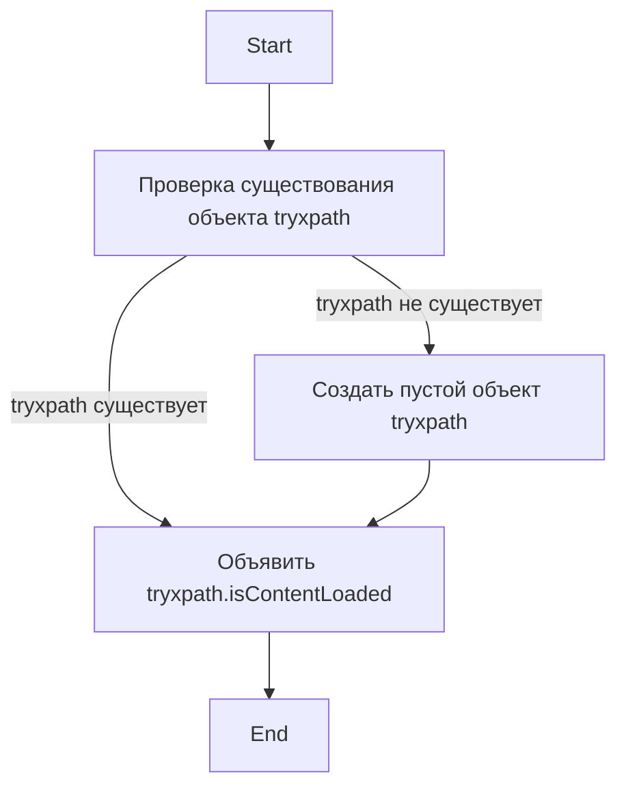

## Анализ кода `try_xpath_check_frame.js`

### 1. <алгоритм>

**Начало:**

1.  **Проверка существования `tryxpath`:** Проверяется, существует ли уже объект `tryxpath` в глобальной области видимости.
    *   **Пример:** Если `tryxpath` не существует, условие `!tryxpath` истинно.

2.  **Создание `tryxpath` (если не существует):** Если `tryxpath` не существует, он создается как пустой объект.
    *   **Пример:** `var tryxpath = {};` создает объект `tryxpath`.

3.  **Объявление `tryxpath.isContentLoaded`:** Создается переменная `tryxpath.isContentLoaded` без присваивания ей значения.

**Конец:**

**Поток данных:**

*   Код начинает выполнение.
*   Происходит проверка, существует ли объект `tryxpath`. Если нет, то создается пустой объект.
*   Вне зависимости от результата предыдущей проверки, объявляется переменная `tryxpath.isContentLoaded`, в данный момент не инициализированная.

### 2. <mermaid>

**Объяснение:**

*   `Start`: Начало выполнения скрипта.
*   `CheckTryxpath`: Логический блок, который проверяет, определен ли в глобальной области видимости объект `tryxpath`.
*   `CreateTryxpath`: Блок, который выполняется, если `tryxpath` не был определен ранее, создавая пустой объект с именем `tryxpath`.
*   `DeclareIsContentLoaded`: Блок, который создает переменную `tryxpath.isContentLoaded`.
*   `End`: Конец выполнения скрипта.

**Зависимости:**

Данный код не имеет внешних зависимостей. Он является самодостаточным и работает в контексте среды выполнения JavaScript (например, в браузере).

### 3. <объяснение>

**Импорты:**

В данном коде нет импортов, так как это базовый javascript код и весь необходимый контекст предоставляется браузером.

**Классы:**

В данном коде нет определения классов.

**Функции:**

В данном коде нет функций.

**Переменные:**

*   `tryxpath`: Объект, используемый как пространство имен для хранения переменных и функций. Он может быть создан, если еще не существует.
*   `tryxpath.isContentLoaded`: Переменная, которая будет использоваться в дальнейшем для хранения информации о том, загружен ли контент. На момент выполнения этого кода ей не присваивается никакого значения (`undefined`).

**Объяснение:**

Данный код является базовой частью расширения `tryxpath` и  отвечает за инициализацию пространства имен `tryxpath` и переменной `tryxpath.isContentLoaded`.

*   **Проверка `tryxpath`:** Код начинает с проверки существования объекта `tryxpath` в глобальной области видимости. Если объект не существует, он создается как пустой объект `{}`. Это распространенный подход в JavaScript для предотвращения конфликтов имен и создания пространства имен для расширения или модуля.

*   **Инициализация `tryxpath.isContentLoaded`:**  После гарантированного создания объекта `tryxpath` объявляется переменная `tryxpath.isContentLoaded` внутри этого объекта. Эта переменная, вероятно, будет использоваться для отслеживания состояния загрузки контента, что является типичной задачей при работе с веб-страницами, но в данном фрагменте ей не присваивается никакого значения.

**Потенциальные ошибки и области для улучшения:**

*   **Отсутствие значения по умолчанию:** Переменная `tryxpath.isContentLoaded` объявлена, но не инициализирована значением по умолчанию.  Возможно, в дальнейшем коде ей будет присвоено значение по умолчанию, но  лучше было бы сразу инициализировать её  значением `false`, чтобы изначально не полагаться на `undefined`.
*   **Предполагаемый контекст:** Код предполагает, что он выполняется в окружении браузера, где доступно глобальное пространство имен.
*   **Отсутствие обработки ошибок:** Код не содержит обработки ошибок, но, учитывая его простоту, это не является большой проблемой.
*   **Зависимость от глобального пространства имен:** Использование глобальной области видимости может привести к конфликтам с другими расширениями или скриптами.

**Цепочка взаимосвязей с другими частями проекта:**

Этот код, вероятно, является частью более крупного расширения для Firefox `tryxpath`.  Он устанавливает базовое пространство имен и  переменную, которые будут использоваться другими скриптами в расширении, такими как `try_xpath_main.js`  или другими модулями `tryxpath`.  `tryxpath.isContentLoaded` может быть использована для синхронизации различных частей расширения.