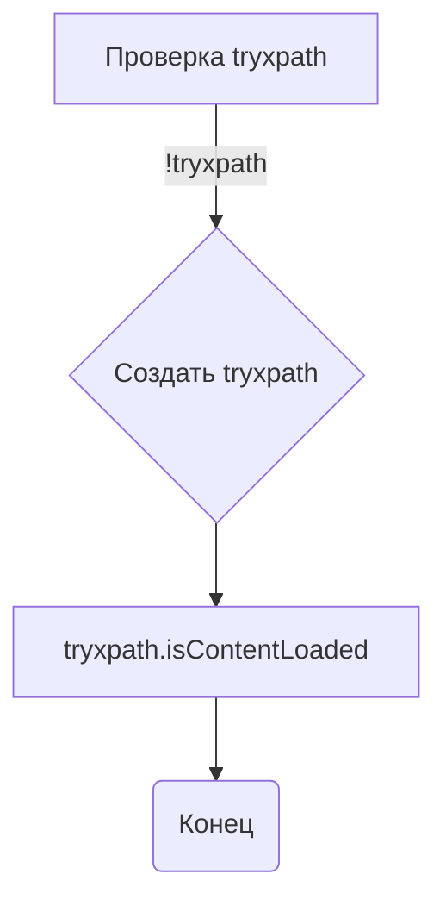

```MD
# Анализ кода try_xpath_check_frame.js

## <input code>

```javascript
/* This Source Code Form is subject to the terms of the Mozilla Public
 * License, v. 2.0. If a copy of the MPL was not distributed with this
 * file, You can obtain one at http://mozilla.org/MPL/2.0/. */

// namespace
if (!tryxpath) {
    var tryxpath = {};
}

tryxpath.isContentLoaded;
```

## <algorithm>

Этот код не содержит логики выполнения и не производит никаких действий. Он всего лишь создает (или проверяет наличие) объект `tryxpath` в глобальном пространстве имён.

**Шаг 1:** Проверяется, существует ли уже объект `tryxpath` в глобальном пространстве имён.
* Если объект `tryxpath` не существует, он создается.
* Если объект `tryxpath` уже существует, ничего не происходит.

**Шаг 2:** Объекту `tryxpath` добавляется свойство `isContentLoaded`.  Свойство инициализировано, но значение не указано.

**Пример:**

До выполнения кода: `tryxpath` не существует.

После выполнения кода: `tryxpath` существует и содержит свойство `isContentLoaded`, значение которого будет `undefined`.


## <mermaid>



## <explanation>

**Импорты:**  В данном коде нет импортов в традиционном понимании. Код использует глобальную область видимости.  Нет зависимости от каких-либо внешних модулей или библиотек.

**Классы:** Отсутствуют классы.

**Функции:** Нет функций.

**Переменные:** Нет явно объявленных переменных. Однако, код создает объект `tryxpath` и свойство `isContentLoaded`  в пространстве имён `tryxpath`. 

**Объяснение логики:**

Код представляет собой фрагмент JavaScript, который создаёт глобальный объект `tryxpath` если его нет.  В большинстве случаев, `tryxpath` является частью более крупного проекта или библиотеки, связанной с автоматизацией браузера, вероятно, для проверки навигации по страницам. Свойство `isContentLoaded` будет использоваться для управления выполнением действий, когда страница загрузится.  Проверка и дальнейшие действия, связанные с этим свойством, определены в другом, связанном коде.  Установленное свойство `isContentLoaded`  предполагает, что код, его использующий, должен реализовать логику для установления значения этого свойства в `true`  при полной загрузке страницы.

**Возможные ошибки и улучшения:**

* **Отсутствие функциональности:** Код сам по себе не делает ничего полезного. Он лишь подготавливает пространство имён для последующего использования.  Следующий фрагмент кода должен инициализировать или использовать это свойство.
* **Неясный контекст:** Без контекста, в котором используется `tryxpath.isContentLoaded`, сложно оценить полную функциональность.


**Взаимосвязь с другими частями проекта:**

Код, скорее всего, является частью расширения Firefox для автоматизации веб-драйвера или тестирования.  Вероятно, существуют другие файлы, которые используют объект `tryxpath` для обработки событий, проверки загрузки страниц и выполнения других операций.


**Вывод:**

Код выполняет простую задачу по созданию пространства имён, которое будет использовано для более сложной задачи, вероятно, связанной с обработкой событий загрузки страницы.  Без контекста трудно оценить его полную роль в проекте.