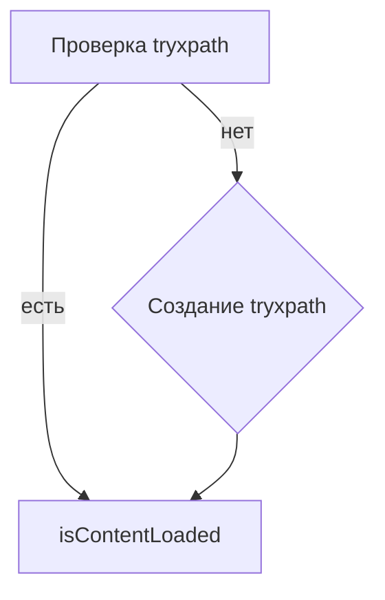

# Анализ кода try_xpath_check_frame.js

## <input code>

```javascript
/* This Source Code Form is subject to the terms of the Mozilla Public
 * License, v. 2.0. If a copy of the MPL was not distributed with this
 * file, You can obtain one at http://mozilla.org/MPL/2.0/. */

// namespace
if (!tryxpath) {
    var tryxpath = {};
}

tryxpath.isContentLoaded;
```

## <algorithm>

Код представляет собой очень простую инициализацию пространства имён (namespace) `tryxpath`.  Пошаговая блок-схема крайне проста:

1. **Проверка существования:** Проверяется, существует ли объект `tryxpath`.
2. **Создание объекта:** Если `tryxpath` не существует, создаётся новый пустой объект `tryxpath`.
3. **Инициализация свойства:**  Свойство `isContentLoaded` в объекте `tryxpath` инициализируется, но без присваивания какого-либо значения.

**Пример:**

```
// Начало
tryxpath  // undefined
// Шаг 1: Проверка
// Шаг 2: Создание
tryxpath // {}
// Шаг 3: Инициализация
tryxpath.isContentLoaded // undefined
// Конец
```

Данные не перемещаются между функциями, классами или методами, так как код очень простой.


## <mermaid>



**Объяснение диаграммы:**

Диаграмма показывает, что код состоит из одной ветви. Если `tryxpath` не существует (false), происходит его создание; если существует (true), код просто инициализирует свойство `isContentLoaded`.


## <explanation>

**Импорты:**

Код не содержит импортов в традиционном понимании. Отсутствуют  `import`, `require` или подобные конструкции.

**Классы:**

Нет определений классов.

**Функции:**

Нет определений функций.

**Переменные:**

- `tryxpath`: Объект, представляющий namespace. Его тип - объект JavaScript.

**Возможные ошибки или области для улучшений:**

* **Неинициализированное свойство:** Свойство `tryxpath.isContentLoaded`  не имеет значения. Это, вероятно, предназначалось для последующей инициализации.

**Цепочка взаимосвязей с другими частями проекта:**

Код, вероятно, будет частью скрипта, связанного с веб-драйвером Firefox, и используется для проверки загрузки содержимого страницы (или фрейма) перед выполнением дальнейших действий. Зависимости неявно находятся в контексте, в котором скрипт используется. Свойства `isContentLoaded` будут инициализированы или изменены в коде, где это свойство проверяется.

**Дополнительные предположения:**

В дальнейшем `tryxpath.isContentLoaded`  скорее всего будет использоваться в качестве флага или переменной состояния, обозначающей, загружено ли содержимое страницы (или фрейма) или нет. В другой части кода будет условие `if (tryxpath.isContentLoaded)`, которое указывает на выполнение какого-либо действия после загрузки.