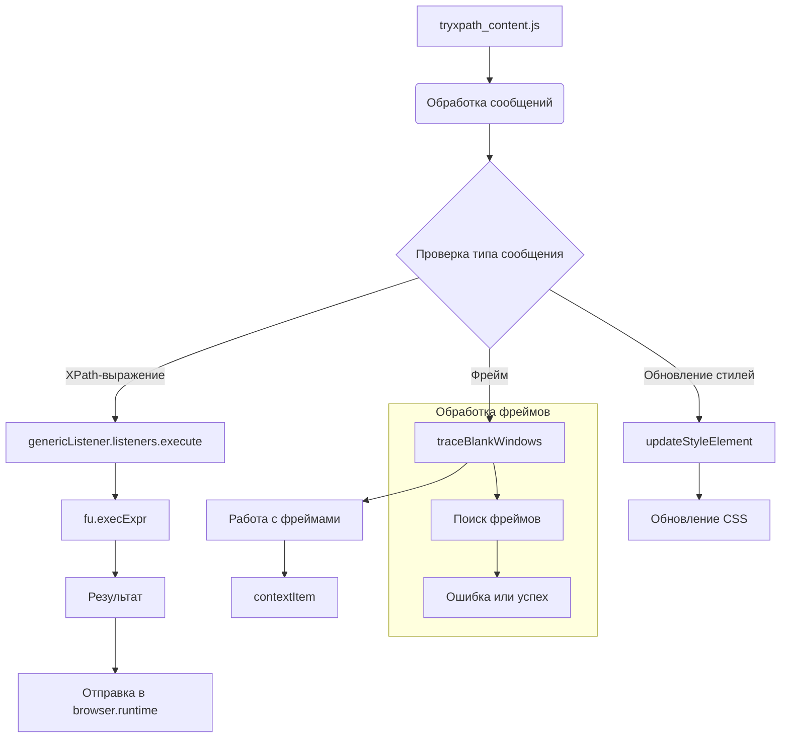

# Анализ кода try_xpath_content.js

**1. <input code>**

```javascript
/* This Source Code Form is subject to the terms of the Mozilla Public
 * License, v. 2.0. If a copy of the MPL was not distributed with this
 * file, You can obtain one at http://mozilla.org/MPL/2.0/. */

(function (window, undefined) {
    "use strict";

    // alias
    var tx = tryxpath;
    var fu = tryxpath.functions;

    // prevent multiple execution
    if (tx.isContentLoaded) {
        return;
    }
    tx.isContentLoaded = true;

    // ... (остальной код)
```

**2. <algorithm>**

Код представляет собой набор функций для обработки сообщений, связанных с XPath-выражениями и управлением стилями. Алгоритм можно представить в виде последовательности обработки сообщений, включающих вычисление XPath-выражений, управление фокусом, и обновление CSS.


**Пример использования:**

Пользователь отправляет сообщение с XPath-выражением в текущее окно.

**Этапы:**

1. **Проверка на существование сообщения:** Проверяется наличие сообщения с типом `tryxpath-focus-frame`  или с другими командами.
2. **Обработка сообщения:**  В зависимости от типа сообщения вызываются разные функции (например, `setFocusFrameListener`, `handleCssChange` и др).
3. **Выполнение XPath-выражения:** Функция `genericListener.listeners.execute` выполняет XPath-выражение на текущем контексте.
4. **Обработка фреймов:** Функция `traceBlankWindows` обрабатывает запрос, если он связан с определенным фреймом.
5. **Обновление стилей:** Функция `updateStyleElement` обновляет стили на странице.
6. **Отправка результата:** Результат вычисления (обновленные атрибуты, найденные элементы, сообщение об ошибке) отправляется в `browser.runtime`.
7. **Установка обработчиков сообщений:** Происходит установка обработчиков на события `message` в текущем и вложенных окнах браузера.

**Пример данных:**

Взаимодействие между функциями происходит через сообщения, которые содержат данные о методе, выражении, типе результата и контексте.  Например, при `genericListener.listeners.execute`:

* `message.main` – данные о вычисляемом выражении.
* `contextItem`, `currentItems` – информация о контексте.


**3. <mermaid>**



**4. <explanation>**

* **Импорты:** Код импортирует alias `tx` (tryxpath) и `fu` (tryxpath.functions) для сокращения имен. Они, скорее всего, определены в других файлах проекта (например, `src/webdriver/firefox/extentions/try_path_1.3.5/scripts/tryxpath_functions.js`), обеспечивая доступ к функциям для работы с XPath и DOM-элементами.
* **Классы:** Нет явно определенных классов. Используются функции и переменные для управления контекстом, фокусом, стилями и результатами.
* **Функции:**  Функции `genericListener`, `setFocusFrameListener`, `setMainAttrs`, `updateStyleElement` обрабатывают разные виды сообщений и изменяют состояние.  Функции `fu.*` (tryxpath.functions) – это вспомогательные функции, которые скорее всего, выполняют операции с DOM-элементами и фреймами.
* **Переменные:** Используются переменные `currentCss`, `originalAttributes`, `insertedStyleElements` для хранения состояния стилей и атрибутов элементов. `contextItem` хранит текущий контекст, `currentItems` – результат XPath.
* **Возможные ошибки или области для улучшений:**
    * Код очень сложный и громоздкий, особенно обработка сообщений.  Желательно разбить его на более мелкие, специализированные функции для улучшения читаемости и поддержания.
    * Дополнительно,  код должен быть более защищенным от ошибок, например, проверка на корректность входных данных в функциях, таких как `parseFrameDesignation`.
    * Обилие вложенных условий и вызовов функций затрудняет отладку. Возможно, стоит использовать отладку, логирование или структуры данных для более ясного представления потока.

**Цепочка взаимосвязей:**

Файл `try_xpath_content.js` взаимодействует с `tryxpath_functions.js` (предполагается), обрабатывая XPath-выражения. Он взаимодействует с расширением браузера (через `browser.runtime.sendMessage`) для получения и отправки данных, включая обновления CSS и результата.  Внешние части проекта (например, пользовательский интерфейс расширения) связываются с этим файлом, отправляя сообщения с запросами и получая результаты.