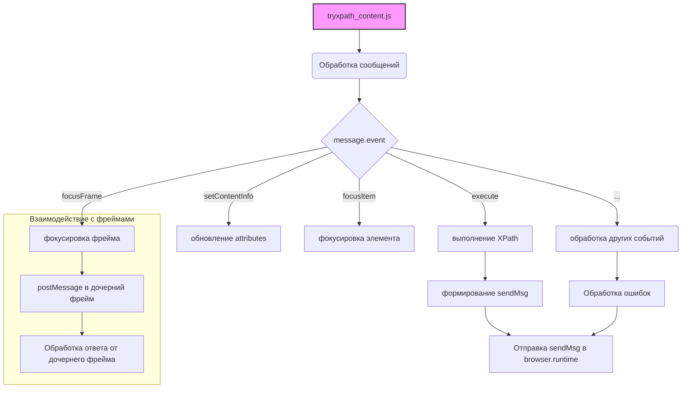

# Анализ кода try_xpath_content.js

## <input code>

```javascript
/* ... (многострочный комментарий) */

(function (window, undefined) {
    "use strict";

    // alias
    var tx = tryxpath;
    var fu = tryxpath.functions;

    // prevent multiple execution
    if (tx.isContentLoaded) {
        return;
    }
    tx.isContentLoaded = true;

    // ... (определения констант и переменных)

    // ... (определения функций setAttr, setIndex, isFocusable, focusItem, setMainAttrs, restoreAttrs, resetPrev, makeTypeStr, updateCss, getFrames, parseFrameDesignation, traceBlankWindows, handleCssChange, findFrameByMessage, setFocusFrameListener, initBlankWindow, findStyleParent, updateStyleElement, updateAllStyleElements, removeStyleElement, removeAllStyleElements, createResultMessage, genericListener)
    // ... (определения функций в genericListener.listeners)

    // ... (обработчики событий)
})(window);
```

## <algorithm>

Этот код реализует обработчик сообщений для расширения браузера, ориентированного на взаимодействие с DOM-элементами (вероятно, для поиска по XPath).  Он устанавливает слушатель сообщений, который обрабатывает различные события, такие как выполнение запросов, фокусировка элементов, обновление стилей и т.д.

**Шаг 1:** Проверка на повторное выполнение.  Если `tx.isContentLoaded` уже `true`, функция ничего не делает.

**Шаг 2:** Обработка событий `onMessage` от `browser.runtime`.  Внутри `genericListener`  на основе `message.event` вызываются соответствующие функции:
 * `setContentInfo`: обновляет глобальную переменную `attributes`.
 * `execute`:  выполняет XPath-запрос.  Собирает данные, создает `sendMsg` с результатами, отправляет его. Обрабатывает ошибки в процессе.
 * `focusItem`: фокусирует элемент по индексу.
 * `focusContextItem`: фокусирует элемент контекста.
 * `focusFrame`: фокусирует фрейм (вложенную страницу).
 * ... (другие события)

**Шаг 3:** Обработка событий `onMessage` от вложенных фреймов (например, если запрос `execute` был направлен во фрейм).


**Пример:** Если получено сообщение `execute`,  функция `genericListener.listeners.execute` выполнит запрос, получит результат, заполнит `sendMsg` и отправит ответ в `browser.runtime`.


## <mermaid>



## <explanation>

**Импорты:**  Код не содержит прямых импортов в формате `import`. Вероятно, используется внутренняя система модулей расширения браузера. `tx` и `fu` - это алиасы для объекта `tryxpath` и его свойства `functions`, подразумевая, что они определены в другом модуле (вероятно, в другом JavaScript-файле расширения).


**Классы:** Нет явных определений классов. Код использует функции и объекты для организации логики.


**Функции:** 
    * `setAttr`, `setIndex`: Устанавливают атрибуты элементам.  Они используют вспомогательные функции `fu.saveAttrForItem`, `fu.setAttrToItem` и т.д.
    * `isFocusable`, `focusItem`: Проверяют фокусируемость элемента и осуществляют фокусировку.
    * `setMainAttrs`, `restoreAttrs`: Обновляют основные атрибуты и восстанавливают их значения соответственно.
    * `makeTypeStr`: Преобразует тип результата XPath-запроса в строку.
    * `updateCss`: Обновляет CSS-стили, если это необходимо.
    * `getFrames`, `parseFrameDesignation`, `traceBlankWindows`: Обрабатывают фреймы (вложенные страницы).
    * `handleCssChange`: Обрабатывает изменения CSS-стилей.
    * `findFrameByMessage`: Находит фрейм по полученному сообщению.
    * `setFocusFrameListener`, `initBlankWindow`: Устанавливают слушатели событий для фреймов.
    * `updateStyleElement`, `updateAllStyleElements`, `removeStyleElement`, `removeAllStyleElements`: Управляют CSS-стилями, которые, по всей видимости, применяются к DOM.
    * `createResultMessage`: Создает объект с информацией об ошибках или успешном выполнении запроса.
    * `genericListener`: Обработчик событий `onMessage`. Он делегирует обработку различных событий другим функциям.
    * Функции внутри `genericListener.listeners`:  Специализированные обработчики для различных событий.

**Переменные:**
  * `tx`, `fu`, `attributes`, `currentCss`, `insertedStyleElements`, `expiredCssSet`, `originalAttributes`, `contextItem`, `currentItems`, `focusedItem`, `focusedAncestorItems`: Хранят важные состояния и данные во время выполнения.


**Возможные ошибки и улучшения:**

* **Обработка ошибок:** Код содержит `try...catch` блоки, но  более конкретная обработка ошибок (например, `Invalid JSON` для `JSON.parse`) была бы полезной. 
* **Избыточность кода:** Некоторые проверки на null/undefined могут быть излишни.
* **Документация:** Не хватает хорошей документации для функций и переменных.  Подробное описание назначения переменных и функций улучшило бы понимание кода.
* **Улучшение производительности:**  Обработка множества фреймов или больших объемов данных может снизить производительность.


**Взаимосвязи с другими частями проекта:**

Код активно взаимодействует с `tryxpath` (возможно, с другими частями расширения). `browser.runtime.sendMessage`  и `postMessage` предполагают взаимодействие с другими компонентами расширения.  Объект `fu` ссылается на функции, вероятно, определенные в `tryxpath.functions.js`.  Изменение настроек через `browser.storage` показывает интеграцию с хранением данных.


**Общий вывод:**  Код является частью расширения браузера, реализующего функциональность поиска по XPath и управления элементами DOM.  Он обрабатывает различные запросы и события, фокусирует элементы, обновляет стили и взаимодействует с вложенными фреймами.