## Анализ JSON-файла конфигурации Firefox

### 1. `<алгоритм>`

JSON-файл представляет собой конфигурацию для запуска браузера Firefox с определенными параметрами.  

1. **`options`**:  Массив `options` в данный момент пуст, это значит, что никакие специфические опции командной строки Firefox не передаются при запуске. 
   *Пример*: `["--start-maximized", "--disable-gpu"]` -  максимизировать окно и отключить аппаратное ускорение.
2. **`disabled_options`**: Массив `disabled_options` содержит опции, которые отключаются при запуске Firefox. В данном случае отключаются опции `--kiosk` (режим киоска) и `--headless` (запуск без графического интерфейса).
   *Пример*:  Если бы присутствовала опция "--disable-webgl", то было бы отменено использование WebGL.
3. **`profile_directory`**: 
   - **Определение**: Задает директорию профиля Firefox.
   - **`os`**:  Путь к профилю в ОС пользователя, например, `%LOCALAPPDATA%\\Mozilla\\Firefox\\Profiles\\zojh5u5a.default-release-3`.
   - **`internal`**: Путь к профилю внутри директории проекта `webdriver\\firefox\\profiles\\95c5aq3n.default-release`.
   - **`default`**:  Значение `"os"` указывает, что по умолчанию используется путь из поля `os`.
    *Пример*: если `default` был бы `"internal"` то использовался бы внутренний путь.
4. **`executable_path`**:
   - **Определение**: Указывает пути к исполняемым файлам Firefox и geckodriver.
   - **`firefox_binary`**: Путь к исполняемому файлу Firefox: `bin\\webdrivers\\firefox\\ff\\core-127.0.2\\firefox.exe`.
   - **`geckodriver`**: Путь к исполняемому файлу geckodriver: `bin\\webdrivers\\firefox\\gecko\\33\\geckodriver.exe`.
   *Пример*: Эти пути могут меняться в зависимости от расположения исполняемых файлов.
5. **`headers`**:
   - **Определение**: Задает набор HTTP заголовков, используемых при HTTP-запросах.
   - **`User-Agent`**:  Строка User-Agent, идентифицирующая браузер.
   - **`Accept`**:  Список MIME-типов, которые браузер принимает.
   - **`Accept-Charset`**: Кодировки символов, которые браузер принимает.
   - **`Accept-Encoding`**: Типы сжатия, которые браузер принимает (в данном случае - "none", т.е. без сжатия).
   - **`Accept-Language`**: Список языков, которые браузер принимает.
   - **`Connection`**:  Опция для постоянного соединения ("keep-alive").
   *Пример*: Эти заголовки могут быть изменены для маскировки автоматизации.
6. **`proxy_enabled`**:
   - **Определение**:  Флаг, указывающий, включено ли использование прокси-сервера. В данном случае - `false`.
    *Пример*: Если значение было бы `true`, то прокси сервер был бы включен.

```mermaid
flowchart TD
    subgraph "Firefox Configuration"
        Options[options: Array<string>]
        DisabledOptions[disabled_options: Array<string>]
        ProfileDirectory[profile_directory: Object]
        ExecutablePath[executable_path: Object]
        Headers[headers: Object]
        ProxyEnabled[proxy_enabled: boolean]
    end
    
    ProfileDirectory --> OS_Path[os: string]
    ProfileDirectory --> Internal_Path[internal: string]
    ProfileDirectory --> Default_Path[default: string]
    
    ExecutablePath --> FirefoxBinary[firefox_binary: string]
    ExecutablePath --> GeckodriverPath[geckodriver: string]
    
    Headers --> UserAgent[User-Agent: string]
    Headers --> AcceptHeader[Accept: string]
    Headers --> AcceptCharset[Accept-Charset: string]
    Headers --> AcceptEncoding[Accept-Encoding: string]
    Headers --> AcceptLanguage[Accept-Language: string]
    Headers --> ConnectionHeader[Connection: string]
    
```

### 2. `<mermaid>`

**Объяснение диаграммы:**

-  Диаграмма представляет собой flowchart, который начинается с общего контейнера "Firefox Configuration".
-  Внутри этого контейнера определены основные элементы конфигурации: `Options`, `DisabledOptions`, `ProfileDirectory`, `ExecutablePath`, `Headers` и `ProxyEnabled`.
-  `ProfileDirectory` разделяется на `OS_Path` (путь к профилю ОС), `Internal_Path` (путь к внутреннему профилю) и `Default_Path` (какой путь используется по умолчанию) .
-   `ExecutablePath` разделяется на `FirefoxBinary` (путь к исполняемому файлу Firefox) и `GeckodriverPath` (путь к исполняемому файлу geckodriver).
-   `Headers` разделяется на различные HTTP заголовки: `UserAgent`, `AcceptHeader`, `AcceptCharset`, `AcceptEncoding`, `AcceptLanguage`, и `ConnectionHeader`.

### 3. `<объяснение>`

**Импорты:**
В данном JSON-файле нет импортов, так как это файл конфигурации, а не программный код. Он используется для хранения настроек, которые затем могут быть прочитаны программой.

**Классы:**
В данном случае отсутствуют классы, так как это конфигурационный JSON-файл. Он предназначен для хранения данных в структурированном виде, а не для описания объектов и их поведения.

**Функции:**
Функции здесь также отсутствуют, поскольку это JSON-файл с конфигурационными данными, а не код. Он представляет собой набор пар ключ-значение, где ключи описывают параметры конфигурации, а значения содержат соответствующие данные.

**Переменные:**

- **`options`**: Массив (список) строк, представляющий собой дополнительные параметры командной строки Firefox.
- **`disabled_options`**: Массив строк, содержащий список опций, которые нужно отключить.
- **`profile_directory`**: Объект (словарь), содержащий пути к профилям Firefox.
  - **`os`**: Строка, представляющая путь к профилю в операционной системе.
  - **`internal`**: Строка, представляющая внутренний путь к профилю.
  - **`default`**: Строка, определяющая, какой путь к профилю использовать по умолчанию.
- **`executable_path`**: Объект, содержащий пути к исполняемым файлам Firefox и geckodriver.
  - **`firefox_binary`**: Строка, представляющая путь к исполняемому файлу Firefox.
  - **`geckodriver`**: Строка, представляющая путь к исполняемому файлу geckodriver.
- **`headers`**: Объект, содержащий HTTP-заголовки.
  - **`User-Agent`**: Строка, представляющая HTTP-заголовок User-Agent.
  - **`Accept`**: Строка, представляющая HTTP-заголовок Accept.
  - **`Accept-Charset`**: Строка, представляющая HTTP-заголовок Accept-Charset.
  - **`Accept-Encoding`**: Строка, представляющая HTTP-заголовок Accept-Encoding.
  - **`Accept-Language`**: Строка, представляющая HTTP-заголовок Accept-Language.
  - **`Connection`**: Строка, представляющая HTTP-заголовок Connection.
- **`proxy_enabled`**: Логическая переменная (булевое значение), указывающая, включен ли прокси-сервер (в данном случае false - выключен).

**Потенциальные ошибки или области для улучшения:**
- **Пути к файлам:** Пути к исполняемым файлам и профилям являются абсолютными или зависят от переменных окружения (`%LOCALAPPDATA%`).  Это может создать проблемы, если файлы или папки будут перемещены или если код будет запущен на другой ОС. Можно сделать пути относительными, для большей гибкости.
- **Отсутствие гибкости:** Некоторые параметры (например, значения `User-Agent` или `Accept-Encoding`) могут быть жестко заданы, что может ограничить возможности кастомизации.  Можно предусмотреть возможность задания этих параметров извне (например, из переменных окружения или через другой конфигурационный файл).
- **Жестко заданные версии:** Версии firefox и geckodriver указаны прямо в путях, это может привести к проблемам при обновлении.

**Взаимосвязь с другими частями проекта:**
Этот JSON-файл, скорее всего, будет использоваться для настройки параметров Firefox при запуске автоматизированных тестов или веб-скрапинга. Он является важной частью конфигурации, которая определяет поведение веб-браузера. Пути, указанные здесь, будут использованы в коде, который использует WebDriver для управления браузером.