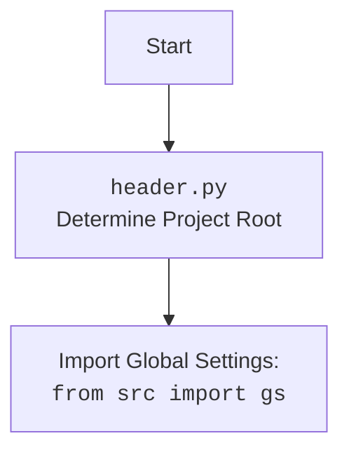

## ИНСТРУКЦИЯ:

Анализируй предоставленный код подробно и объясни его функциональность. Ответ должен включать три раздела:

1.  **<алгоритм>**: Опиши рабочий процесс в виде пошаговой блок-схемы, включая примеры для каждого логического блока, и проиллюстрируй поток данных между функциями, классами или методами.
2.  **<mermaid>**: Напиши код для диаграммы в формате `mermaid`, проанализируй и объясни все зависимости,
    которые импортируются при создании диаграммы.
    **ВАЖНО!** Убедитесь, что все имена переменных, используемые в диаграмме `mermaid`,
    имеют осмысленные и описательные имена. Имена переменных вроде `A`, `B`, `C`, и т.д., не допускаются!

    **Дополнительно**: Если в коде есть импорт `import header`, добавьте блок `mermaid` flowchart, объясняющий `header.py`:
    ```mermaid
    flowchart TD
        Start --> Header[<code>header.py</code><br> Determine Project Root]

        Header --> import[Import Global Settings: <br><code>from src import gs</code>]
    ```

3.  **<объяснение>**: Предоставьте подробные объяснения:
    -   **Импорты**: Их назначение и взаимосвязь с другими пакетами `src.`.
    -   **Классы**: Их роль, атрибуты, методы и взаимодействие с другими компонентами проекта.
    -   **Функции**: Их аргументы, возвращаемые значения, назначение и примеры.
    -   **Переменные**: Их типы и использование.
    -   Выделите потенциальные ошибки или области для улучшения.

Дополнительно, постройте цепочку взаимосвязей с другими частями проекта (если применимо).

Это обеспечивает всесторонний и структурированный анализ кода.
## Формат ответа: `.md` (markdown)
**КОНЕЦ ИНСТРУКЦИИ**

## <алгоритм>

1.  **Инициализация `Firefox`:**
    *   При создании экземпляра класса `Firefox` происходит:
        *   Загрузка настроек из `firefox.json`.
        *   Определение путей к `geckodriver` и бинарнику Firefox.
        *   Создание экземпляров `Service` и `Options`.
        *   Применение опций из файла настроек и переданных аргументов.
        *   Установка пользовательского агента.
        *   Настройка прокси, если `proxy_enabled` в настройках.
        *   Настройка директории профиля.
    *   Создается экземпляр `FirefoxProfile` с указанной директорией.
    *   Вызывается конструктор родительского класса `WebDriver` для запуска Firefox.
    *   Вызывается метод `_payload()` для загрузки дополнительных функций.
    *   Обработка исключений `WebDriverException` и других `Exception` с записью логов.

    *Пример:*

        ```python
        browser = Firefox(
            profile_name="custom_profile",
            geckodriver_version="v0.29.0",
            firefox_version="78.0",
            proxy_file_path="path/to/proxies.txt"
            options=["--headless"]
        )
        ```
2.  **`set_proxy(options)`:**
    *   Получение словаря прокси через `get_proxies_dict`.
    *   Объединение всех прокси (socks4, socks5) в один список.
    *   Поиск рабочего прокси путем случайного перебора списка и проверки с помощью `check_proxy`.
    *   Если рабочий прокси найден:
        *   Установка настроек прокси в `options` в зависимости от протокола (http, socks4, socks5).
        *   Логирование настроенного прокси.
    *   Если рабочий прокси не найден, выдается предупреждение в лог.

    *Пример:*

    ```python
    # proxies_dict = {"socks4": [{"host": "127.0.0.1", "port": 9050, "protocol": "socks4"}]};
    # рабочий прокси: {"host": "127.0.0.1", "port": 9050, "protocol": "socks4"}
    # options.set_preference('network.proxy.type', 1)
    # options.set_preference('network.proxy.socks', "127.0.0.1")
    # options.set_preference('network.proxy.socks_port', 9050)
    ```
3.  **`_payload()`:**
    *   Создается экземпляр `JavaScript` для выполнения JS-скриптов.
    *   Присваивание методов из экземпляра `JavaScript` к текущему экземпляру `Firefox`: `get_page_lang`, `ready_state`, `get_referrer`, `unhide_DOM_element`, `window_focus`.
    *   Создание экземпляра `ExecuteLocator` для выполнения локаторов.
    *   Присваивание методов из экземпляра `ExecuteLocator` к текущему экземпляру `Firefox`: `execute_locator`, `get_webelement_as_screenshot`, `get_webelement_by_locator`, `get_attribute_by_locator`, `send_message`.

    *Пример:*

    ```python
    # self.get_page_lang = instance_js.get_page_lang
    # self.execute_locator = instance_execute_locator.execute_locator
    ```

## <mermaid>
```mermaid
flowchart TD
    Start(Начало) --> LoadSettings[Загрузка настроек из firefox.json]
    LoadSettings --> GetPaths[Определение путей к geckodriver и firefox]
    GetPaths --> CreateService[Создание Service(geckodriver_path)]
    CreateService --> CreateOptions[Создание Options()]
    CreateOptions --> ApplySettingsOptions[Применение опций из settings.options]
     ApplySettingsOptions --> ApplyOptions[Применение переданных options]
     ApplyOptions --> ApplyHeaders[Применение заголовков из settings.headers]
    ApplyHeaders --> SetUserAgent[Установка UserAgent]
    SetUserAgent --> CheckProxyEnabled{proxy_enabled?}
    CheckProxyEnabled -- Yes --> SetProxy[Вызов set_proxy(options)]
    SetProxy --> SetProfileDir[Определение директории профиля]
    CheckProxyEnabled -- No --> SetProfileDir
     SetProfileDir --> CreateFirefoxProfile[Создание FirefoxProfile(profile_directory)]
    CreateFirefoxProfile --> StartWebDriver[super().__init__(service, options)]
    StartWebDriver --> ExecutePayload[Вызов _payload()]
     ExecutePayload --> End(Конец)
    StartWebDriver --> ExceptionHandler{Ошибка WebDriver?}
    ExceptionHandler -- Yes --> LogCriticalError[Логирование ошибки]
     LogCriticalError --> End
     ExceptionHandler -- No --> ExecutePayload


    subgraph set_proxy
        SetProxyStart[Начало set_proxy] --> GetProxiesDict[Получение словаря прокси]
        GetProxiesDict --> CombineProxies[Объединение прокси]
        CombineProxies --> FindWorkingProxy[Поиск рабочего прокси]
         FindWorkingProxy --> ProxyFound{Рабочий прокси найден?}
        ProxyFound -- Yes --> SetProxySettings[Установка настроек прокси в options]
         SetProxySettings --> LogProxySettings[Логирование настроек прокси]
        LogProxySettings --> SetProxyEnd[Конец set_proxy]
        ProxyFound -- No --> LogNoProxy[Логирование: нет доступных прокси]
        LogNoProxy --> SetProxyEnd
    end

    subgraph _payload
        PayloadStart[Начало _payload] --> CreateJavaScript[Создание экземпляра JavaScript]
        CreateJavaScript --> AssignJavaScriptMethods[Присвоение методов JavaScript]
        AssignJavaScriptMethods --> CreateExecuteLocator[Создание экземпляра ExecuteLocator]
        CreateExecuteLocator --> AssignExecuteLocatorMethods[Присвоение методов ExecuteLocator]
        AssignExecuteLocatorMethods --> PayloadEnd[Конец _payload]
    end

```

## <объяснение>

**Импорты:**

*   **`os`**:  Используется для работы с операционной системой, например, для получения переменных окружения.
*   **`random`**: Используется для случайного выбора прокси из списка.
*   **`pathlib.Path`**: Используется для работы с путями к файлам и каталогам. Позволяет более гибко работать с путями, чем стандартные строковые манипуляции.
*   **`typing.Optional, List`**: Используется для аннотации типов, указывая, что переменные могут быть `None` или иметь конкретный тип.
*   **`selenium.webdriver.Firefox as WebDriver`**: Импортирует класс `Firefox` из `selenium` и переименовывает его в `WebDriver` для избежания конфликтов имен. Это базовый класс для управления браузером Firefox.
*   **`selenium.webdriver.firefox.options.Options`**: Используется для настройки параметров запуска Firefox.
*   **`selenium.webdriver.firefox.service.Service`**:  Используется для управления процессом `geckodriver`.
*   **`selenium.webdriver.firefox.firefox_profile.FirefoxProfile`**: Используется для настройки профиля Firefox.
*   **`selenium.common.exceptions.WebDriverException`**: Используется для перехвата исключений, возникающих при работе WebDriver.
*   **`src.gs`**: Импортирует глобальные настройки проекта.  Обеспечивает доступ к общим путям и другим настройкам, используемых во всем проекте.
*   **`src.webdriver.executor.ExecuteLocator`**: Импортирует класс для выполнения поиска элементов на веб-странице.
*   **`src.webdriver.js.JavaScript`**: Импортирует класс для выполнения JavaScript на веб-странице.
*   **`src.webdriver.proxy.download_proxies_list, get_proxies_dict, check_proxy`**: Импортирует функции для работы с прокси, такие как скачивание списка, получение словаря и проверка прокси.
*    **`src.utils.jjson.j_loads_ns`**: Импортирует функцию для загрузки JSON настроек.
*   **`src.logger.logger.logger`**: Импортирует логгер для записи сообщений о состоянии выполнения программы.
*   **`fake_useragent.UserAgent`**: Используется для генерации случайных User-Agent, имитирующих различных пользователей.
*   **`header`**: Импортирует модуль `header.py`, который, вероятно, определяет корень проекта и загружает глобальные настройки.

**Классы:**

*   **`Firefox(WebDriver)`**:
    *   **Роль:** Расширяет функциональность базового класса `webdriver.Firefox`.  Предоставляет возможность настройки профиля, прокси, пользовательского агента и других опций.
    *   **Атрибуты:**
        *   `driver_name: str = 'firefox'` - Имя драйвера.
    *   **Методы:**
        *   `__init__(...)`: Конструктор класса, инициализирует драйвер Firefox с заданными параметрами.
        *   `set_proxy(options: Options)`: Настраивает прокси для драйвера, выбирая рабочий прокси из списка.
        *   `_payload()`: Загружает исполнителей для локаторов и JavaScript сценариев.

**Функции:**

*   `__init__`:
    *   **Аргументы:**
        *   `profile_name: Optional[str]`: Имя профиля Firefox.
        *   `geckodriver_version: Optional[str]`: Версия geckodriver.
        *   `firefox_version: Optional[str]`: Версия Firefox.
        *  `user_agent: Optional[str]`: Пользовательский агент.
        *   `proxy_file_path: Optional[str]`: Путь к файлу с прокси.
        *   `options: Optional[List[str]]`: Список опций для Firefox.
        *   `*args, **kwargs`: Дополнительные аргументы для родительского класса.
    *   **Возвращаемое значение:** `None`.
    *   **Назначение:** Инициализирует драйвер Firefox, настраивает профиль, прокси и другие параметры.
*   `set_proxy(options)`:
    *   **Аргументы:**
        *   `options: Options`: Экземпляр `Options`, в который добавляются настройки прокси.
    *   **Возвращаемое значение:** `None`.
    *   **Назначение:** Настраивает прокси для драйвера, выбирая рабочий прокси из списка.
*    `_payload`:
     *   **Аргументы:** Нет.
     *   **Возвращаемое значение:** `None`.
     *   **Назначение:** Загружает исполнителей для локаторов и JavaScript сценариев.

**Переменные:**

*   `service`: Экземпляр `Service` для управления `geckodriver`.
*   `profile`: Экземпляр `FirefoxProfile` для настройки профиля.
*   `options_obj`: Экземпляр `Options` для настройки параметров запуска Firefox.
*    `settings`:  Загруженные настройки из `firefox.json`.
*   `geckodriver_path`: Путь к исполняемому файлу `geckodriver`.
*   `firefox_binary_path`: Путь к бинарному файлу Firefox.
*    `user_agent`:  Пользовательский агент.
*   `profile_directory`: Путь к каталогу профиля Firefox.
*   `proxies_dict`: Словарь прокси, полученный из `get_proxies_dict`.
*   `all_proxies`: Список всех прокси (socks4 и socks5).
*   `working_proxy`: Рабочий прокси, найденный из списка.

**Потенциальные ошибки и области для улучшения:**

*   **Обработка ошибок при загрузке настроек:** Отсутствует обработка ошибок при загрузке файла `firefox.json`.
*   **Проверка версий драйвера и Firefox:** Не проверяется соответствие версий `geckodriver` и Firefox, что может привести к ошибкам.
*   **Обработка ошибок при работе с прокси:** Не обрабатываются исключения при работе с прокси, например, если прокси недоступен.
*   **Отсутствие явного закрытия драйвера:** В примере использования не вызывается метод `quit()` или `close()` для закрытия драйвера, что может привести к утечке ресурсов.
*   **Использование `vars()` для доступа к атрибутам:**  Использование `vars()` может быть не безопасным, стоит проверить, какой тип данных и какие атрибуты ожидаются. Лучше использовать явный доступ.
*   **Неявное преобразование типа:** В `options.set_preference('network.proxy.http_port', int(proxy['port']))`  происходит неявное преобразование типа `int()` без проверки на допустимые значения, что может вызвать исключение.
*   **Неопределенный `proxy_file_path`:** В коде не используется параметр `proxy_file_path`, хотя он присутствует в описании класса, а прокси настраиваются из `get_proxies_dict`.
*   **Сложная логика выбора прокси:** Логика выбора прокси предполагает случайный перебор, что может быть не оптимально. Можно рассмотреть варианты с кэшированием рабочих прокси или использованием более эффективных алгоритмов.
*   **Не хватает проверок на допустимые значения:** Не хватает проверок на корректность передаваемых параметров, что может привести к ошибкам во время выполнения.

**Цепочка взаимосвязей с другими частями проекта:**

1.  **`src.gs`**: Получает глобальные настройки проекта, включая пути к исполняемым файлам и другим ресурсам.
2.  **`src.webdriver.executor.ExecuteLocator`**: Используется для выполнения поиска элементов на веб-странице, предоставляя функционал для взаимодействия с веб-элементами.
3.  **`src.webdriver.js.JavaScript`**: Используется для выполнения JavaScript-сценариев на веб-странице, предоставляя дополнительные возможности для взаимодействия с веб-страницей.
4.  **`src.webdriver.proxy`**: Используется для работы с прокси, включая загрузку списка прокси, получение словаря и проверку их работоспособности.
5.  **`src.utils.jjson`**: Используется для загрузки настроек из JSON-файла.
6.  **`src.logger.logger`**:  Используется для логирования событий и ошибок во время работы драйвера.
7.  **`header`**: Определяет корень проекта, от куда берутся все пути.
8. **`fake_useragent`**: Используется для генерации случайных user-agent.

Этот класс `Firefox` является центральным элементом для управления браузером Firefox и интегрирован с другими модулями для обеспечения расширенной функциональности.