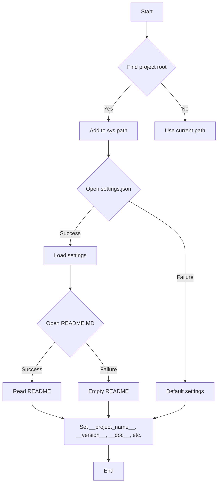

```MD
# <input code>

```python
## \file hypotez/src/webdriver/firefox/header.py
# -*- coding: utf-8 -*-\
#! venv/Scripts/python.exe
#! venv/bin/python/python3.12

"""
.. module: src.webdriver.firefox 
	:platform: Windows, Unix
	:synopsis:

"""
MODE = 'dev'

import sys
import json
from packaging.version import Version

from pathlib import Path
def set_project_root(marker_files=('pyproject.toml', 'requirements.txt', '.git')) -> Path:
    """
    Finds the root directory of the project starting from the current file's directory,
    searching upwards and stopping at the first directory containing any of the marker files.

    Args:
        marker_files (tuple): Filenames or directory names to identify the project root.
    
    Returns:
        Path: Path to the root directory if found, otherwise the directory where the script is located.
    """
    __root__:Path
    current_path:Path = Path(__file__).resolve().parent
    __root__ = current_path
    for parent in [current_path] + list(current_path.parents):
        if any((parent / marker).exists() for marker in marker_files):
            __root__ = parent
            break
    if __root__ not in sys.path:
        sys.path.insert(0, str(__root__))
    return __root__


# Get the root directory of the project
__root__ = set_project_root()
"""__root__ (Path): Path to the root directory of the project"""

from src import gs

settings:dict = None
try:
    with open(gs.path.root / 'src' / 'settings.json', 'r') as settings_file:
        settings = json.load(settings_file)
except (FileNotFoundError, json.JSONDecodeError):
    ...

doc_str:str = None
try:
    with open(gs.path.root / 'src' / 'README.MD', 'r') as settings_file:
        doc_str = settings_file.read()
except (FileNotFoundError, json.JSONDecodeError):
    ...


__project_name__ = settings.get("project_name", 'hypotez') if settings  else 'hypotez'
__version__: str = settings.get("version", '')  if settings  else ''
__doc__: str = doc_str if doc_str else ''
__details__: str = ''
__author__: str = settings.get("author", '')  if settings else ''
__copyright__: str = settings.get("copyrihgnt", '')  if settings else ''
__cofee__: str = settings.get("cofee", "Treat the developer to a cup of coffee for boosting enthusiasm in development: https://boosty.to/hypo69")  if settings else "Treat the developer to a cup of coffee for boosting enthusiasm in development: https://boosty.to/hypo69"
```

# <algorithm>



**Example:**

If `__file__` points to `hypotez/src/webdriver/firefox/header.py`, the script will search for `pyproject.toml`, `requirements.txt`, or `.git` in the parent directories:


```
hypotez/src/webdriver/firefox/header.py
hypotez/src/webdriver/firefox
hypotez/src/webdriver
hypotez/src
hypotez
```

If `pyproject.toml` exists in `hypotez`, `__root__` will be set to `hypotez`, and `hypotez` will be added to `sys.path`.

# <mermaid>

```mermaid
graph LR
    subgraph Project Root Finding
        A[header.py] --> B(Path(__file__));
        B --> C[resolve()];
        C --> D{parent directories};
        D -- marker_file exists --> E[__root__ = parent];
        D -- marker_file does not exist --> F[continue loop];
        E --> G[sys.path.insert(0)];
        G --> H[__root__];
    end
    subgraph Settings Loading
        H --> I[open settings.json];
        I -- success --> J[load json];
        I -- failure --> K[settings=None];
    end
    subgraph README Loading
        J --> L[open README.MD];
        L -- success --> M[read README];
        L -- failure --> N[doc_str=None];
    end
    H --> O[get settings values];
    O --> P[set __project_name__, __version__, etc.];

```

**Dependencies Analysis**:

The diagram shows the dependencies on:

*   `pathlib`: for working with file paths.
*   `json`: for loading the `settings.json` file.
*   `packaging.version`: (possibly) for version handling.
*   `src.gs`:  This suggests a module named `gs` within the `src` package, likely providing utility functions related to the project's file system. This is the key external dependency.


# <explanation>

**Imports:**

*   `sys`: Provides access to system-specific parameters and functions, including the `sys.path` used for module search.
*   `json`: Used for handling JSON data, specifically to load configuration from `settings.json`.
*   `packaging.version`:  Used for handling versions of Python packages.  This is often included when comparing different package version strings in order to resolve compatibility issues.
*   `pathlib`: Used for manipulating file paths in a more object-oriented way, providing methods for resolving paths.
*   `src.gs`: This is a custom module within the project, likely containing functions or classes related to file system operations, specifically handling the project's root directory.


**Classes:**

There are no classes defined in this file.

**Functions:**

*   `set_project_root(marker_files)`: This function aims to locate the project root directory. It takes a tuple of marker files (e.g., `pyproject.toml`, `requirements.txt`) as input.  It starts from the current file's directory and iterates up the directory tree until one of the marker files is found, indicating the project root. If a root isn't found, the current directory is returned. Critically, it adds the project root to `sys.path`, which allows Python to find modules from within the project. This is *crucial* for modular project organization.

**Variables:**

*   `MODE`: A string constant likely used for configuration in different development phases.
*   `__root__`: A `Path` object representing the project root directory, obtained from `set_project_root()`.
*   `settings`: A dictionary loaded from `settings.json`.  Crucially, if `settings.json` is missing, or if it has a format error, then `settings` remains `None`. This is good defensive coding.
*   `doc_str`: A string containing the documentation from `README.MD`.  Similar defensive coding to the `settings` variable.
*   `__project_name__`, `__version__`, `__doc__`, `__details__`, `__author__`, `__copyright__`, `__cofee__`: These variables are populated from the `settings` dictionary if available and are useful for accessing project details.  They are in `__` form (leading and trailing double underscores) which is convention in Python for private variables, but in practice these are likely meant to be used (as global constants or accessed by methods).

**Possible Errors and Improvements:**

1.  **Error Handling:** The code uses `try...except` blocks for file opening and JSON loading. This is good practice to prevent crashes due to missing or invalid files. However, consider logging these errors for debugging purposes and providing more informative error messages to the user.

2.  **Robustness:** Consider adding checks to verify the existence of the `pyproject.toml` or other marker files to make the behavior more robust.

3.  **Clearer Variable Names**: While using `__` form for these variables is convention for private members, using more descriptive names for `__root__` and so on might improve readability.

4.  **Explicit type hinting:**  In Python 3, type hints can help catch errors, and `settings` should, ideally, be typed to explicitly convey it is a dictionary. However, this is not necessary to understand or to run the code, just to have greater future maintainability.

**Relationship with other parts of the project:**

This file likely works in conjunction with other files in the `src.webdriver` and `src` packages.  The `gs` module (likely from the `src` package) is critical for resolving file paths. Files like `settings.json` and `README.MD` are assumed to exist in the project structure.  This implies a project structure, and the use of external libraries.  All of these together indicate the need for careful handling of project directories and configuration.