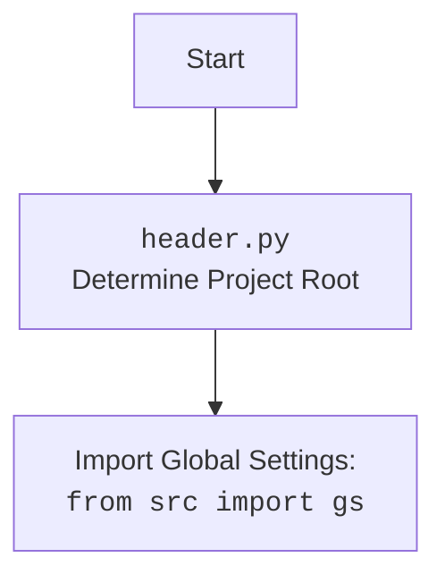

## Анализ кода `hypotez/src/webdriver/firefox/header.py`

### 1. <алгоритм>

**Блок-схема:**

1.  **Начало**: Запуск скрипта `header.py`.
2.  **Определение корня проекта**:
    *   Инициализация `current_path` как абсолютного пути к директории, в которой находится `header.py`.
    *   Инициализация `__root__`  путем `current_path`.
    *   **Цикл** по родительским директориям, начиная с `current_path`:
        *   Проверка, есть ли в текущей родительской директории любой из файлов или папок, указанных в `marker_files` (`__root__` или `.git`).
        *   Если есть, присвоить `__root__` значение текущей родительской директории и выход из цикла.
    *   Если `__root__` не в `sys.path`, добавить `__root__` в начало `sys.path`.
    *   Возврат `__root__`.
    *  **Пример**:
        *   Если `header.py` находится в `hypotez/src/webdriver/firefox/`, а `__root__` расположен в `hypotez/`, то `__root__` будет равен `hypotez/`.

3.  **Импорт `gs`**:
    *   Импорт модуля `gs` из пакета `src`.
4.  **Загрузка настроек**:
    *   Инициализация `settings` как `None`.
    *   **Попытка**: Открыть файл `settings.json` из директории `src` внутри `__root__`, прочитать JSON данные и сохранить их в `settings`.
    *   **Исключение**: Если возникает `FileNotFoundError` или `json.JSONDecodeError`, то ничего не происходит ( `...` ).
5.  **Загрузка документации**:
    *   Инициализация `doc_str` как `None`.
    *   **Попытка**: Открыть файл `README.MD` из директории `src` внутри `__root__`, прочитать данные и сохранить их в `doc_str`.
    *   **Исключение**: Если возникает `FileNotFoundError` или `json.JSONDecodeError`, то ничего не происходит ( `...` ).
6.  **Установка глобальных переменных**:
    *   `__project_name__`: Значение из `settings.json` по ключу `project_name` или `'hypotez'` по умолчанию.
    *   `__version__`: Значение из `settings.json` по ключу `version` или `''` по умолчанию.
    *   `__doc__`: Значение из `doc_str` или `''` по умолчанию.
    *   `__details__`: Значение `'\'\'`.
    *   `__author__`: Значение из `settings.json` по ключу `author` или `''` по умолчанию.
    *   `__copyright__`: Значение из `settings.json` по ключу `copyrihgnt` или `''` по умолчанию.
    *  `__cofee__`: Значение из `settings.json` по ключу `cofee` или `Treat the developer to a cup of coffee for boosting enthusiasm in development: https://boosty.to/hypo69` по умолчанию.
7.  **Конец**.

### 2. <mermaid>

```mermaid
flowchart TD
    Start[Начало] --> FindRoot[<code>set_project_root()</code><br>Определение корня проекта];
    FindRoot -- Путь к проекту --> SetRootPath[Установка пути проекта в <code>sys.path</code>];
    SetRootPath --> ImportGS[Импорт: <br><code>from src import gs</code>];
    ImportGS --> LoadSettings[Загрузка настроек из <br><code>settings.json</code>];
    LoadSettings -- Настройки загружены --> LoadDoc[Загрузка документации из <br><code>README.MD</code>];
    LoadSettings -- Ошибка при загрузке --> LoadDoc;
    LoadDoc -- Документация загружена --> SetGlobalVars[Установка глобальных переменных];
    LoadDoc -- Ошибка при загрузке --> SetGlobalVars;
    SetGlobalVars --> End[Конец];

    style Start fill:#f9f,stroke:#333,stroke-width:2px
    style End fill:#ccf,stroke:#333,stroke-width:2px
    
    
```

**Анализ зависимостей `mermaid`:**

*   **`Start`**: Начало выполнения скрипта.
*   **`FindRoot`**: Вызывает функцию `set_project_root`, которая определяет корневую директорию проекта, путем поиска файлов-маркеров (`__root__` или `.git`).
*   **`SetRootPath`**: Устанавливает корень проекта в `sys.path`, чтобы импорты из проекта работали правильно.
*   **`ImportGS`**: Импортирует модуль `gs` (global settings), который содержит общие настройки проекта.
*   **`LoadSettings`**: Пытается загрузить данные из файла `settings.json` который расположен в `src`. Если не удаётся, то пропускает этот шаг.
*   **`LoadDoc`**: Пытается загрузить данные из файла `README.MD` который расположен в `src`. Если не удаётся, то пропускает этот шаг.
*   **`SetGlobalVars`**:  Устанавливает глобальные переменные, такие как имя проекта, версию, документацию, автора, копирайт, используя данные из `settings.json` и `README.MD`, если они были загружены.
*   **`End`**: Конец выполнения скрипта.

**Дополнительный блок `mermaid` для `header.py`:**



### 3. <объяснение>

**Импорты:**

*   `import sys`: Модуль `sys` предоставляет доступ к некоторым переменным и функциям, которые взаимодействуют с интерпретатором Python. В данном коде используется для добавления пути к корневой директории проекта в `sys.path`, что позволяет импортировать модули из проекта.
*   `import json`: Модуль `json` используется для работы с данными в формате JSON. В данном коде используется для загрузки настроек из файла `settings.json`.
*  `from packaging.version import Version`:  Класс `Version` из библиотеки `packaging` для сравнения версий. В текущем коде не используется, но импортирован. Возможно, планируется использование в будущих версиях.
*   `from pathlib import Path`: Класс `Path` из модуля `pathlib` используется для работы с путями к файлам и директориям. Обеспечивает более удобный и кроссплатформенный способ работы с путями.
*   `from src import gs`: Импортирует модуль `gs` из пакета `src`, который, предположительно, содержит глобальные настройки или пути к файлам проекта.

**Функции:**

*   `set_project_root(marker_files: tuple = ('__root__', '.git')) -> Path`:
    *   **Аргументы**:
        *   `marker_files` (tuple): Список файлов или папок, наличие которых в директории указывает на то, что это корневая директория проекта. По умолчанию `('__root__', '.git')`.
    *   **Возвращаемое значение**:
        *   `Path`: Объект `Path`, представляющий путь к корневой директории проекта. Если корневая директория не найдена, возвращает путь к директории, где расположен скрипт.
    *   **Назначение**:
        *   Определяет корневую директорию проекта путем поиска снизу вверх по дереву каталогов, пока не найдет один из `marker_files`.
    *   **Пример**:
        *   Если `header.py` расположен в `hypotez/src/webdriver/firefox/`, и корень проекта находится в `hypotez/`, то при вызове `set_project_root()` он вернет `Path('hypotez/')`.

**Переменные:**

*   `__root__`: `Path` -  Содержит путь к корневой директории проекта. Глобальная переменная.
*    `settings`: `dict` - Содержит настройки, загруженные из `settings.json`, если файл существует и не содержит ошибок, иначе `None`.
*   `doc_str`: `str` - Содержит документацию, загруженную из `README.MD`, если файл существует и не содержит ошибок, иначе `None`.
*   `__project_name__`: `str` - Имя проекта (берется из `settings.json` или 'hypotez').
*   `__version__`: `str` - Версия проекта (берется из `settings.json` или '').
*   `__doc__`: `str` - Документация проекта (берется из `README.MD` или '').
*   `__details__`: `str` -  Строка для деталей проекта, значение `''`
*   `__author__`: `str` - Автор проекта (берется из `settings.json` или '').
*   `__copyright__`: `str` - Копирайт проекта (берется из `settings.json` или '').
*   `__cofee__`: `str` - Строка с ссылкой на кофе для разработчика(берется из `settings.json` или "Treat the developer to a cup of coffee for boosting enthusiasm in development: https://boosty.to/hypo69").

**Объяснения:**

*   Скрипт `header.py` выполняет инициализацию проекта.
*   Функция `set_project_root` автоматически определяет корень проекта. Это позволяет запускать скрипты из любой точки проекта без необходимости вручную указывать пути.
*   Загрузка настроек и документации из файлов `settings.json` и `README.MD` позволяет централизованно управлять информацией о проекте.
*   Глобальные переменные (начинаются с `__`) используются для хранения информации о проекте (имя, версия, документация и т.д.), доступной в других модулях.
*   Блок `try...except` для загрузки настроек и документации позволяет скрипту работать даже в случае отсутствия файлов.
*   Приоритезация значений из `settings.json` при определении глобальных переменных, при отсутсвии  берет значение по умолчанию.

**Потенциальные ошибки и области для улучшения:**

*   **Обработка ошибок**: Исключения `FileNotFoundError` и `json.JSONDecodeError` обрабатываются пассивно ( `...`). Лучше добавить логгирование ошибок или вывод предупреждений для более понятной диагностики проблем.
*   **Проверка версий**: Импортированный класс `Version` не используется. Возможно, стоит добавить функциональность сравнения версий.
*   **Глобальные переменные**: Использование глобальных переменных может привести к проблемам в больших проектах. Рекомендуется по возможности перенести эти данные в классы или константы.
*  **Поиск маркеров**: Определение `marker_files` в `set_project_root` может быть более гибким, например, через переменную окружения или аргумент командной строки.

**Цепочка взаимосвязей с другими частями проекта:**

*   `header.py` является общим модулем, который используется другими частями проекта, предоставляя доступ к глобальным настройкам и информации о проекте.
*   `gs` вероятно используется для доступа к путям и другим глобальным параметрам проекта,  которые определены в `header.py`.
*   Настройки в `settings.json` могут влиять на поведение других модулей проекта.

Таким образом,  `header.py` играет ключевую роль в инициализации и настройке всего проекта,  обеспечивая централизованный доступ к важным данным и параметрам.