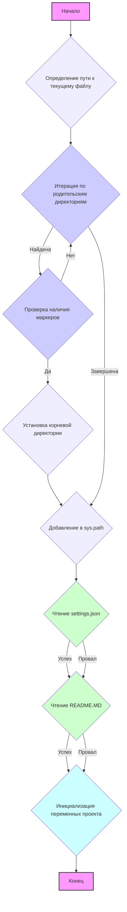

## Анализ кода `hypotez/src/webdriver/firefox/header.py`

### <алгоритм>

1.  **`set_project_root(marker_files)`**:
    *   **Вход:** `marker_files` (кортеж строк, по умолчанию `('pyproject.toml', 'requirements.txt', '.git')`).
    *   **Действие:**
        1.  Определяет абсолютный путь к директории, где находится текущий файл (`__file__`).
        2.  Итерируется по текущей директории и всем её родительским директориям.
        3.  Для каждой директории проверяет, существует ли хотя бы один из файлов/директорий, указанных в `marker_files`.
        4.  Если такой файл/директория найден, устанавливает текущую директорию как корневую директорию проекта (`__root__`) и прекращает поиск.
        5.  Если корневая директория (`__root__`) не находится в `sys.path`, добавляет её в начало.
    *   **Выход:** Абсолютный путь к корневой директории проекта (`Path`).
    *   **Пример:** Если скрипт находится в `hypotez/src/webdriver/firefox`, а файл `pyproject.toml` находится в `hypotez`, то `set_project_root()` вернёт путь к директории `hypotez`.

2.  **Инициализация `__root__`:**
    *   **Действие:** Вызывает функцию `set_project_root()` для определения корневой директории проекта и сохраняет результат в переменную `__root__`.

3.  **Чтение файла `settings.json`:**
    *   **Действие:**
        1.  Формирует путь к файлу `settings.json` внутри директории `src` корневого проекта.
        2.  Пытается открыть `settings.json` и загрузить его содержимое как словарь `settings`.
        3.  Если происходит ошибка (`FileNotFoundError`, `json.JSONDecodeError`), устанавливает `settings` в `None`.
    *   **Пример:**  Файл settings.json может содержать: `{"project_name": "hypotez", "version": "1.0.0", "author": "John Doe"}`

4.  **Чтение файла `README.MD`:**
    *   **Действие:**
        1.  Формирует путь к файлу `README.MD` внутри директории `src` корневого проекта.
        2.  Пытается открыть `README.MD` и прочитать его содержимое в виде строки `doc_str`.
        3.  Если происходит ошибка (`FileNotFoundError`, `json.JSONDecodeError`), устанавливает `doc_str` в `None`.
    *   **Пример:** Файл `README.MD` может содержать описание проекта.

5.  **Инициализация глобальных переменных проекта:**
    *   **Действие:** Инициализирует глобальные переменные `__project_name__`, `__version__`, `__doc__`, `__details__`, `__author__`, `__copyright__`, `__cofee__`, используя данные из словаря `settings` или значения по умолчанию, если `settings` не был загружен.

### <mermaid>



### <объяснение>

#### Импорты
*   **`sys`**: Модуль для работы с системными параметрами и функциями, используется для модификации `sys.path`.
*   **`json`**: Модуль для работы с данными в формате JSON, используется для чтения `settings.json`.
*   **`packaging.version.Version`**: Класс для работы с версиями, в данном файле не используется, но импортируется.
*   **`pathlib.Path`**: Класс для работы с путями к файлам и директориям, используется для определения корневой директории.
*   **`src.gs`**: Модуль, предположительно, содержит глобальные переменные и настройки проекта, импортируется как `gs`.

#### Переменные
*   `MODE`: Строка, указывает режим работы (по умолчанию `'dev'`).
*   `__root__`: Объект `pathlib.Path`, хранит путь к корневой директории проекта.
*   `settings`: Словарь (или `None`), хранит данные из файла `settings.json`.
*   `doc_str`: Строка (или `None`), хранит содержимое файла `README.MD`.
*   `__project_name__`: Строка, имя проекта, берётся из `settings` или по умолчанию `'hypotez'`.
*    `__version__`: Строка, версия проекта, берётся из `settings` или по умолчанию пустая строка.
*   `__doc__`: Строка, документация проекта, берётся из `doc_str` или по умолчанию пустая строка.
*   `__details__`: Строка, детали проекта, пока пустая.
*   `__author__`: Строка, автор проекта, берётся из `settings` или по умолчанию пустая строка.
*   `__copyright__`: Строка, авторские права, берётся из `settings` или по умолчанию пустая строка.
*   `__cofee__`: Строка, приглашение к чашечке кофе разработчику, берётся из `settings` или имеет значение по умолчанию.

#### Функции
*   **`set_project_root(marker_files)`**:
    *   **Аргументы**:
        *   `marker_files`:  `tuple`  из строк, которые определяют корневую директорию.
    *   **Возвращаемое значение**: `pathlib.Path`, путь к корневой директории проекта.
    *   **Назначение**: Поиск корневой директории проекта, начиная с текущего файла и поднимаясь вверх по дереву директорий, пока не будет найдена директория, содержащая один из файлов или директорий, указанных в `marker_files`. Добавляет найденную корневую директорию в `sys.path`.
    *   **Пример**: `set_project_root(marker_files=('pyproject.toml', 'requirements.txt'))` - ищет родительскую директорию, содержащую либо файл `pyproject.toml`, либо `requirements.txt`.

#### Классы
*   Классы не определены в данном файле.

#### Объяснения и взаимосвязи
1. **Определение корневой директории проекта**:
   - Функция `set_project_root` динамически определяет корень проекта, что позволяет запускать скрипт из любого места в структуре проекта. Это достигается через проверку наличия маркерных файлов.
   - Добавление корневого пути в `sys.path` позволяет импортировать модули из других частей проекта, используя относительные пути (например, `from src import gs`).
2. **Загрузка настроек**:
   - Файл `settings.json` содержит настройки проекта, которые загружаются в словарь `settings`. Это позволяет гибко настраивать проект без изменения кода.
   - Использование `try-except` блоков предотвращает ошибки при отсутствии файла или некорректном JSON.
3. **Получение документации**:
   - Содержимое файла `README.MD` загружается в переменную `doc_str`, что позволяет хранить и использовать описание проекта.
   - Аналогично с `settings.json`, используется `try-except` блок для обработки ошибок.
4. **Инициализация глобальных переменных**:
   - Глобальные переменные, такие как `__project_name__`, `__version__`, `__doc__`, `__author__`, и другие, инициализируются на основе настроек из `settings.json` или значений по умолчанию. Это обеспечивает доступ к базовой информации о проекте в различных его частях.
5. **Взаимосвязи**:
   - Данный модуль является частью пакета `src.webdriver.firefox`, и его основная задача - настроить окружение проекта, получить общую информацию о проекте.
   - Модуль `src.gs` содержит общие глобальные переменные и настройки.
   -  Использует модули `json` для работы с JSON, и `pathlib` для работы с путями.
   -  Использует модуль `sys` для работы с системными параметрами, чтобы добавить корень проекта в пути поиска модулей.

#### Потенциальные ошибки и области для улучшения
1.  **Обработка ошибок:**
    *   В `try-except` блоках используется `...`, что затрудняет отладку. Лучше выводить в лог или обрабатывать исключения более конкретно.
    *   Например:
    ```python
        except FileNotFoundError:
           logging.error("settings.json not found")
        except json.JSONDecodeError:
           logging.error("settings.json is corrupted")
    ```
2.  **Устаревшие shebang:**
    *   Строки `#! venv/Scripts/python.exe` и `#! venv/bin/python/python3.12` являются устаревшими shebang и не являются переносимыми между разными ОС.
3. **Наличие `packaging.version.Version`**:
    - `packaging.version.Version` импортируется, но не используется. Это следует исправить, либо удалить импорт, либо добавить функциональность.

В целом, код хорошо структурирован и выполняет свои задачи.