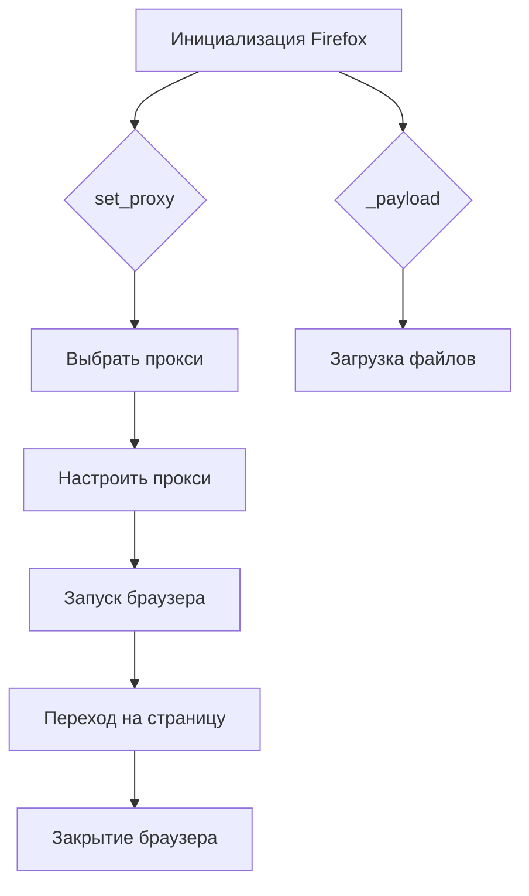

# <input code>

```rst
.. :module: src.webdriver.firefox
```
```
# Модуль для работы с WebDriver Firefox

Этот модуль содержит класс `Firefox`, который расширяет функциональность стандартного WebDriver для Firefox. Он позволяет настраивать пользовательский профиль, запускать WebDriver в киоске и устанавливать настройки прокси-сервера.

## Требования

- Python 3.12+
- Selenium
- Fake User-Agent
- Модуль для работы с прокси

## Установка

1. Установите все зависимости:

   ```bash
   pip install -r requirements.txt
   ```

2. Убедитесь, что у вас установлены следующие компоненты:
   - **geckodriver** (для работы с WebDriver)
   - **Firefox** (поддерживаемая версия)

3. Для работы с прокси, укажите путь к файлу с прокси-серверами через параметр `proxy_file_path`.

## Пример использования

Пример использования класса `Firefox`:

```python
from src.webdriver.firefox import Firefox

if __name__ == "__main__":
    profile_name = "custom_profile"
    geckodriver_version = "v0.29.0"
    firefox_version = "78.0"
    proxy_file_path = "path/to/proxies.txt"

    # Инициализация и запуск браузера
    browser = Firefox(
        profile_name=profile_name, 
        geckodriver_version=geckodriver_version, 
        firefox_version=firefox_version,
        proxy_file_path=proxy_file_path
    )
    browser.get("https://www.example.com")
    browser.quit()
```

## Описание классов и методов

### Класс `Firefox`

- Расширяет стандартный WebDriver для Firefox, добавляя функции:
  - Установка пользовательского профиля
  - Прокси-настройки
  - Установка пользовательского агента
  - Интеграция с JavaScript и исполнение локаторов

#### Конструктор `__init__`

```python
def __init__(self, profile_name: Optional[str] = None,
             geckodriver_version: Optional[str] = None,
             firefox_version: Optional[str] = None,
             user_agent: Optional[str] = None,
             proxy_file_path: Optional[str] = None,
             *args, **kwargs) -> None:
```

- **profile_name**: Имя пользовательского профиля Firefox.
- **geckodriver_version**: Версия geckodriver.
- **firefox_version**: Версия Firefox.
- **user_agent**: Пользовательский агент.
- **proxy_file_path**: Путь к файлу с прокси.

#### Метод `set_proxy`

```python
def set_proxy(self, options: Options) -> None:
```

- Настроит прокси для Firefox, выбрав случайный рабочий прокси из предоставленного файла.

#### Метод `_payload`

```python
def _payload(self) -> None:
```

- Загружает необходимые исполнительные файлы для локаторов и JavaScript.
```

# <algorithm>

**Шаг 1:** Инициализация класса `Firefox`

- Принимает параметры `profile_name`, `geckodriver_version`, `firefox_version`, `user_agent`, `proxy_file_path`.
- Сохраняет эти параметры как атрибуты класса.
- Вызывает метод `set_proxy` для настройки прокси.
- Вызывает метод `_payload` для загрузки необходимых файлов.

**Шаг 2:** Настройка прокси (`set_proxy`)

- Читает прокси из файла, указанного в `proxy_file_path`.
- Выбирает случайный рабочий прокси.
- Настраивает прокси в опциях браузера (options).

**Шаг 3:** Загрузка исполнительных файлов (`_payload`)

- Загружает необходимые файлы для работы с JavaScript и локаторами.

**Шаг 4:** Запуск браузера

- Используется инициализированный объект `browser` класса `Firefox`.
- Вызывается метод `get("https://www.example.com")` для перехода на указанный URL.

**Шаг 5:** Закрытие браузера

- Вызывается метод `quit()` для закрытия браузера.


# <mermaid>



**Объяснение диаграммы:**

Диаграмма отображает последовательность выполнения кода. `A` - это инициализация класса `Firefox`, `B` - вызов метода `set_proxy`, `C` - выбор прокси, `D` - настройка прокси, `E` - вызов метода `_payload`, `F` - загрузка файлов, `G` - запуск браузера, `H` - переход на страницу, `I` - закрытие браузера.

# <explanation>

**Импорты:**

`from src.webdriver.firefox import Firefox`: Импортирует класс `Firefox` из модуля `src.webdriver.firefox`. Это указывает на структуру проекта, где `src` - корневая папка проекта, `webdriver` - папка с драйверами браузеров, а `firefox` - конкретный модуль для работы с Firefox.

**Классы:**

* **`Firefox`**:  Этот класс расширяет функциональность стандартного WebDriver для Firefox. Он предоставляет методы для настройки прокси, профиля, пользовательского агента. Класс взаимодействует с другими модулями проекта (например, с модулем для работы с прокси),  используя соответствующие методы и атрибуты.

**Функции:**

* **`__init__`:** Инициализирует объект `Firefox`, принимая параметры для настройки браузера (профиль, версия geckodriver, версия Firefox, пользовательский агент, прокси).  Это ключевая функция для настройки всех свойств браузера, перед его запуском.
* **`set_proxy`:** Настраивает прокси-сервер для браузера.  Важно для анонимизации.
* **`_payload`:**  (скрытый) Метод скорее всего отвечает за загрузку необходимых библиотек/файлов для работы браузера, например, локаторов, js-кода.

**Переменные:**

Переменные (например, `profile_name`, `geckodriver_version`, `firefox_version`, `proxy_file_path`) определяют параметры запуска браузера.

**Возможные ошибки и улучшения:**

* **Проверка существования файла прокси:** Код должен проверять, что файл `proxy_file_path` существует, и содержат валидные прокси-сервера.
* **Обработка ошибок при чтении прокси:**  Важная добавка - проверка наличия ошибок при чтении файла прокси и обработка возможных исключений (например, `FileNotFoundError`, `IOError`).
* **Логирование:**  Необходимо более подробное логирование, которое будет включать успехи, ошибки, время выполнения.
* **Управление ресурсами:** Закрытие файла прокси после использования, закрытие ресурсов, освобождение памяти.
* **Выбор лучшего прокси:**  Лучше использовать алгоритм для выбора наиболее подходящего прокси, например, по скорости или доступности.
* **Обработка невалидных прокси:**  Необходимо добавить проверку валидности прокси, чтобы избежать использования битых прокси-серверов.


**Взаимосвязи с другими частями проекта:**

Модуль `src.webdriver.firefox` зависит от `Selenium`, `Fake User-Agent`,  и модуля для работы с прокси. Эти зависимости должны быть явно указаны в `requirements.txt`.   Необходимость в таких зависимостях означает, что данный проект, скорее всего, имеет больший контекст (другие части кода,  которые используют этот модуль) и зависит от других модулей `src`.