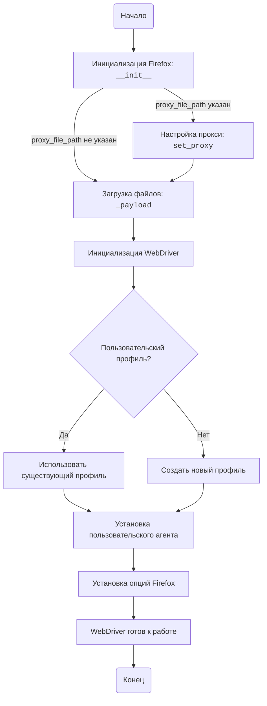

## АНАЛИЗ КОДА: src/webdriver/firefox/readme.ru.md

### 1. <алгоритм>

**Общая схема работы:**

1.  **Инициализация Firefox:**
    *   При создании экземпляра класса `Firefox` вызывается конструктор `__init__`.
    *   Конструктор принимает параметры: `profile_name`, `geckodriver_version`, `firefox_version`, `user_agent`, `proxy_file_path` и `options`.
        *   **Пример:** `browser = Firefox(profile_name="test", geckodriver_version="0.30", firefox_version="90", proxy_file_path="proxies.txt", options=["--headless"])`
    *   Если `proxy_file_path` указан, вызывается метод `set_proxy` для настройки прокси.
        *   **Пример:** Прокси из файла выбирается случайным образом, и прокси-сервер устанавливается в настройках Firefox.
    *   Вызывается метод `_payload`, который загружает необходимые для работы локаторов и JS файлы.
    *   Инициализируется WebDriver с заданными настройками.

2.  **Установка Прокси:**
    *   Метод `set_proxy` вызывается при инициализации, если предоставлен путь к файлу прокси.
        *   **Пример:** Из файла `proxies.txt` загружается список прокси, из которого выбирается случайный рабочий прокси.
    *   Firefox WebDriver настраивается для использования выбранного прокси.

3.  **Настройка Пользовательского Профиля:**
    *   При инициализации `Firefox` может быть указано имя пользовательского профиля, который используется для запуска браузера.
        *   **Пример:** Если `profile_name="custom"`, будет использован или создан профиль "custom".

4.  **Установка Пользовательского Агента:**
    *   При инициализации `Firefox` может быть указан пользовательский агент.
        *   **Пример:** `user_agent="Mozilla/5.0..."`, и это значение будет установлено в настройках браузера.

5.  **Использование WebDriver:**
    *   После инициализации можно использовать методы WebDriver (например, `get`, `quit`).
        *   **Пример:** `browser.get("https://www.example.com")`, `browser.quit()`

6.  **Дополнительные Опции:**
    *   При создании экземпляра `Firefox` можно указать список опций, которые будут переданы в Firefox.
        *   **Пример:** `options=["--kiosk", "--headless"]` - запускает Firefox в киоск-режиме и в headless режиме.

**Блок-схема:**

```
Начало --> Инициализация Firefox
Инициализация Firefox -- Прокси файл указан? --> Да: Установка Прокси
Установка Прокси --> Загрузка Payload
Инициализация Firefox -- Прокси файл не указан? --> Загрузка Payload
Загрузка Payload --> Инициализация WebDriver
Инициализация WebDriver --> Пользовательский профиль? --> Да: Использовать профиль
Пользовательский профиль? --> Нет: Создать профиль
Создать/Использовать Профиль --> Установка пользовательского агента
Установка пользовательского агента --> Установка Опций
Установка Опций --> Конец (Готов к использованию WebDriver)
```

### 2. <mermaid>



**Описание зависимостей `mermaid`:**

*   **FirefoxInit**: Инициализирует класс `Firefox`, вызывая метод `__init__`. Проверяет, был ли указан путь к файлу с прокси.
*   **SetProxy**: Вызывается метод `set_proxy` для настройки прокси, если `proxy_file_path` был указан.
*   **LoadPayload**: Вызывается метод `_payload`, загружающий необходимые файлы.
*   **WebDriverInit**: Инициализирует WebDriver с заданными настройками профиля, прокси и т.д.
*   **ProfileCheck**: Проверяет, был ли указан пользовательский профиль.
*   **UseProfile**: Если профиль указан, использует его для запуска браузера.
*   **CreateProfile**: Если профиль не указан, создает новый профиль для запуска браузера.
*   **SetUserAgent**: Устанавливает пользовательский агент для браузера.
*    **SetOptions**: Устанавливает дополнительные опции, переданные при инициализации Firefox
*   **Ready**: Состояние, когда WebDriver готов к работе.
*   **Start**: Начальная точка процесса.
*   **End**: Конечная точка процесса.

### 3. <объяснение>

**Импорты:**

В явном виде импорты не показаны в предоставленном фрагменте, но предполагается, что проект имеет следующую структуру:

-   `src.webdriver.firefox`: текущий модуль.
-   `selenium`:  используется для управления браузером через WebDriver (основная библиотека для автоматизации браузеров).
-   `fake_useragent`: генерирует поддельные User-Agent (указано в требованиях).
-   Модуль для работы с прокси: (не определен, но необходим для работы с прокси-серверами).

**Класс `Firefox`:**

*   **Роль:** Расширяет базовую функциональность WebDriver для Firefox, добавляя возможность настройки прокси, пользовательского профиля, пользовательского агента, дополнительных опций и загрузки файлов для локаторов и JS.
*   **Атрибуты:**
    -   `profile_name`: Имя профиля Firefox.
    -   `geckodriver_version`: Версия geckodriver.
    -   `firefox_version`: Версия Firefox.
    -   `user_agent`: Пользовательский агент.
    -   `proxy_file_path`: Путь к файлу прокси.
    -   `options`: Список дополнительных опций для Firefox.
*   **Методы:**
    -   `__init__`: Конструктор класса, принимает параметры для настройки Firefox.
    -   `set_proxy`: Настраивает прокси для Firefox.
    -   `_payload`: Загружает необходимые исполняемые файлы.

**Функции:**

*   `__init__` (конструктор):
    -   **Аргументы:**
        -   `profile_name` (str, Optional): Имя профиля.
        -   `geckodriver_version` (str, Optional): Версия geckodriver.
        -   `firefox_version` (str, Optional): Версия Firefox.
        -   `user_agent` (str, Optional): Пользовательский агент.
        -   `proxy_file_path` (str, Optional): Путь к файлу прокси.
        -   `options` (List[str], Optional): Список опций.
        -   `*args`, `**kwargs`:  дополнительные аргументы, которые могут быть переданы в WebDriver.
    -   **Возвращаемое значение:** `None`
    -   **Назначение:** Инициализирует объект `Firefox`, настраивая профиль, прокси, пользовательский агент и опции.
    -   **Пример:**
        ```python
        browser = Firefox(
            profile_name="myprofile",
            geckodriver_version="0.30.0",
            firefox_version="90.0",
            user_agent="Mozilla/5.0...",
            proxy_file_path="proxies.txt",
            options=["--headless"]
        )
        ```
*   `set_proxy`:
    -   **Аргументы:** `options` (selenium.webdriver.firefox.options.Options): Объект опций Firefox.
    -   **Возвращаемое значение:** `None`
    -   **Назначение:** Устанавливает прокси в настройках Firefox, используя случайный рабочий прокси из файла.
    -   **Пример:**
        ```python
        options = Options()
        browser.set_proxy(options)
        ```
*   `_payload`:
    -   **Аргументы:** Нет
    -   **Возвращаемое значение:** `None`
    -   **Назначение:** Загружает необходимые исполняемые файлы для работы с локаторами и JS.

**Переменные:**

*   В коде используются переменные, такие как `profile_name`, `geckodriver_version`, `firefox_version`, `user_agent`, `proxy_file_path` и `options`.
*   Эти переменные хранят конфигурационные данные для настройки WebDriver и Firefox.
*   Типы переменных:
    -   `profile_name`, `geckodriver_version`, `firefox_version`, `user_agent`, `proxy_file_path`: `str` (или `None`).
    -   `options`: `List[str]` (или `None`).

**Потенциальные ошибки и области для улучшения:**

1.  **Обработка ошибок:** В коде не продемонстрирована обработка ошибок, например, ошибки при чтении файла прокси, проблемы с инициализацией WebDriver, и т.д. Рекомендуется добавить блоки `try-except` для обработки исключений.
2.  **Логирование:** Используется `logger` для логирования, но не указано как он сконфигурирован. Рекомендуется добавить конфигурацию логгера для более информативного логирования.
3.  **Зависимость от файла прокси:**  Прокси берутся из файла, и неясно как происходит выбор рабочего прокси. Необходимо уточнить логику выбора, проверки доступности прокси и обработки случаев, когда нет рабочих прокси.
4.  **Версии библиотек:** Жестко заданы версии `geckodriver` и `firefox_version`. Рекомендуется добавить более гибкую систему управления версиями или использовать динамическое определение.
5.  **Модуль для работы с прокси:** Неизвестно, какой именно модуль используется для работы с прокси. Рекомендуется уточнить эту зависимость и предоставить конкретные инструкции по установке.
6.  **Абстракция WebDriver:** Класс `Firefox` не является полностью абстрактным от `selenium.webdriver`. Было бы лучше если бы класс `Firefox` содержал экземпляр `webdriver` и позволял бы вызывать его методы.

**Взаимосвязь с другими частями проекта:**

*   Этот модуль является частью проекта автоматизации браузера.
*   Он взаимодействует с модулем `src.webdriver`, предоставляя конкретную реализацию WebDriver для Firefox.
*   Также вероятно есть взаимодействие с общими модулями конфигурации и логгирования проекта `src`.
*    Также есть взаимодействие с модулями, которые реализуют работу с прокси.

**Заключение:**

Модуль `src.webdriver.firefox` предоставляет удобный интерфейс для инициализации и настройки WebDriver Firefox с возможностью управления профилем, прокси, пользовательским агентом, дополнительными опциями, и загрузкой необходимых файлов для работы с JS и локаторами.