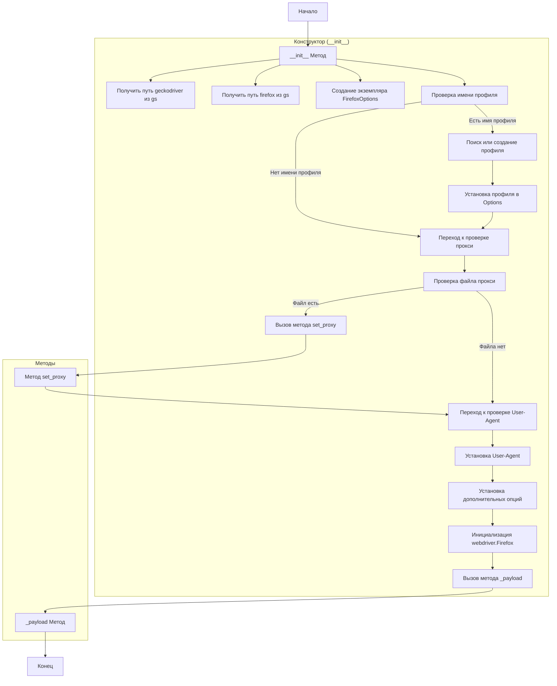
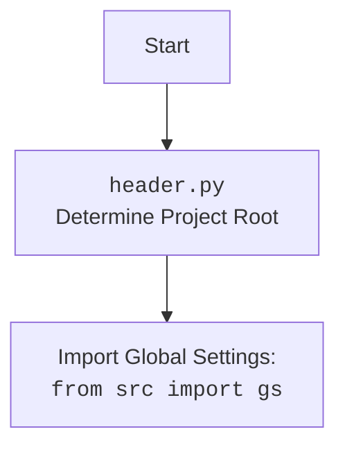

## АНАЛИЗ КОДА: src/webdriver/firefox/readme.ru.md

### 1. <алгоритм>

**Описание процесса работы с `Firefox` WebDriver:**

1.  **Инициализация (Конструктор `__init__`)**:
    *   Принимает параметры для настройки Firefox: `profile_name`, `geckodriver_version`, `firefox_version`, `user_agent`, `proxy_file_path` и `options`.
    *   Определяет пути к драйверу `geckodriver` и бинарнику Firefox, используя глобальные настройки проекта (`gs.get_gecko_driver_path()` и `gs.get_firefox_binary_path()`).
    *   Создает экземпляр `FirefoxOptions` для управления опциями браузера.
    *   Если предоставлен `profile_name`, то ищет существующий профиль или создает новый.
    *   Настраивает прокси, если `proxy_file_path` указан.
    *   Задает пользовательский агент, если он передан.
    *   Добавляет переданные опции (например, `--kiosk`, `--headless`) к опциям браузера.
    *   Инициализирует `webdriver.Firefox` с настроенными параметрами.
    *   Запускает метод `_payload`, который загружает необходимые файлы для JS и локаторов.

    **Пример:**
    ```python
    browser = Firefox(
      profile_name="my_profile",
      geckodriver_version="v0.30.0",
      firefox_version="80.0",
      proxy_file_path="proxies.txt",
      options=["--kiosk"]
    )
    ```

2.  **Настройка прокси (`set_proxy`)**:
    *   Если `proxy_file_path` указан, то считывает список прокси из файла.
    *   Выбирает случайный рабочий прокси из списка.
    *   Устанавливает прокси через `options.proxy`.

    **Пример:**
    ```python
    options = FirefoxOptions()
    self.set_proxy(options)
    ```

3.  **Загрузка ресурсов (`_payload`)**:
    *   Копирует необходимые JavaScript файлы и ресурсы для локаторов в профиль Firefox.

    **Пример:**
    ```python
    self._payload()
    ```

**Поток данных:**

1.  **Входные параметры** (`profile_name`, `geckodriver_version`, `firefox_version`, `user_agent`, `proxy_file_path`, `options`) передаются в конструктор `__init__`.
2.  Конструктор `__init__` использует `global settings` (`gs`) для получения путей к драйверу и бинарнику.
3.  Метод `set_proxy` принимает объект `Options` и настраивает прокси, если необходимо.
4.  Метод `_payload` загружает JS payload в профиль.
5.  Создается экземпляр `webdriver.Firefox` с настроенными опциями.

### 2. <mermaid>





**Анализ диаграммы `mermaid`:**

*   **Start**: Начало процесса инициализации объекта `Firefox`.
*   **`__init__` Method**:  Главная функция, управляющая процессом инициализации.
    *   **GetDriverPath**: Получает путь к `geckodriver` используя `gs` (global settings).
    *   **GetBinaryPath**: Получает путь к бинарному файлу Firefox, используя `gs`.
    *   **CreateOptions**: Создает объект `FirefoxOptions`, который используется для настройки параметров браузера.
    *   **ProfileCheck**: Проверяет, было ли передано имя профиля.
        *   Если **есть имя профиля**, переходит к **FindOrCreateProfile**
        *   Если **нет имени профиля**, переходит к **ProxyCheck**
    *   **FindOrCreateProfile**: Ищет существующий профиль по имени или создает новый, если такового нет.
    *   **SetProfile**: Устанавливает выбранный профиль в объект `FirefoxOptions`.
    *   **ProxyCheck**: Проверка, нужно ли настраивать прокси.
    *   **ProxyFileCheck**: Проверяет, был ли указан путь к файлу прокси.
        *   Если **файл есть**, вызывается **SetProxyCall**, вызывающий метод **SetProxy**.
        *   Если **файла нет**, переходит к **UserAgentCheck**.
    *   **SetProxyCall**: Вызывает метод `set_proxy`.
    *   **SetProxy**: Метод `set_proxy` устанавливает прокси в `FirefoxOptions`.
    *   **UserAgentCheck**: Проверка, нужно ли устанавливать пользовательский агент.
    *   **SetUserAgent**: Устанавливает пользовательский агент, если был передан.
    *    **SetOptions**: Устанавливает дополнительные опции, переданные при инициализации.
    *   **InitWebDriver**: Инициализирует `webdriver.Firefox` с настроенными опциями.
    *   **PayloadCall**: Вызывает метод `_payload`.
    *   **`_payload` Method**: Метод, который загружает необходимые ресурсы для JS и локаторов.
*   **End**: Конец процесса инициализации.

**Зависимости и импорты (из `header.py`):**

*   Из `header.py` импортируется `from src import gs`. Это указывает на то, что данный модуль зависит от глобальных настроек проекта, которые предоставляет объект `gs`. Эти настройки могут включать пути к драйверам и бинарным файлам, а также другие общие параметры проекта.

### 3. <объяснение>

**Импорты:**

*   `from selenium import webdriver`: Импортирует основной модуль WebDriver из библиотеки Selenium, который используется для управления браузерами.
*   `from selenium.webdriver.firefox.options import Options as FirefoxOptions`: Импортирует класс `Options` для настройки параметров Firefox, таких как прокси, пользовательский агент и другие.
*   `from selenium.webdriver.firefox.firefox_profile import FirefoxProfile`:  Импортирует класс для управления профилями Firefox.
*    `from selenium.webdriver.common.proxy import Proxy, ProxyType`: Импортирует классы `Proxy` и `ProxyType` для настройки прокси.
*   `from fake_useragent import UserAgent`: Импортирует класс `UserAgent` из библиотеки `fake-useragent`, который используется для генерации случайных пользовательских агентов.
*   `import logging`: Импортирует модуль `logging` для записи логов.
*   `import os`: Импортирует модуль `os` для работы с файловой системой.
*   `import shutil`: Импортирует модуль `shutil` для операций с файлами и каталогами.
*   `from typing import Optional, List`: Импортирует типы данных `Optional` и `List` для аннотаций типов.
*    `from src import gs`: Импортирует глобальные настройки проекта из пакета `src`.
*   `import random`: Импортирует модуль `random` для генерации случайных чисел, например, при выборе прокси.

**Класс `Firefox`:**

*   **Роль**: Предоставляет расширенные возможности для работы с браузером Firefox через WebDriver. Он инкапсулирует настройку пользовательского профиля, прокси, пользовательского агента и предоставляет возможность передачи опций при инициализации.
*   **Атрибуты**:
    *   `_driver`: Приватный атрибут, хранящий экземпляр `webdriver.Firefox`.
    *   `logger`: Логгер для записи сообщений.
*   **Методы**:
    *   `__init__(...)`: Конструктор, инициализирует WebDriver с заданными параметрами.
    *   `set_proxy(options: Options) -> None`: Настраивает прокси для Firefox.
    *   `_payload() -> None`: Загружает необходимые файлы для JS и локаторов.
    *   `get(...)`: Переопределяет метод для добавления ожидания после загрузки страницы.
    *   `__getattr__(...)`: Перенаправляет вызовы методов к внутреннему экземпляру WebDriver (`_driver`).

**Функции:**

*   `__init__`:
    *   **Аргументы**:
        *   `profile_name` (Optional[str]): Имя профиля Firefox.
        *   `geckodriver_version` (Optional[str]): Версия `geckodriver`.
        *   `firefox_version` (Optional[str]): Версия Firefox.
        *   `user_agent` (Optional[str]): Пользовательский агент.
        *   `proxy_file_path` (Optional[str]): Путь к файлу с прокси.
        *   `options` (Optional[List[str]]): Список опций Firefox.
        *   `*args`, `**kwargs`: Дополнительные позиционные и именованные аргументы, которые могут быть переданы в `webdriver.Firefox`.
    *   **Возвращает**: `None`.
    *   **Назначение**: Инициализирует объект `Firefox`, настраивая WebDriver с заданными параметрами.
*   `set_proxy`:
    *   **Аргументы**: `options` (`Options`): Объект `FirefoxOptions` для настройки прокси.
    *   **Возвращает**: `None`.
    *   **Назначение**: Устанавливает прокси для Firefox, выбирая случайный прокси из файла, если `proxy_file_path` указан.
*   `_payload`:
    *   **Аргументы**: Нет.
    *   **Возвращает**: `None`.
    *   **Назначение**: Копирует необходимые JavaScript файлы и ресурсы для локаторов в профиль Firefox.

**Переменные:**

*   `profile_path`: Путь к пользовательскому профилю Firefox.
*    `geckodriver_path`: Путь к `geckodriver`, полученный из глобальных настроек проекта (`gs`).
*   `firefox_binary_path`: Путь к бинарнику Firefox, полученный из глобальных настроек проекта (`gs`).
*   `options`: Экземпляр класса `FirefoxOptions`, используемый для настройки Firefox.
*   `user_agent`: Пользовательский агент, может быть получен из `fake_useragent` или передан.
*   `proxies`: Список прокси-серверов, загруженных из файла.
*   `proxy`: Экземпляр `Proxy` для установки прокси в Firefox.

**Потенциальные ошибки и области для улучшения:**

1.  **Обработка ошибок файла прокси**: Если файл прокси не существует или пуст, может возникнуть ошибка. Следует добавить более надежную обработку ошибок, например, проверку существования файла и его содержимого.
2.  **Обработка ошибок при чтении прокси**: В методе `set_proxy` отсутствует обработка потенциальных исключений, которые могут возникнуть при чтении файла с прокси.
3.  **Управление файлами профиля**: При создании нового профиля, если имя профиля уже существует, может возникнуть конфликт. Возможно, следует предусмотреть механизм удаления или переименования старого профиля.
4.  **Логирование**: Логирование можно сделать более информативным, добавляя уровни логирования для различных событий.

**Взаимосвязь с другими частями проекта:**

*   Импорт `from src import gs` показывает связь с модулем глобальных настроек проекта.
*   Класс использует модуль `fake_useragent`, что указывает на связь с модулем для генерации поддельных пользовательских агентов.
*   Использует модуль `logging` для логирования событий, что позволяет отслеживать работу модуля.

В заключение, модуль предоставляет функциональность для гибкой настройки Firefox WebDriver, включая пользовательские профили, прокси, пользовательские агенты и дополнительные опции. Он обеспечивает интеграцию с другими частями проекта, такими как глобальные настройки и модуль генерации пользовательских агентов.