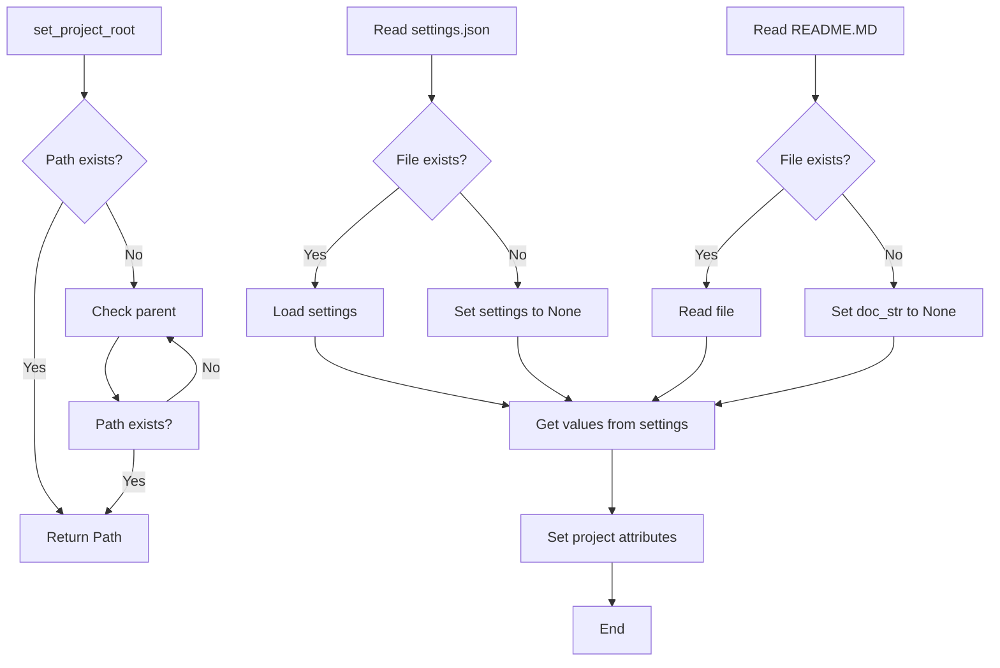

# <input code>

```python
## \file hypotez/src/webdriver/header.py
# -*- coding: utf-8 -*-\
#! venv/Scripts/python.exe
#! venv/bin/python/python3.12

"""
.. module: src.webdriver 
	:platform: Windows, Unix
	:synopsis:

"""
MODE = 'dev'

import sys
import json
from packaging.version import Version

from pathlib import Path
def set_project_root(marker_files=('pyproject.toml', 'requirements.txt', '.git')) -> Path:
    """ Finds the root directory of the project starting from the current file's directory,
    searching upwards and stopping at the first directory containing any of the marker files.

    Args:
        marker_files (tuple): Filenames or directory names to identify the project root.
    
    Returns:
        Path: Path to the root directory if found, otherwise the directory where the script is located.
    """
    __root__:Path
    current_path:Path = Path(__file__).resolve().parent
    __root__ = current_path
    for parent in [current_path] + list(current_path.parents):
        if any((parent / marker).exists() for marker in marker_files):
            __root__ = parent
            break
    if __root__ not in sys.path:
        sys.path.insert(0, str(__root__))
    return __root__


# Get the root directory of the project
__root__ = set_project_root()
"""__root__ (Path): Path to the root directory of the project"""

from src import gs

settings:dict = None
try:
    with open(gs.path.root / 'src' /  'settings.json', 'r') as settings_file:
        settings = json.load(settings_file)
except (FileNotFoundError, json.JSONDecodeError):
    ...

doc_str:str = None
try:
    with open(gs.path.root / 'src' /  'README.MD', 'r') as settings_file:
        doc_str = settings_file.read()
except (FileNotFoundError, json.JSONDecodeError):
    ...


__project_name__ = settings.get("project_name", 'hypotez') if settings  else 'hypotez'
__version__: str = settings.get("version", '')  if settings  else ''
__doc__: str = doc_str if doc_str else ''
__details__: str = ''
__author__: str = settings.get("author", '')  if settings  else ''
__copyright__: str = settings.get("copyrihgnt", '')  if settings  else ''
__cofee__: str = settings.get("cofee", "Treat the developer to a cup of coffee for boosting enthusiasm in development: https://boosty.to/hypo69")  if settings  else "Treat the developer to a cup of coffee for boosting enthusiasm in development: https://boosty.to/hypo69"
```

# <algorithm>

**Шаг 1:** Функция `set_project_root`.  Находит корневую директорию проекта, начиная с текущей директории и идя вверх по дереву директорий.
    * **Вход:** Кортеж `marker_files` с именами файлов, которые указывают на корень проекта.
    * **Выход:** Объект `Path` с путем к корневой директории проекта.
    * **Пример:** Если `marker_files` содержит `pyproject.toml`, и этот файл находится в родительской директории, то функция вернет путь к этой родительской директории.
    * **Логика:** Итерируется по родительским директориям текущей директории. Если в какой-то директории есть один из файлов в `marker_files`, то функция возвращает путь к этой директории. Если ни в одной из директорий нет файла, то возвращается путь к исходной директории.  Добавляет корневую директорию в `sys.path`.

**Шаг 2:** `__root__ = set_project_root()`.  Вызов функции для определения корня проекта.

**Шаг 3:** Чтение `settings.json` и `README.MD` из корня проекта.
    * **Вход:** Пути к файлам относительно корня проекта.
    * **Выход:** Словарь `settings` (из `settings.json`) и строка `doc_str` (из `README.MD`).
    * **Пример:** Если `settings.json` существует и содержит корректные данные, `settings` будет содержать эти данные. Если файл не найден или поврежден, `settings` остается `None`.
    * **Логика:** Используются `try-except` блоки для обработки `FileNotFoundError` и `json.JSONDecodeError` в случае проблем с чтением файлов.


**Шаг 4:** Получение значений из `settings`.
    * **Вход:** Словарь `settings`.
    * **Выход:** Переменные `__project_name__`, `__version__`, `__doc__`, `__details__`, `__author__`, `__copyright__`, `__cofee__`.
    * **Пример:** Если `settings` содержит `project_name: "MyProject"`, то `__project_name__` примет значение `"MyProject"`.
    * **Логика:** Используется функция `get()` для безопасного извлечения значений из словаря `settings`. Если ключ не найден, используется значение по умолчанию.


# <mermaid>




# <explanation>

**Импорты:**

* `sys`: Предоставляет доступ к системным параметрам и функциям, в частности, к `sys.path` для управления путями поиска модулей.
* `json`:  Для работы с JSON-данными, в частности для загрузки `settings.json`.
* `packaging.version`: Для работы с версиями пакетов (не используется напрямую, но импортирован).
* `pathlib`: Для работы с путями к файлам (объекты Path).
* `src.gs`: (Подразумевается), модуль, вероятно, содержащий функции для работы с ресурсами проекта, по имени `gs` и `gs.path.root`.


**Классы:**

В коде нет классов.

**Функции:**

* `set_project_root(marker_files)`: Находит корневую директорию проекта.  Аргументы: кортеж `marker_files` с именами файлов для поиска корня. Возвращает `Path` объект корня проекта или директорию текущего скрипта. Это полезно, чтобы определять пути к файлам относительно корня проекта, чтобы скрипты работали одинаково на разных системах.

**Переменные:**

* `MODE`: Строковая переменная, вероятно, используемая для выбора режима работы приложения ('dev' — возможно, для разработки).
* `__root__`: Путь к корневой директории проекта.
* `settings`: Словарь, содержащий настройки проекта, загруженный из `settings.json`.
* `doc_str`: Строка, содержащая текст файла `README.MD`.
* `__project_name__`, `__version__`, `__doc__`, `__details__`, `__author__`, `__copyright__`, `__cofee__`: Строковые переменные, содержащие информацию о проекте (из `settings.json` или значения по умолчанию).

**Возможные ошибки и улучшения:**

* **Обработка ошибок:** `try-except` блоки для обработки `FileNotFoundError` и `json.JSONDecodeError` при чтении файлов — это хорошо. Можно добавить более подробные сообщения об ошибках. Например, вместо `...` можно вывести информацию о том, что файл не найден или некорректный формат.
* **Типы данных:** Можно указать более точные типы для переменных, используя аннотации типов (как сделано для функции `set_project_root`).
* **Детализация логики:**  Подробно описать, что делает `gs.path.root`.  Без контекста `gs` непонятно, из какого модуля или класса она берется.

**Взаимосвязь с другими частями проекта:**

Модуль `gs` (и `gs.path.root`) связывает текущий скрипт с другими модулями проекта, вероятно, через общую систему управления файлами или ресурсами. Необходимо знать содержимое `gs`, чтобы увидеть полную картину.


**Общее впечатление:**

Код организован достаточно хорошо, есть комментарии и аннотации. Важно понимать контекст `gs`, чтобы оценить полную картину взаимодействия с другими частями приложения.