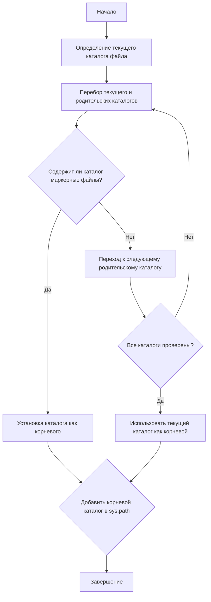

### **Анализ кода `hypotez/src/webdriver/header.py`**

#### 1. **<алгоритм>**:

1. **`set_project_root(marker_files)`**:
   - Начинает поиск корневого каталога проекта от текущего файла (`__file__`).
   - Определяет текущий каталог как начальную точку поиска.
   - Перебирает текущий каталог и его родительские каталоги.
   - Проверяет, содержит ли какой-либо из каталогов маркерные файлы (например, `__root__`, `.git`).
   - Если маркерный файл найден, устанавливает этот каталог как корневой и прекращает поиск.
   - Добавляет корневой каталог в `sys.path`, если его там еще нет.
   - Возвращает путь к корневому каталогу.

   Пример:
   - Если `__file__` находится в `/path/to/project/src/webdriver/header.py`, и `/path/to/project` содержит файл `.git`, то функция вернет `/path/to/project`.

2. **`__root__ = set_project_root()`**:
   - Вызывает функцию `set_project_root()` для определения корневого каталога проекта.
   - Присваивает возвращенное значение переменной `__root__`.

#### 2. **<mermaid>**:

**Объяснение зависимостей**:
- `import sys`: Используется для добавления корневого каталога проекта в `sys.path`, что позволяет импортировать модули из этого каталога.
- `import json`: Не используется в данном коде.
- `from packaging.version import Version`: Не используется в данном коде.
- `from pathlib import Path`: Используется для работы с путями к файлам и каталогам.

#### 3. **<объяснение>**:

**Импорты**:
- `sys`: Предоставляет доступ к некоторым переменным и функциям, взаимодействующим с интерпретатором Python. В данном случае используется для добавления корневого каталога проекта в `sys.path`.
- `json`: Хотя импортирован, не используется в предоставленном коде. Возможно, остался от предыдущих версий или будет использоваться в будущем.
- `packaging.version.Version`: Хотя импортирован, не используется в предоставленном коде. Возможно, остался от предыдущих версий или будет использоваться в будущем.
- `pathlib.Path`: Используется для представления путей к файлам и каталогам, упрощая операции с файловой системой.

**Классы**:
- Нет классов в данном коде.

**Функции**:
- `set_project_root(marker_files: tuple[str, ...]) -> Path`:
    - **Аргументы**:
        - `marker_files` (tuple): Кортеж имен файлов или каталогов, используемых для определения корневого каталога проекта. По умолчанию `('__root__', '.git')`.
    - **Возвращаемое значение**:
        - `Path`: Путь к корневому каталогу проекта.
    - **Назначение**:
        - Определяет корневой каталог проекта, начиная поиск от текущего файла и двигаясь вверх по дереву каталогов. Поиск останавливается, когда найден каталог, содержащий один из маркерных файлов.

**Переменные**:
- `__root__` (Path): Путь к корневому каталогу проекта. Инициализируется результатом вызова `set_project_root()`.

**Потенциальные ошибки и области для улучшения**:
- Импорты `json` и `packaging.version.Version` не используются в коде. Рекомендуется удалить неиспользуемые импорты для повышения читаемости кода.

**Взаимосвязи с другими частями проекта**:
- Этот модуль используется для определения корневого каталога проекта, что позволяет другим модулям правильно импортировать необходимые ресурсы и модули. Добавление корневого каталога в `sys.path` обеспечивает доступность модулей проекта из любого места.