## ИНСТРУКЦИЯ:

Анализируй предоставленный код подробно и объясни его функциональность. Ответ должен включать три раздела:

1.  **<алгоритм>**: Опиши рабочий процесс в виде пошаговой блок-схемы, включая примеры для каждого логического блока, и проиллюстрируй поток данных между функциями, классами или методами.
2.  **<mermaid>**: Напиши код для диаграммы в формате `mermaid`, проанализируй и объясни все зависимости,
    которые импортируются при создании диаграммы.
    **ВАЖНО!** Убедитесь, что все имена переменных, используемые в диаграмме `mermaid`,
    имеют осмысленные и описательные имена. Имена переменных вроде `A`, `B`, `C`, и т.д., не допускаются!

    **Дополнительно**: Если в коде есть импорт `import header`, добавьте блок `mermaid` flowchart, объясняющий `header.py`:
    ```mermaid
    flowchart TD
        Start --> Header[<code>header.py</code><br> Determine Project Root]

        Header --> import[Import Global Settings: <br><code>from src import gs</code>]
    ```

3.  **<объяснение>**: Предоставьте подробные объяснения:
    *   **Импорты**: Их назначение и взаимосвязь с другими пакетами `src.`.
    *   **Классы**: Их роль, атрибуты, методы и взаимодействие с другими компонентами проекта.
    *   **Функции**: Их аргументы, возвращаемые значения, назначение и примеры.
    *   **Переменные**: Их типы и использование.
    *   Выделите потенциальные ошибки или области для улучшения.

Дополнительно, постройте цепочку взаимосвязей с другими частями проекта (если применимо).

Это обеспечивает всесторонний и структурированный анализ кода.
## Формат ответа: `.md` (markdown)
**КОНЕЦ ИНСТРУКЦИИ**

## <алгоритм>

```mermaid
graph LR
    A[Начало] --> B{Получение пути к текущему файлу};
    B --> C{Установка текущего каталога как корневого};
    C --> D{Итерация по родительским каталогам};
    D -- "Найдено маркерное имя" --> E{Обновление корневого каталога};
    D -- "Маркерное имя не найдено" --> D;
    D -- "Все родительские каталоги проверены" --> F{Проверка пути корня в sys.path};
    E --> F;
    F -- "Корневой каталог в sys.path" --> G{Возврат корня};
    F -- "Корневой каталог не в sys.path" --> H{Добавление пути корня в sys.path};
    H --> G;
    G --> I{Импорт глобальных настроек src.gs};
     I --> J{Попытка загрузки settings.json};
    J -- "Файл найден и JSON валидный" --> K{Загрузка настроек};
    J -- "Файл не найден или JSON не валидный" --> L{Пропуск загрузки настроек};
    K --> M{Попытка чтения README.MD};
    L --> M;
    M -- "Файл найден" --> N{Чтение README.MD};
    M -- "Файл не найден" --> O{Пропуск чтения README.MD};
    N --> P{Получение значений настроек};
    O --> P;
    P --> Q[Конец];

    style A fill:#f9f,stroke:#333,stroke-width:2px
    style Q fill:#f9f,stroke:#333,stroke-width:2px

    style B fill:#ccf,stroke:#333,stroke-width:1px
    style C fill:#ccf,stroke:#333,stroke-width:1px
    style D fill:#ccf,stroke:#333,stroke-width:1px
    style E fill:#ccf,stroke:#333,stroke-width:1px
    style F fill:#ccf,stroke:#333,stroke-width:1px
    style G fill:#ccf,stroke:#333,stroke-width:1px
    style H fill:#ccf,stroke:#333,stroke-width:1px
     style I fill:#ccf,stroke:#333,stroke-width:1px
     style J fill:#ccf,stroke:#333,stroke-width:1px
      style K fill:#ccf,stroke:#333,stroke-width:1px
      style L fill:#ccf,stroke:#333,stroke-width:1px
        style M fill:#ccf,stroke:#333,stroke-width:1px
         style N fill:#ccf,stroke:#333,stroke-width:1px
            style O fill:#ccf,stroke:#333,stroke-width:1px
             style P fill:#ccf,stroke:#333,stroke-width:1px
```



**Примеры для блоков:**

*   **B (Получение пути к текущему файлу):** Если файл `header.py` находится в `/home/user/project/src/webdriver/`, то путь будет `/home/user/project/src/webdriver/header.py`.
*   **C (Установка текущего каталога как корневого):** Изначально корневой каталог устанавливается как `/home/user/project/src/webdriver/`.
*   **D (Итерация по родительским каталогам):**  Проверяются каталоги: `/home/user/project/src/webdriver/`, `/home/user/project/src/`, `/home/user/project/`, `/home/user/`.
*   **E (Обновление корневого каталога):** Если в `/home/user/project/` есть файл `__root__`, то корневым каталогом станет `/home/user/project/`.
*  **F (Проверка пути корня в sys.path):** Проверяется, есть ли `/home/user/project/` в списке путей Python.
*   **H (Добавление пути корня в sys.path):** Если  `/home/user/project/`  не в `sys.path`, то он добавляется в начало списка.
*   **J (Попытка загрузки settings.json):** Файл `/home/user/project/src/settings.json`  открывается для чтения.
*   **K (Загрузка настроек):**  Если  `settings.json`  содержит, например,  `{"project_name": "hypotez", "version": "1.0.0"}`,  то переменная  `settings`  получит это значение.
*    **M (Попытка чтения README.MD):** Файл `/home/user/project/src/README.MD`  открывается для чтения.
*   **N (Чтение README.MD):** Содержимое `README.MD` записывается в переменную `doc_str`.
*   **P (Получение значений настроек):** Переменные `__project_name__`, `__version__` и т.д. получают значения из `settings` (если они есть).

## <mermaid>

```mermaid
flowchart TD
    Start --> Header[<code>header.py</code><br> Determine Project Root]
     Header --> Import_sys[Import sys]
    Header --> Import_json[Import json]
    Header --> Import_Version[Import Version from packaging.version]
    Header --> Import_Path[Import Path from pathlib]
    Header --> Set_Project_Root[<code>set_project_root()</code> function]
    Set_Project_Root --> Find_Root_Directory[Find root directory with marker files]
    Find_Root_Directory --> Update_Sys_Path[Update <code>sys.path</code>]
    Update_Sys_Path --> Root_Path[Return Root Path]
    Root_Path -->  Set_Root_Variable[Set <code>__root__</code> variable]
    Set_Root_Variable --> Import_gs[Import Global Settings: <br><code>from src import gs</code>]
    Import_gs --> Load_Settings[Try to load settings from <code>settings.json</code>]
        Load_Settings --> Load_Doc[Try to load doc from <code>README.MD</code>]
        Load_Doc --> Set_Global_Variables[Set Global variables <code>__project_name__</code>, <code>__version__</code> and etc.]

    
     style Start fill:#f9f,stroke:#333,stroke-width:2px
```

**Анализ зависимостей:**

*   `sys`: Модуль `sys` используется для взаимодействия с интерпретатором Python. В данном коде он применяется для добавления пути к корневой директории проекта в `sys.path`, что позволяет импортировать модули из этого каталога.
*   `json`: Модуль `json` используется для работы с JSON-форматом данных. В этом коде он применяется для загрузки настроек из файла `settings.json`.
*    `packaging.version`: Модуль `packaging.version` используется для работы с версиями программного обеспечения, что позволяет сравнивать и анализировать версии. В данном коде он не используется напрямую, но импортируется для возможного использования в будущем.
*   `pathlib.Path`:  `Path` из модуля `pathlib` используется для работы с путями к файлам и директориям в объектно-ориентированном стиле. Это делает код более читаемым и кроссплатформенным.

## <объяснение>

### Импорты:

*   **`import sys`**: Этот модуль предоставляет доступ к некоторым переменным и функциям, которые взаимодействуют с интерпретатором Python. В данном коде используется для добавления корневого каталога проекта в список путей поиска модулей (`sys.path`).
*   **`import json`**: Модуль `json` используется для работы с данными в формате JSON (JavaScript Object Notation). В коде он применяется для загрузки настроек из файла `settings.json` в словарь Python.
*    **`from packaging.version import Version`**: Импортирует класс `Version` для работы с версиями. В коде напрямую не используется, но импортируется для возможного использования.
*   **`from pathlib import Path`**: Класс `Path` из модуля `pathlib` предоставляет объектно-ориентированный способ работы с путями к файлам и директориям. В коде используется для манипуляции путями, что делает его более читаемым и кроссплатформенным.
*  **`from src import gs`**: Импортирует модуль `gs` из пакета `src`. Предположительно, `gs` содержит глобальные настройки или константы, используемые в проекте. В данном случае, он используется для доступа к `gs.path.root`, который должен быть определен в модуле `gs`.

### Функция `set_project_root`:

*   **Аргументы**: `marker_files` (tuple) - список имен файлов или каталогов, которые используются для определения корневого каталога проекта. По умолчанию `('__root__',)`
*   **Возвращаемое значение**: `Path` - объект, представляющий путь к корневому каталогу проекта.
*   **Назначение**: Функция находит корневой каталог проекта, проходя вверх по иерархии каталогов от текущего файла, пока не встретится каталог, содержащий один из файлов или каталогов из `marker_files`.  Если такой каталог не найден, функция возвращает каталог, в котором находится файл скрипта. После нахождения корня, добавляет его в `sys.path`, чтобы можно было импортировать модули из этого каталога.
*   **Примеры**:
    *   Если файл `header.py` находится в `/home/user/project/src/webdriver/` и в каталоге `/home/user/project/` есть файл с именем `__root__`, функция вернет `Path('/home/user/project/')`.
    *   Если файл `header.py` находится в `/home/user/project/src/webdriver/` и ни в одном из родительских каталогов нет файла с именем `__root__`, функция вернет `Path('/home/user/project/src/webdriver/')`.
    * Если `marker_files = ('my_marker',)` и маркерный файл не найден, вернётся каталог где лежит файл `header.py`
*   **Поток данных**: Функция сначала определяет путь к файлу, затем итерируется по родительским каталогам, проверяя наличие маркерных файлов, затем добавляет путь в sys.path и возвращает путь к корню.

### Переменные:

*   **`MODE` (str)**: Глобальная переменная, определяющая режим работы приложения ('dev' по умолчанию).
*   **`__root__` (Path)**: Переменная, хранящая путь к корневому каталогу проекта, полученный в результате работы функции `set_project_root()`.
*   **`settings` (dict)**: Словарь, содержащий настройки проекта, загруженные из файла `settings.json`. Если загрузка не удалась, значение будет `None`.
*   **`doc_str` (str)**:  Строка, содержащая содержимое файла `README.MD`. Если чтение не удалась, значение будет `None`.
*    **`__project_name__` (str)**: Имя проекта, по умолчанию "hypotez".
*    **`__version__` (str)**: Версия проекта.
*   **`__doc__` (str)**: Описание проекта.
*   **`__details__` (str)**: Детальное описание (по умолчанию пустая строка).
*   **`__author__` (str)**: Автор проекта.
*   **`__copyright__` (str)**: Информация об авторских правах.
*  **`__cofee__` (str)**: Сообщение для поддержки автора.

### Цепочка взаимосвязей с другими частями проекта:

1.  **`set_project_root`**: Находит корневую директорию, это важно для определения путей к файлам конфигурации и модулям проекта.
2.  **`import src.gs`**: Импортирует глобальные настройки, что позволяет получить доступ к общим параметрам и константам. `gs.path.root` используется для построения путей к файлам настроек (`settings.json`) и документации (`README.MD`).
3.  **Загрузка настроек**: `settings.json` загружается и используется для инициализации глобальных переменных проекта (имя, версия, автор и т.д.).
4.  **Чтение README.MD**:  Содержимое файла `README.MD` используется для документации проекта.

### Потенциальные ошибки и области для улучшения:

*   **Обработка ошибок:** Код использует `try-except` для обработки ошибок при чтении файлов `settings.json` и `README.MD`, но просто пропускает ошибку (`...`). Было бы полезно добавить логирование ошибок или предоставить пользователю более информативное сообщение.
*   **`settings.json` и `README.MD`**: Жестко заданные имена файлов и их расположение, лучше сделать их настраиваемыми.
*   **Использование `gs.path.root`**: Предполагается, что `gs` всегда корректно инициализировано. Важно убедиться, что модуль `gs`  инициализируется до `header.py`.
*   **Маркерные файлы**: Использование `__root__` как маркера может быть неочевидным. Можно рассмотреть возможность использования более стандартного подхода, например, `.git` директории.

Этот анализ обеспечивает полное представление о структуре, функциях и зависимостях `header.py` в рамках проекта.