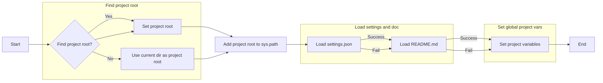
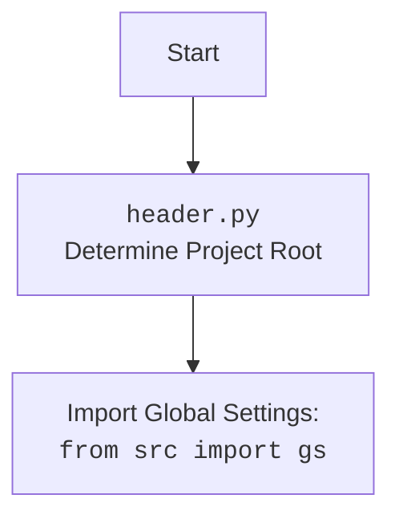

## АНАЛИЗ КОДА `src/webdriver/header.py`

### 1. <алгоритм>

**Блок-схема:**



**Примеры для каждого логического блока:**

1.  **Start:** Начало выполнения скрипта `header.py`.

2.  **Find project root?:** Проверка наличия маркерных файлов (`__root__`, `.git`) в текущей директории или родительских.
    *   **Пример (Yes):** Если `.git` найден в `/home/user/project`, корневой директорией будет `/home/user/project`.
    *   **Пример (No):** Если ни один из маркерных файлов не найден, корневой директорией будет директория, где находится `header.py` (например, `/home/user/project/src/webdriver`).

3.  **Set project root:** Устанавливает переменную `__root__` в найденную корневую директорию.
    *   **Пример:** `__root__` = `Path('/home/user/project')`.

4.  **Use current dir as project root:** Устанавливает переменную `__root__` в директорию, где находится `header.py`.
    *   **Пример:** `__root__` = `Path('/home/user/project/src/webdriver')`

5.  **Add project root to sys.path:** Добавляет корневую директорию в `sys.path`, чтобы можно было импортировать модули из нее.
    *   **Пример:** `sys.path` = `['/home/user/project', ...]`

6. **Load settings.json:** Пытается загрузить `settings.json` из `src/settings.json` относительно корневой директории.
    *   **Пример (Success):** Загружает JSON-объект из файла.
    *   **Пример (Fail):**  Если файл не найден или JSON не валиден, `settings` остается `None`.

7.  **Load README.md:** Пытается загрузить `README.md` из `src/README.MD` относительно корневой директории.
    *   **Пример (Success):** Загружает содержимое файла в виде строки.
    *   **Пример (Fail):** Если файл не найден, то `doc_str` будет `None`.
    
8.  **Set project variables:** Устанавливает глобальные переменные: `__project_name__`, `__version__`, `__doc__`, `__details__`, `__author__`, `__copyright__`, `__cofee__`, извлекая их из `settings` и `doc_str`. Используются значения по умолчанию, если не указаны в `settings` или `doc_str`.

9.  **End:** Завершение выполнения скрипта.

### 2. <mermaid>

```mermaid
flowchart TD
    Start[Start <code>header.py</code>] --> FindRoot[<code>set_project_root()</code>: Find Project Root];
    FindRoot --> AddPath[Add Project Root to <code>sys.path</code>];
    AddPath --> LoadSettings[Load <code>settings.json</code>];
    LoadSettings -- Success --> LoadReadme[Load <code>README.MD</code>];
    LoadSettings -- Fail --> LoadReadme
    LoadReadme -- Success --> SetVars[Set Global Project Variables];
    LoadReadme -- Fail --> SetVars
    SetVars --> End[End <code>header.py</code>];

    subgraph "Project Root Discovery"
        FindRoot
    end

    subgraph "Global settings load"
        LoadSettings
        LoadReadme
    end
    
    subgraph "Variables initialization"
       SetVars
    end
    
    style Start fill:#f9f,stroke:#333,stroke-width:2px
    style End fill:#f9f,stroke:#333,stroke-width:2px
```

**Описание зависимостей:**

*   **`Start`:** Начало выполнения скрипта.
*   **`FindRoot`:** Вызов функции `set_project_root()`, которая определяет корневую директорию проекта на основе наличия маркерных файлов.
*   **`AddPath`:** Добавление пути к корневой директории в `sys.path` для возможности импорта модулей.
*  **`LoadSettings`**: Загружает файл `settings.json`, находящийся в `src/settings.json` относительно корневой директории.
*   **`LoadReadme`:** Загрузка файла `README.MD`, находящегося в `src/README.MD` относительно корневой директории.
*   **`SetVars`**: Присваивание глобальных переменных, таких как `__project_name__`, `__version__` и т.д., значения из файла настроек или значения по умолчанию.
*   **`End`:** Завершение выполнения скрипта.

**Дополнительно:**



### 3. <объяснение>

**Импорты:**

*   `import sys`: Используется для доступа к системным переменным и функциям, таким как `sys.path` для модификации путей поиска модулей.
*   `import json`: Используется для работы с файлами JSON, а именно для загрузки данных из `settings.json`.
*   `from packaging.version import Version`: Импортирует класс `Version` из библиотеки `packaging` для сравнения версий программного обеспечения, но в данном коде он не используется.
*   `from pathlib import Path`: Используется для работы с путями к файлам и директориям в кросс-платформенном виде.
*   `from src import gs`: Импортирует глобальные настройки из пакета `src`.

**Функции:**

*   **`set_project_root(marker_files: tuple = ('__root__', '.git')) -> Path`**:
    *   **Аргументы**: `marker_files` (кортеж строк) – список файлов или директорий, которые используются для определения корневой директории проекта. По умолчанию используются `__root__` и `.git`.
    *   **Возвращаемое значение**: `Path` – объект, представляющий путь к корневой директории проекта.
    *   **Назначение**: Определяет корневую директорию проекта, начиная с директории файла и двигаясь вверх по родительским директориям, пока не будет найден маркерный файл/директория. Если не найдено, возвращается директория текущего файла.
    *   **Пример**: Если скрипт находится в `/home/user/project/src/webdriver`, и в `/home/user/project` есть директория `.git`, то функция вернет `Path('/home/user/project')`.

**Переменные:**

*   `__root__` (Path): Путь к корневой директории проекта. Определяется в начале скрипта и используется для доступа к другим файлам проекта.
*   `settings` (dict): Словарь, загруженный из файла `settings.json`. Содержит настройки проекта.
*   `doc_str` (str): Строка, содержащая содержимое файла `README.MD`.
*   `__project_name__` (str): Имя проекта, извлеченное из `settings.json` или по умолчанию `'hypotez'`.
*   `__version__` (str): Версия проекта, извлеченная из `settings.json` или пустая строка.
*   `__doc__` (str): Содержимое файла `README.MD` или пустая строка.
*  `__details__` (str): Пустая строка.
*   `__author__` (str): Автор проекта, извлеченный из `settings.json` или пустая строка.
*   `__copyright__` (str): Авторские права проекта, извлеченные из `settings.json` или пустая строка.
*    `__cofee__` (str): Сообщение с предложением угостить разработчика кофе, извлеченное из `settings.json` или по умолчанию `"Treat the developer to a cup of coffee for boosting enthusiasm in development: https://boosty.to/hypo69"`.

**Объяснение:**

Этот скрипт `header.py` является частью более крупного проекта и служит для определения корневой директории проекта и загрузки основных настроек. Он выполняет следующие шаги:

1.  **Определение корневой директории:** Функция `set_project_root` ищет маркерные файлы (например, `.git` или `__root__`) в родительских директориях, чтобы определить корневую директорию проекта. Это обеспечивает гибкость в структуре проекта и возможность запуска скриптов из разных мест.
2.  **Добавление корневой директории в `sys.path`**: Это делается для того, чтобы можно было импортировать модули из пакета `src` (такие как `gs`) и другие части проекта.
3.  **Загрузка настроек из `settings.json`:** Скрипт пытается загрузить настройки проекта из файла `src/settings.json`, который находится в корневой директории. Если файл не найден или поврежден, `settings` остается равным `None`, а глобальные переменные получают значения по умолчанию.
4.  **Загрузка документации из `README.MD`:** Скрипт пытается загрузить документацию проекта из файла `src/README.MD`, который находится в корневой директории. Если файл не найден или поврежден, `doc_str` остается равным `None`.
5.  **Установка глобальных переменных:** Загруженные настройки и документация, а также значения по умолчанию, используются для установки глобальных переменных, которые могут использоваться другими модулями проекта.

**Потенциальные ошибки и области для улучшения:**

1.  **Обработка ошибок `json.JSONDecodeError` и `FileNotFoundError`:** Сейчас ошибки обрабатываются молчаливо (`...`). Было бы лучше логировать эти ошибки, чтобы отслеживать их.
2.  **Отсутствие проверки наличия ключей в словаре `settings`:** При доступе к ключам словаря `settings`, используются методы `get()`, который возвращает значение по умолчанию если ключа нет.
3.  **Упрощение загрузки настроек:** Загрузка `settings.json` и `README.MD` дублируется. Это можно вынести в отдельную функцию, для избежания повторения кода.
4. **Не используется import `packaging.version`**: В коде присутствует импорт `from packaging.version import Version`, но данный класс не используется. Необходимо удалить неиспользуемые импорты.

**Взаимосвязь с другими частями проекта:**

*   `set_project_root` является ключевой функцией, так как она определяет, где находятся ресурсы проекта, и позволяет правильно импортировать модули.
*   `settings.json` содержит конфигурацию проекта, используемую в других частях проекта для настройки поведения.
*   `README.MD` содержит документацию о проекте и может использоваться для показа информации о проекте в других частях.
*   `gs` из `src` – это глобальные настройки проекта, которые инициализируются этим файлом.

В целом, `header.py` играет важную роль в инициализации проекта, определении его структуры и настройке среды для дальнейшей работы.