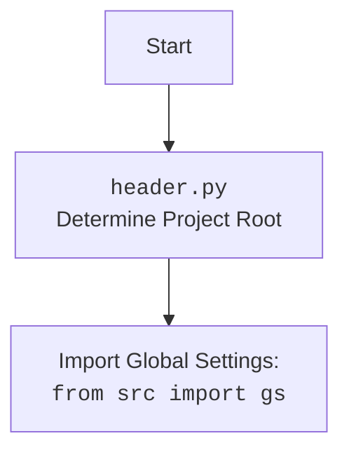

## ИНСТРУКЦИЯ:

Анализируй предоставленный код подробно и объясни его функциональность. Ответ должен включать три раздела:  

1.  **<алгоритм>**: Опиши рабочий процесс в виде пошаговой блок-схемы, включая примеры для каждого логического блока, и проиллюстрируй поток данных между функциями, классами или методами.  
2.  **<mermaid>**: Напиши код для диаграммы в формате `mermaid`, проанализируй и объясни все зависимости, 
    которые импортируются при создании диаграммы.  
    **ВАЖНО!** Убедитесь, что все имена переменных, используемые в диаграмме `mermaid`, 
    имеют осмысленные и описательные имена. Имена переменных вроде `A`, `B`, `C`, и т.д., не допускаются!  
    
    **Дополнительно**: Если в коде есть импорт `import header`, добавьте блок `mermaid` flowchart, объясняющий `header.py`:\
    ```mermaid
    flowchart TD
        Start --> Header[<code>header.py</code><br> Determine Project Root]
    
        Header --> import[Import Global Settings: <br><code>from src import gs</code>] 
    ```

3.  **<объяснение>**: Предоставьте подробные объяснения:  
    - **Импорты**: Их назначение и взаимосвязь с другими пакетами `src.`.  
    - **Классы**: Их роль, атрибуты, методы и взаимодействие с другими компонентами проекта.  
    - **Функции**: Их аргументы, возвращаемые значения, назначение и примеры.  
    - **Переменные**: Их типы и использование.  
    - Выделите потенциальные ошибки или области для улучшения.  

Дополнительно, постройте цепочку взаимосвязей с другими частями проекта (если применимо).  

Это обеспечивает всесторонний и структурированный анализ кода.
## Формат ответа: `.md` (markdown)
**КОНЕЦ ИНСТРУКЦИИ**

## <алгоритм>

```mermaid
graph LR
    Start[Начало] --> Initialize[Инициализация класса JavaScript];
    Initialize --> SetWebDriver[Сохранение WebDriver];
    SetWebDriver --> UnhideElementCheck{Вызов unhide_DOM_element(element)};
    UnhideElementCheck -- Да --> UnhideDOM[Выполнение JavaScript для отображения элемента]
    UnhideDOM --> ExecuteScript[Выполнение скрипта через driver.execute_script(script, element)]
    ExecuteScript -- Успех --> ReturnTrue[Возврат True]
    ExecuteScript -- Ошибка --> ErrorHandling[Логирование ошибки]
    ErrorHandling --> ReturnFalse[Возврат False]
    UnhideElementCheck -- Нет --> ReadyStateCheck{Вызов ready_state};
    ReadyStateCheck -- Да --> GetReadyState[Получение document.readyState]
    GetReadyState --> ExecuteReadyState[Выполнение скрипта через driver.execute_script('return document.readyState;')]
    ExecuteReadyState -- Успех --> ReturnReadyState[Возврат состояния готовности]
    ExecuteReadyState -- Ошибка --> ErrorReadyState[Логирование ошибки]
    ErrorReadyState --> ReturnEmptyString[Возврат пустой строки]
    ReadyStateCheck -- Нет --> WindowFocusCheck{Вызов window_focus()}
    WindowFocusCheck -- Да --> WindowFocus[Установка фокуса на окно]
    WindowFocus --> ExecuteWindowFocus[Выполнение скрипта через driver.execute_script('window.focus();')]
    ExecuteWindowFocus -- Успех --> EndWindowFocus[Завершение]
    ExecuteWindowFocus -- Ошибка --> ErrorWindowFocus[Логирование ошибки]
    ErrorWindowFocus --> EndWindowFocus
    WindowFocusCheck -- Нет --> ReferrerCheck{Вызов get_referrer()}
    ReferrerCheck -- Да --> GetReferrer[Получение document.referrer]
    GetReferrer --> ExecuteReferrer[Выполнение скрипта через driver.execute_script('return document.referrer;')]
    ExecuteReferrer -- Успех --> ReturnReferrer[Возврат URL]
    ExecuteReferrer -- Ошибка --> ErrorReferrer[Логирование ошибки]
    ErrorReferrer --> ReturnEmptyString2[Возврат пустой строки]
    ReferrerCheck -- Нет --> PageLangCheck{Вызов get_page_lang()}
    PageLangCheck -- Да --> GetPageLang[Получение document.documentElement.lang]
    GetPageLang --> ExecutePageLang[Выполнение скрипта через driver.execute_script('return document.documentElement.lang;')]
    ExecutePageLang -- Успех --> ReturnPageLang[Возврат языкового кода]
    ExecutePageLang -- Ошибка --> ErrorPageLang[Логирование ошибки]
    ErrorPageLang --> ReturnEmptyString3[Возврат пустой строки]
    PageLangCheck -- Нет --> End[Конец]
    ReturnTrue --> End
    ReturnFalse --> End
    ReturnReadyState --> End
    ReturnEmptyString --> End
    EndWindowFocus --> End
    ReturnReferrer --> End
    ReturnEmptyString2 --> End
    ReturnPageLang --> End
    ReturnEmptyString3 --> End

```

## <mermaid>

```mermaid
flowchart TD
    Start[Начало] --> JavaScriptClass[<code>JavaScript</code> Class];
    JavaScriptClass --> JavaScriptInit[<code>__init__</code> Метод];
    JavaScriptInit --> StoreWebDriver[Сохранение <code>WebDriver</code>];
    StoreWebDriver --> UnhideDOMElementMethod[<code>unhide_DOM_element</code> Метод];
     UnhideDOMElementMethod --> ExecuteUnhideScript[Выполнение JavaScript через <code>driver.execute_script()</code>];
     ExecuteUnhideScript -- Успех --> ReturnTrue[<code>return True</code>];
     ExecuteUnhideScript -- Ошибка --> LogUnhideError[Логирование ошибки через <code>logger.error()</code>];
     LogUnhideError --> ReturnFalse[<code>return False</code>];
    JavaScriptClass --> ReadyStateProperty[<code>ready_state</code> Property];
    ReadyStateProperty --> ExecuteReadyStateScript[Выполнение JavaScript через <code>driver.execute_script()</code>];
    ExecuteReadyStateScript -- Успех --> ReturnReadyStateValue[Возврат значения <code>document.readyState</code>];
    ExecuteReadyStateScript -- Ошибка --> LogReadyStateError[Логирование ошибки через <code>logger.error()</code>];
    LogReadyStateError --> ReturnEmptyString[Возврат пустой строки];
    JavaScriptClass --> WindowFocusMethod[<code>window_focus</code> Метод];
    WindowFocusMethod --> ExecuteFocusScript[Выполнение JavaScript через <code>driver.execute_script()</code>];
    ExecuteFocusScript -- Успех --> EndWindowFocus[Конец <code>window_focus</code>];
    ExecuteFocusScript -- Ошибка --> LogWindowFocusError[Логирование ошибки через <code>logger.error()</code>];
    LogWindowFocusError --> EndWindowFocus;
    JavaScriptClass --> GetReferrerMethod[<code>get_referrer</code> Метод];
    GetReferrerMethod --> ExecuteReferrerScript[Выполнение JavaScript через <code>driver.execute_script()</code>];
    ExecuteReferrerScript -- Успех --> ReturnReferrerValue[Возврат значения <code>document.referrer</code>];
     ExecuteReferrerScript -- Ошибка --> LogReferrerError[Логирование ошибки через <code>logger.error()</code>];
     LogReferrerError --> ReturnEmptyString2[Возврат пустой строки];
    JavaScriptClass --> GetPageLangMethod[<code>get_page_lang</code> Метод];
    GetPageLangMethod --> ExecutePageLangScript[Выполнение JavaScript через <code>driver.execute_script()</code>];
    ExecutePageLangScript -- Успех --> ReturnPageLangValue[Возврат значения <code>document.documentElement.lang</code>];
    ExecutePageLangScript -- Ошибка --> LogPageLangError[Логирование ошибки через <code>logger.error()</code>];
     LogPageLangError --> ReturnEmptyString3[Возврат пустой строки];
    ReturnTrue --> End[Конец];
    ReturnFalse --> End;
    ReturnReadyStateValue --> End;
     ReturnEmptyString --> End;
    EndWindowFocus --> End;
    ReturnReferrerValue --> End;
     ReturnEmptyString2 --> End;
    ReturnPageLangValue --> End;
     ReturnEmptyString3 --> End;
```



### Анализ зависимостей `mermaid`:

-   **Импорты:**

    -   `header`: Этот импорт указывает на то, что в коде используется модуль `header.py` для определения корня проекта и загрузки глобальных настроек.
    -  `from src import gs`:  Импортирует глобальные настройки из модуля `gs` внутри пакета `src`.
    -   `from src.logger.logger import logger`:  Импортирует объект `logger` из модуля `logger.py` внутри пакета `src.logger`, который используется для логирования ошибок и другой информации.
    -   `from selenium.webdriver.remote.webdriver import WebDriver`: Импортирует класс `WebDriver` из пакета `selenium`, который представляет собой интерфейс для управления браузером.
    -   `from selenium.webdriver.remote.webelement import WebElement`:  Импортирует класс `WebElement` из пакета `selenium`, представляющий собой элемент на веб-странице.

-   **Классы:**
    -   `JavaScript`: Класс `JavaScript` содержит методы для выполнения различных действий с помощью JavaScript на веб-странице.
-  **Методы:**

    -   `__init__`: Инициализирует экземпляр класса JavaScript, принимая объект WebDriver в качестве аргумента.
    -   `unhide_DOM_element`: Метод делает невидимый элемент видимым с помощью JavaScript.
    -   `ready_state`: Свойство, возвращающее состояние загрузки документа.
    -   `window_focus`: Метод устанавливает фокус на окно браузера.
    -   `get_referrer`: Метод получает URL-адрес реферера.
    -   `get_page_lang`: Метод получает язык текущей страницы.
-   **Стрелки:**
    -   Стрелки показывают поток выполнения кода и вызовы методов, начиная с инициализации класса `JavaScript` и заканчивая выполнением JavaScript через `driver.execute_script()` или возвратом значений.

## <объяснение>

### Импорты:

-   `import header`: Используется для определения корня проекта и загрузки глобальных настроек, что необходимо для правильной работы всего проекта.
-   `from src import gs`: Импортирует глобальные настройки, такие как пути к файлам и другие параметры, которые используются в различных модулях проекта. Это обеспечивает согласованность и централизованное управление конфигурацией.
-   `from src.logger.logger import logger`: Импортирует объект логгера, который используется для записи ошибок и другой отладочной информации. Это позволяет отслеживать проблемы и обеспечивает поддержку при их возникновении.
-   `from selenium.webdriver.remote.webdriver import WebDriver`:  Импортирует класс `WebDriver` для взаимодействия с браузером, позволяя выполнять действия на веб-странице, такие как выполнение JavaScript.
-   `from selenium.webdriver.remote.webelement import WebElement`:  Импортирует класс `WebElement`, представляющий собой элемент веб-страницы, который используется для манипуляций с элементами.

### Классы:

-   `JavaScript`:
    -   **Роль:**  Предоставляет набор утилитных функций для взаимодействия с веб-страницами через выполнение JavaScript-кода в контексте Selenium WebDriver.
    -   **Атрибуты:**
        -   `driver`: Экземпляр `WebDriver`, который используется для выполнения JavaScript-кода.
    -   **Методы:**
        -   `__init__(self, driver: WebDriver)`: Конструктор класса, инициализирует объект `JavaScript`, устанавливая `driver` для выполнения JS-кода.
        -   `unhide_DOM_element(self, element: WebElement) -> bool`: Делает невидимый DOM-элемент видимым путем изменения его стилей с помощью JavaScript. Возвращает `True`, если скрипт выполнен успешно, или `False`, если произошла ошибка.
        -   `ready_state(self) -> str`: Возвращает состояние загрузки документа (`loading` или `complete`), используя JavaScript.  При возникновении ошибки возвращает пустую строку.
        -   `window_focus(self) -> None`: Устанавливает фокус на окно браузера с помощью JavaScript.  Логирует ошибки, если таковые возникают.
        -   `get_referrer(self) -> str`: Возвращает URL-адрес реферера текущей страницы с помощью JavaScript. В случае ошибки или отсутствия реферера возвращает пустую строку.
        -   `get_page_lang(self) -> str`: Возвращает язык текущей страницы с помощью JavaScript.  Если язык не найден или произошла ошибка, возвращает пустую строку.

### Функции:

-   `__init__(self, driver: WebDriver)`:
    -   **Аргументы**:
        -   `driver`: Экземпляр `WebDriver`, необходимый для выполнения JavaScript-кода.
    -   **Возвращаемое значение**:  Нет.
    -   **Назначение**: Инициализирует объект `JavaScript`, сохраняя переданный экземпляр `WebDriver` для дальнейшего использования.
    -   **Пример**:
        ```python
        from selenium import webdriver
        from src.webdriver.js import JavaScript

        driver = webdriver.Chrome()
        js_helper = JavaScript(driver)
        ```

-   `unhide_DOM_element(self, element: WebElement) -> bool`:
    -   **Аргументы**:
        -   `element`: Экземпляр `WebElement`, который нужно сделать видимым.
    -   **Возвращаемое значение**: `True` в случае успеха, `False` в случае ошибки.
    -   **Назначение**: Позволяет сделать скрытый элемент видимым, изменяя его стили с помощью JavaScript.  Использует `scrollIntoView(true)` для прокрутки элемента в видимую область.
    -   **Пример**:
        ```python
        element = driver.find_element(By.ID, "hiddenElement")
        is_unhidden = js_helper.unhide_DOM_element(element)
        if is_unhidden:
            print("Элемент стал видимым")
        else:
            print("Не удалось сделать элемент видимым")
        ```
-   `ready_state(self) -> str`:
    -   **Аргументы**: Нет.
    -   **Возвращаемое значение**: `loading` или `complete`, или пустая строка при ошибке.
    -   **Назначение**: Возвращает состояние загрузки страницы, которое может быть `loading` или `complete`.
    -   **Пример**:
        ```python
        state = js_helper.ready_state
        if state == "complete":
            print("Страница загружена")
        else:
            print("Страница еще загружается")
        ```
-   `window_focus(self) -> None`:
    -   **Аргументы**: Нет.
    -   **Возвращаемое значение**: Нет.
    -   **Назначение**: Устанавливает фокус на текущее окно браузера, используя JavaScript.
    -   **Пример**:
        ```python
        js_helper.window_focus()
        ```

-   `get_referrer(self) -> str`:
    -   **Аргументы**: Нет.
    -   **Возвращаемое значение**:  URL-адрес реферера в виде строки, или пустая строка, если реферер отсутствует или возникла ошибка.
    -   **Назначение**:  Получает URL-адрес, с которого пользователь перешел на текущую страницу.
    -   **Пример**:
        ```python
        referrer = js_helper.get_referrer()
        if referrer:
            print("Реферер:", referrer)
        else:
            print("Реферер отсутствует")
        ```
-   `get_page_lang(self) -> str`:
    -   **Аргументы**: Нет.
    -   **Возвращаемое значение**:  Языковой код страницы в виде строки, или пустая строка, если язык не определен или возникла ошибка.
    -   **Назначение**: Получает языковой код текущей страницы, определенный в HTML-теге.
    -   **Пример**:
        ```python
        page_lang = js_helper.get_page_lang()
        if page_lang:
            print("Язык страницы:", page_lang)
        else:
            print("Язык страницы не определен")
        ```

### Переменные:

-   `driver`: Объект `WebDriver`, который используется для выполнения JavaScript-кода в браузере.
-   `script`: Строка, содержащая JavaScript-код для выполнения.
-   `element`: Объект `WebElement`, к которому применяется JavaScript.
-   `ex`: Объект ошибки, который используется для логирования информации об ошибках.

### Взаимосвязи с другими частями проекта:

-   **Зависимость от `header.py` и `gs`**: Класс `JavaScript` зависит от общих настроек проекта, загружаемых через `header.py` и `gs`, что обеспечивает консистентную работу всех модулей.
-   **Зависимость от `logger`**: Логирование ошибок через `logger` позволяет отслеживать проблемы во время работы и облегчает отладку.
-   **Зависимость от `selenium`**: Класс `JavaScript` напрямую зависит от библиотеки `selenium` для управления браузером и выполнения JavaScript-кода.

### Потенциальные ошибки и области для улучшения:

-   **Обработка ошибок:** Обработка ошибок ограничена логированием и возвратом пустых значений или `False`. Возможно, стоит добавить более детальную обработку, например, выбрасывать собственные исключения.
-   **Расширение функциональности**: Класс `JavaScript` можно расширить для включения других часто используемых JavaScript-функций для взаимодействия со страницей.
-  **Зависимость от `header.py`**: Использование `header.py` для определения корневого каталога может быть не всегда очевидным для новых разработчиков. Можно пересмотреть этот подход, чтобы сделать его более явным.

Этот анализ обеспечивает всестороннее понимание функциональности кода, его взаимосвязей и возможных улучшений.