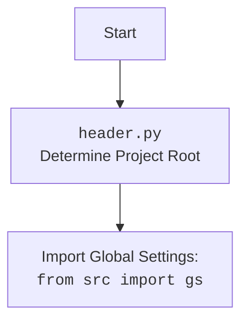

## ИНСТРУКЦИЯ:

Анализируй предоставленный код подробно и объясни его функциональность. Ответ должен включать три раздела:

1.  **<алгоритм>**: Опиши рабочий процесс в виде пошаговой блок-схемы, включая примеры для каждого логического блока, и проиллюстрируй поток данных между функциями, классами или методами.
2.  **<mermaid>**: Напиши код для диаграммы в формате `mermaid`, проанализируй и объясни все зависимости,
    которые импортируются при создании диаграммы.
    **ВАЖНО!** Убедитесь, что все имена переменных, используемые в диаграмме `mermaid`,
    имеют осмысленные и описательные имена. Имена переменных вроде `A`, `B`, `C`, и т.д., не допускаются!

    **Дополнительно**: Если в коде есть импорт `import header`, добавьте блок `mermaid` flowchart, объясняющий `header.py`:
    ```mermaid
    flowchart TD
        Start --> Header[<code>header.py</code><br> Determine Project Root]

        Header --> import[Import Global Settings: <br><code>from src import gs</code>]
    ```

3.  **<объяснение>**: Предоставьте подробные объяснения:
    -   **Импорты**: Их назначение и взаимосвязь с другими пакетами `src.`.
    -   **Классы**: Их роль, атрибуты, методы и взаимодействие с другими компонентами проекта.
    -   **Функции**: Их аргументы, возвращаемые значения, назначение и примеры.
    -   **Переменные**: Их типы и использование.
    -   Выделите потенциальные ошибки или области для улучшения.

Дополнительно, постройте цепочку взаимосвязей с другими частями проекта (если применимо).

Это обеспечивает всесторонний и структурированный анализ кода.
## Формат ответа: `.md` (markdown)
**КОНЕЦ ИНСТРУКЦИИ**

## <алгоритм>

**Класс JavaScript**

1.  **Инициализация (`__init__`)**:
    *   Принимает экземпляр `WebDriver` как аргумент.
    *   Сохраняет `WebDriver` в атрибуте `self.driver`.
    *   *Пример:* `js_helper = JavaScript(driver)`

2.  **`unhide_DOM_element(element: WebElement)`**:
    *   Принимает `WebElement` как аргумент.
    *   Формирует JavaScript код для изменения стилей элемента и прокрутки его в поле видимости.
        *   *Пример JavaScript:*  `arguments[0].style.opacity = 1; ... arguments[0].scrollIntoView(true);`
    *   Выполняет JavaScript код через `self.driver.execute_script()`.
        *   Если успешно, возвращает `True`.
        *   Если возникает ошибка (например, элемент не найден), логгирует ошибку и возвращает `False`.
    *   *Пример вызова:* `is_unhidden = js_helper.unhide_DOM_element(my_element)`

3.  **`ready_state` (property)**:
    *   Выполняет JavaScript код `return document.readyState;`.
    *   Возвращает `readyState` (строку `loading` или `complete`).
        *   Если возникает ошибка, логгирует и возвращает пустую строку.
    *   *Пример вызова:* `page_state = js_helper.ready_state`

4.  **`window_focus()`**:
    *   Выполняет JavaScript код `window.focus();`.
    *   Пытается перенести фокус на окно браузера.
        *   Если возникает ошибка, логгирует.
    *    *Пример вызова:* `js_helper.window_focus()`

5.  **`get_referrer()`**:
    *   Выполняет JavaScript код `return document.referrer;`.
    *   Возвращает строку с URL-адресом реферера.
        *   Если реферер недоступен, возвращает пустую строку.
        *   Если возникает ошибка, логгирует и возвращает пустую строку.
    *   *Пример вызова:* `referrer = js_helper.get_referrer()`

6.  **`get_page_lang()`**:
    *   Выполняет JavaScript код `return document.documentElement.lang;`.
    *   Возвращает строку с кодом языка страницы.
        *   Если язык недоступен, возвращает пустую строку.
        *   Если возникает ошибка, логгирует и возвращает пустую строку.
    *   *Пример вызова:* `page_language = js_helper.get_page_lang()`

## <mermaid>

```mermaid
flowchart TD
    subgraph JavaScript Class
    
        Init(Init\n__init__(driver)) --> AssignDriver(Assign driver to self.driver);
        
        UnhideElement(Unhide Element\nunhide_DOM_element(element)) --> JSCodeUnhide(Create JS code to modify element style);
        JSCodeUnhide --> ExecJSUnhide(Execute JS with driver.execute_script);
        ExecJSUnhide -- Success --> ReturnTrueUnhide(Return True);
        ExecJSUnhide -- Error --> LogErrorUnhide(Log Error);
        LogErrorUnhide --> ReturnFalseUnhide(Return False);
        
        ReadyState(Get Ready State\nready_state) --> ExecuteJSState(Execute JS: return document.readyState);
        ExecuteJSState -- Success --> ReturnState(Return state);
        ExecuteJSState -- Error --> LogErrorState(Log Error);
        LogErrorState --> ReturnEmptyState(Return "");
        
        WindowFocus(Window Focus\nwindow_focus()) --> ExecuteJSFocus(Execute JS: window.focus());
        ExecuteJSFocus -- Success --> ReturnNoneFocus(Return None);
        ExecuteJSFocus -- Error --> LogErrorFocus(Log Error);
        
        GetReferrer(Get Referrer\nget_referrer()) --> ExecuteJSReferrer(Execute JS: return document.referrer);
        ExecuteJSReferrer -- Success --> ReturnReferrer(Return referrer or "");
        ExecuteJSReferrer -- Error --> LogErrorReferrer(Log Error);
        LogErrorReferrer --> ReturnEmptyReferrer(Return "");
        
       GetPageLang(Get Page Lang\nget_page_lang()) --> ExecuteJSLang(Execute JS: return document.documentElement.lang);
        ExecuteJSLang -- Success --> ReturnLang(Return lang or "");
        ExecuteJSLang -- Error --> LogErrorLang(Log Error);
        LogErrorLang --> ReturnEmptyLang(Return "");


    end
    
    AssignDriver --> UnhideElement;
    AssignDriver --> ReadyState;
    AssignDriver --> WindowFocus;
    AssignDriver --> GetReferrer;
    AssignDriver --> GetPageLang;

    Start --> Init
    
     
    ReturnTrueUnhide --> End
    ReturnFalseUnhide --> End
    ReturnState --> End
     ReturnEmptyState --> End
    ReturnNoneFocus --> End
     ReturnReferrer --> End
      ReturnEmptyReferrer --> End
     ReturnLang --> End
    ReturnEmptyLang --> End
    
```



## <объяснение>

**Импорты:**

*   `import header`: Импортирует модуль `header.py`, который, вероятно, отвечает за определение корневой директории проекта и настройку путей.
*   `from src import gs`: Импортирует глобальные настройки (`gs`) из пакета `src`. `gs`, вероятно, содержит общие переменные или конфигурации, используемые в проекте.
*   `from src.logger.logger import logger`: Импортирует объект `logger` для логирования событий и ошибок из пакета `src.logger`.
*   `from selenium.webdriver.remote.webdriver import WebDriver`: Импортирует класс `WebDriver` из библиотеки Selenium. Этот класс используется для управления браузером.
*   `from selenium.webdriver.remote.webelement import WebElement`: Импортирует класс `WebElement`, представляющий DOM-элемент на веб-странице.

**Класс JavaScript:**

*   **Назначение**: Предоставляет набор утилит для выполнения JavaScript кода на веб-странице, управляемой Selenium WebDriver.
*   **`__init__(self, driver: WebDriver)`**:
    *   Инициализирует экземпляр класса, принимая объект `WebDriver`.
    *   Сохраняет WebDriver для использования в методах класса.
*    **`unhide_DOM_element(self, element: WebElement)`**:
    *   **Назначение**: Делает невидимый DOM элемент видимым, изменяя его CSS свойства.
    *   **Алгоритм**:
        1.  Генерирует JavaScript код для установки свойств `opacity`, `transform`, `MozTransform`, `WebkitTransform`, `msTransform` и `OTransform` в значение, обеспечивающее видимость элемента.
        2.  Добавляет `scrollIntoView(true)`, чтобы элемент стал видимым на экране.
        3.  Выполняет код с помощью `self.driver.execute_script(script, element)`.
        4.  Возвращает `True`, если выполнение успешно, `False` в случае ошибки (например, если элемента не существует).
    *   **Пример**: Если элемент скрыт CSS-свойством `opacity: 0;`, метод изменит его на `opacity: 1;`, сделав его видимым.
    *   **Связь**: Использует `WebDriver` для выполнения JavaScript кода в контексте веб-страницы.
*   **`ready_state` (property)**:
    *   **Назначение**: Возвращает текущее состояние загрузки документа.
    *   **Алгоритм**:
        1.  Выполняет JavaScript код `return document.readyState;`.
        2.  Возвращает `loading` если страница еще грузится или `complete` если загрузка завершена.
        3.  В случае ошибки возвращает пустую строку "".
    *   **Пример**: Может вернуть "loading" во время загрузки или "complete" после полной загрузки страницы.
    *   **Связь**: Использует `WebDriver` для выполнения JavaScript и получения данных о странице.
*   **`window_focus(self)`**:
    *   **Назначение**:  Переключает фокус на окно браузера.
    *   **Алгоритм**:
        1.  Выполняет JavaScript код `window.focus();`
        2.  В случае ошибки логирует ее.
    *  **Пример**: Активирует окно браузера, если оно было не в фокусе.
    *  **Связь**: Использует `WebDriver` для выполнения JavaScript кода.
*   **`get_referrer(self)`**:
    *   **Назначение**: Возвращает URL-адрес, с которого пользователь перешел на текущую страницу.
    *   **Алгоритм**:
        1.  Выполняет JavaScript код `return document.referrer;`.
        2.  Возвращает URL или пустую строку, если `referrer` не определен.
        3.  В случае ошибки логирует ее и возвращает пустую строку.
    *   **Пример**: Если пользователь перешел на страницу по ссылке с сайта `example.com`, метод вернет `example.com`.
    *   **Связь**: Использует `WebDriver` для выполнения JavaScript кода и получения данных о странице.
*   **`get_page_lang(self)`**:
    *   **Назначение**: Возвращает язык текущей страницы.
    *   **Алгоритм**:
        1.  Выполняет JavaScript код `return document.documentElement.lang;`.
        2.  Возвращает код языка или пустую строку, если язык не определен.
        3.  В случае ошибки логирует ее и возвращает пустую строку.
    *   **Пример**: Если на странице указан язык `en-US`, метод вернет `en-US`.
    *   **Связь**: Использует `WebDriver` для выполнения JavaScript кода и получения данных о странице.

**Переменные:**

*   `MODE`: Глобальная переменная, устанавливает режим работы модуля (`'dev'`). Не используется в коде.
*   `driver`: Атрибут класса JavaScript, хранит экземпляр `WebDriver`.

**Потенциальные ошибки и области для улучшения:**

*   **Обработка ошибок**:
    *   Обработка ошибок в методах выполняется через `try-except`, что хорошо, однако можно рассмотреть более специфичные типы исключений.
    *   Можно добавить более информативные сообщения в лог.
*   **Общий JavaScript**: JavaScript код для `unhide_DOM_element` может быть объединен в общую функцию в JavaScript, чтобы не дублировать код в Python.
*   **Зависимости**:
    *   Код зависит от наличия корректно настроенного `WebDriver` и `WebElement`.
    *   Следует убедиться, что драйвер совместим с браузером.

**Цепочка взаимосвязей:**

1.  `header.py` определяет корень проекта.
2.  `src.gs` хранит глобальные настройки.
3.  `src.logger.logger` используется для логирования.
4.  `selenium.webdriver.remote.webdriver.WebDriver` управляет браузером.
5.  `selenium.webdriver.remote.webelement.WebElement` представляет DOM-элемент.
6.  `JavaScript` класс использует `WebDriver` для выполнения JavaScript кода.
7.   Другие модули или классы в проекте могут использовать `JavaScript` для управления веб-страницами.