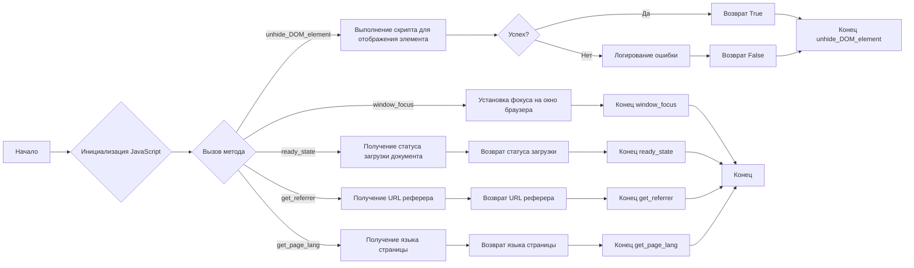
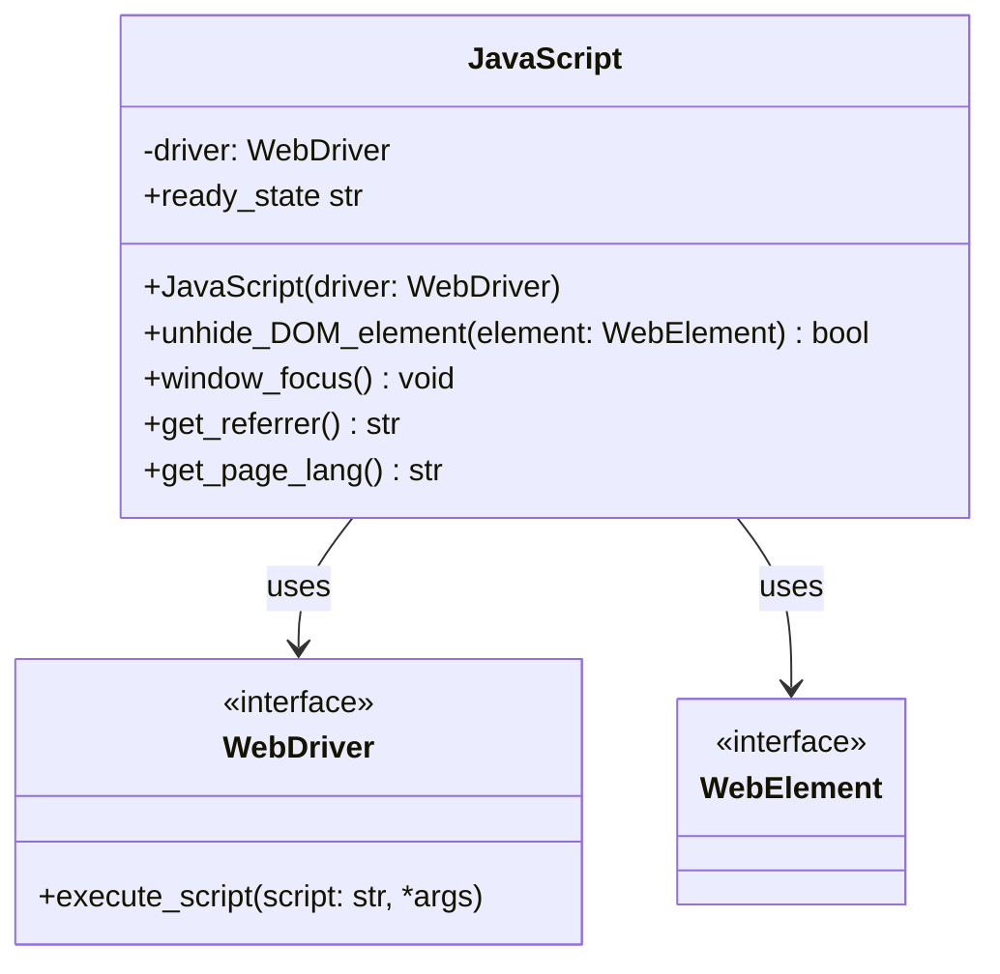

## Анализ кода `hypotez/src/webdriver/js.py`

### 1. <алгоритм>

**Блок-схема:**

**Примеры:**

*   **`unhide_DOM_element`**:
    1.  На входе: `element` - объект `WebElement`, представляющий скрытый DOM элемент.
    2.  Выполняется JavaScript, который изменяет CSS свойства элемента: `opacity`, `transform`, `MozTransform`, `WebkitTransform`, `msTransform`, `OTransform`.
        Например,  `element.style.opacity = 1` сделает элемент видимым.
        Также элемент прокручивается в поле видимости: `element.scrollIntoView(true);`.
    3.  На выходе: `True`, если скрипт выполнен успешно, `False` при ошибке.
*   **`ready_state`**:
    1.  На входе: нет аргументов.
    2.  Выполняется JavaScript `return document.readyState;`.
    3.  На выходе:  `loading`, если документ загружается, или `complete` если загрузка завершена.
        Пример: `"complete"`.
*   **`window_focus`**:
    1.  На входе: нет аргументов.
    2.  Выполняется JavaScript `window.focus();`, который устанавливает фокус на окно браузера.
    3.  На выходе: None.
*  **`get_referrer`**:
     1. На входе: нет аргументов.
     2. Выполняется JavaScript `return document.referrer;`.
     3. На выходе: URL  страницы реферера или пустая строка, если реферер недоступен.
        Пример: `"https://example.com/previous_page"`.
*   **`get_page_lang`**:
    1.  На входе: нет аргументов.
    2.  Выполняется JavaScript `return document.documentElement.lang;`.
    3.  На выходе:  код языка страницы, или пустая строка.
        Пример: `"en"`.

### 2. <mermaid>

**Описание диаграммы:**

*   **`JavaScript`**:  Класс, который предоставляет утилиты для взаимодействия с веб-страницей через JavaScript.
    *   **`driver: WebDriver`**: Атрибут, хранящий экземпляр `WebDriver` для выполнения JavaScript.
    *   **`JavaScript(driver: WebDriver)`**: Конструктор класса, принимающий `WebDriver`.
    *   **`unhide_DOM_element(element: WebElement)`**: Метод, который делает DOM-элемент видимым.
    *   **`ready_state`**: Свойство, которое возвращает статус загрузки документа.
    *   **`window_focus()`**: Метод, который устанавливает фокус на окно браузера.
    *   **`get_referrer()`**: Метод, который возвращает URL реферера.
    *   **`get_page_lang()`**: Метод, который возвращает язык страницы.
*   **`WebDriver`**: Интерфейс, предоставляемый Selenium для взаимодействия с браузером.
    *   **`execute_script(script: str, *args)`**: Метод для выполнения JavaScript кода в контексте веб-страницы.
*   **`WebElement`**: Интерфейс, представляющий элемент на веб-странице.

**Зависимости:**

*   `JavaScript` зависит от `WebDriver` для выполнения JavaScript и от `WebElement` для манипуляции с элементами на странице.
*   Оба `WebDriver` и `WebElement` предоставляются библиотекой `selenium`.

### 3. <объяснение>

**Импорты:**

*   `import header`: Импортирует модуль `header`. Этот импорт может быть использован для каких-либо общих настроек или метаданных проекта, но без дополнительной информации сложно сказать точное назначение.
*   `from src import gs`: Импортирует модуль `gs` из пакета `src`. Предположительно это может быть модуль глобальных настроек или утилит.
*   `from src.logger.logger import logger`: Импортирует объект `logger` для логирования ошибок и отладочной информации.
*   `from selenium.webdriver.remote.webdriver import WebDriver`: Импортирует класс `WebDriver` из библиотеки `selenium`, необходимый для управления браузером.
*   `from selenium.webdriver.remote.webelement import WebElement`: Импортирует класс `WebElement` из библиотеки `selenium`, представляющий элементы веб-страницы.

**Класс `JavaScript`:**

*   **Роль:** Предоставляет набор JavaScript функций для управления веб-страницей через Selenium `WebDriver`.
*   **Атрибуты:**
    *   `driver: WebDriver`:  Экземпляр `WebDriver` для выполнения JavaScript.
*   **Методы:**
    *   `__init__(self, driver: WebDriver)`: Конструктор, принимающий объект `WebDriver`.
    *   `unhide_DOM_element(self, element: WebElement) -> bool`: Делает невидимый DOM-элемент видимым путем изменения его CSS-свойств. Возвращает `True` при успехе и `False` при ошибке, которая логируется с помощью `logger.error`.
    *   `ready_state(self) -> str`: Возвращает статус загрузки документа (`loading` или `complete`). В случае ошибки, она логируется и возвращается пустая строка `''`.
    *   `window_focus(self) -> None`: Устанавливает фокус на окно браузера.  В случае ошибки, она логируется с помощью `logger.error`.
    *   `get_referrer(self) -> str`: Возвращает URL-адрес реферера. В случае ошибки возвращает пустую строку `''`, предварительно залогировав её.
    *   `get_page_lang(self) -> str`: Возвращает язык страницы. В случае ошибки возвращает пустую строку `''`, предварительно залогировав её.
*   **Взаимодействие:**
    *   Класс использует `WebDriver` для выполнения JavaScript кода.
    *   Метод `unhide_DOM_element` использует `WebElement` для манипулирования конкретным элементом.

**Функции:**

*   **`unhide_DOM_element(self, element: WebElement) -> bool`**:
    *   **Аргументы**: `element` - объект `WebElement` для отображения.
    *   **Возвращаемое значение**: `True`, если скрипт выполнен успешно, `False` в противном случае.
    *   **Назначение**: Делает скрытые элементы DOM видимыми, устанавливая необходимые CSS свойства.
*   **`ready_state(self) -> str`**:
    *   **Аргументы**: Нет.
    *   **Возвращаемое значение**: `loading` или `complete`, в зависимости от статуса загрузки документа. Пустая строка в случае ошибки.
    *   **Назначение**: Получает текущий статус загрузки страницы.
*   **`window_focus(self) -> None`**:
    *   **Аргументы**: Нет.
    *   **Возвращаемое значение**: Нет.
    *   **Назначение**: Устанавливает фокус на окно браузера.
*  **`get_referrer(self) -> str`**:
    *   **Аргументы**: Нет.
    *   **Возвращаемое значение**: URL-адрес реферера или пустая строка в случае его отсутствия.
    *   **Назначение**:  Получает URL-адрес страницы, с которой перешли на текущую.
*  **`get_page_lang(self) -> str`**:
    *   **Аргументы**: Нет.
    *   **Возвращаемое значение**: Код языка текущей страницы или пустая строка в случае его отсутствия.
    *   **Назначение**: Получает код языка текущей страницы.

**Переменные:**

*   `MODE = 'dev'` - Глобальная переменная, используемая для определения режима работы. В данном случае установлен режим разработки `'dev'`.

**Потенциальные ошибки и области для улучшения:**

*   **Обработка исключений**: Все методы `JavaScript` используют общую обработку исключений, которая просто логирует ошибку и возвращает значение по умолчанию. Это может быть недостаточно для конкретных ситуаций, где может потребоваться более детальная обработка.
*   **Универсальность:** Скрипт `unhide_DOM_element` может не подходить для всех типов скрытых элементов, так как зависит от CSS свойств. Можно сделать более универсальную функцию, определяющую тип скрытия.
*   **Зависимость от `header` и `gs`:** Без контекста сложно сказать точно, какое назначение у этих модулей. Это может привести к проблемам, если они изменятся в будущем.

**Взаимосвязи с другими частями проекта:**

*   Модуль `js.py` предназначен для использования совместно с модулями, где используется `selenium.webdriver.remote.webdriver.WebDriver`, например, для тестирования или парсинга. Он является утилитой для управления веб-страницами и расширяет стандартные возможности Selenium.
*   `logger` используется для логирования событий, что предполагает существование централизованной системы логирования проекта, в котором используется данный файл.

**Заключение:**

Модуль `js.py` предоставляет набор полезных функций для работы с веб-страницами через JavaScript. Он является важной частью проекта, где используется Selenium для тестирования или автоматизации. Код написан в целом хорошо, но его можно улучшить, добавив более гибкую обработку ошибок и повысив универсальность.