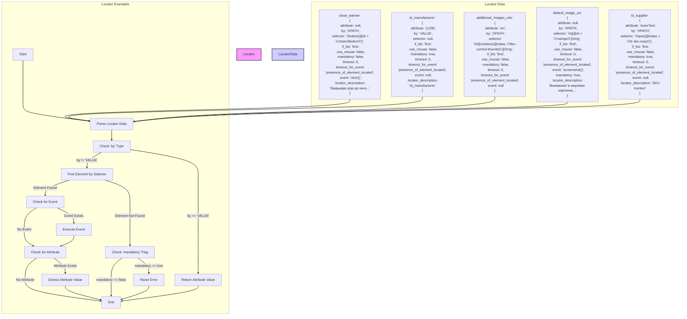

## ИНСТРУКЦИЯ:

Анализируй предоставленный код подробно и объясни его функциональность. Ответ должен включать три раздела:  

1. **<алгоритм>**: Опиши рабочий процесс в виде пошаговой блок-схемы, включая примеры для каждого логического блока, и проиллюстрируй поток данных между функциями, классами или методами.  
2. **<mermaid>**: Напиши код для диаграммы в формате `mermaid`, проанализируй и объясни все зависимости, 
    которые импортируются при создании диаграммы. 
    **ВАЖНО!** Убедитесь, что все имена переменных, используемые в диаграмме `mermaid`, 
    имеют осмысленные и описательные имена. Имена переменных вроде `A`, `B`, `C`, и т.д., не допускаются!  
    
    **Дополнительно**: Если в коде есть импорт `import header`, добавьте блок `mermaid` flowchart, объясняющий `header.py`:\
    ```mermaid
    flowchart TD
        Start --> Header[<code>header.py</code><br> Determine Project Root]
    
        Header --> import[Import Global Settings: <br><code>from src import gs</code>] 
    ```

3. **<объяснение>**: Предоставьте подробные объяснения:  
   - **Импорты**: Их назначение и взаимосвязь с другими пакетами `src.`.  
   - **Классы**: Их роль, атрибуты, методы и взаимодействие с другими компонентами проекта.  
   - **Функции**: Их аргументы, возвращаемые значения, назначение и примеры.  
   - **Переменные**: Их типы и использование.  
   - Выделите потенциальные ошибки или области для улучшения.  

Дополнительно, постройте цепочку взаимосвязей с другими частями проекта (если применимо).  

Это обеспечивает всесторонний и структурированный анализ кода.
## Формат ответа: `.md` (markdown)
**КОНЕЦ ИНСТРУКЦИИ**
```markdown
## <алгоритм>

1.  **Инициализация локатора**:
    *   Локатор, представленный в виде JSON, загружается.
    *   Пример: `close_banner` локатор загружается со всеми своими ключами, такими как `attribute`, `by`, `selector` и т.д.
2.  **Парсинг локатора**:
    *   Локатор (JSON) преобразуется в объект, доступный для использования.
    *   Пример: Локатор `close_banner` преобразуется в объект, где к каждому ключу можно обратиться по имени (`locator.by`, `locator.selector`, и т.д.).
3.  **Определение типа поиска элемента**:
    *   Определяется тип локатора (`by`).
    *   Пример: Для локатора `close_banner` тип `by` - `XPATH`.
    *   Пример: Для локатора `id_manufacturer` тип `by` - `VALUE`.
4.  **Поиск элемента на странице (если `by` != `VALUE`)**:
    *   Если `by` не `VALUE`, выполняется поиск элемента на странице с использованием `selector`.
    *   Пример: Для `close_banner`, элемент ищется с использованием XPATH `//button[@id = 'closeXButton']`.
    *   Пример: Для `additional_images_urls`, элементы ищутся с использованием XPATH `//ol[contains(@class, 'flex-control-thumbs')]//img`.
5.  **Выполнение события (если указано `event`)**:
    *   Если в локаторе есть ключ `event`, выполняется действие.
    *   Пример: Для `close_banner` выполняется `click()` на найденном элементе.
    *   Пример: Для `default_image_url` выполняется `screenshot()` найденного элемента.
6.  **Извлечение атрибута (если указано `attribute`)**:
    *   Если в локаторе есть ключ `attribute`, извлекается значение атрибута.
    *   Пример: Для `additional_images_urls` извлекается атрибут `src` для каждого найденного элемента.
    *   Пример: Для `id_supplier` извлекается `innerText` найденного элемента.
    *   Пример: Для `id_manufacturer` возвращается `attribute` значение `11290`, поскольку поиск не требуется.
7.  **Обработка обязательности (`mandatory`)**:
    *   Если `mandatory: true` и элемент не найден, выдается ошибка.
    *   Если `mandatory: false` и элемент не найден, выполнение продолжается без ошибки.
    *   Пример: Для `close_banner`, если элемент не найден, ошибка не выдается, так как `mandatory: false`.
    *   Пример: Для `default_image_url`, если элемент не найден, будет ошибка, так как `mandatory: true`.
8.  **Возвращение результата**:
    *   Возвращается результат выполнения локатора, например:
        *   Значение атрибута (`src`, `innerText`, `attribute` value).
        *   Результат действия (`screenshot()`, `click()`).
        *   `None`, если действие не обязательное и нечего возвращать.

## <mermaid>


## <объяснение>

### Импорты
В предоставленном коде нет явных импортов. Однако, исходя из контекста, можно предположить, что `executor` и `SimpleNamespace` являются частью проекта `hypo` и, возможно, находятся в модулях, которые импортируются неявно. `executor` вероятно отвечает за выполнение действий с веб-элементами, а `SimpleNamespace`  используется для представления локатора в виде объекта, к свойствам которого можно получить доступ по имени.

### Классы
В коде нет явных классов. Однако подразумевается взаимодействие с классом `ExecuteLocator`, который (вероятно) использует логику, описанную в примерах локаторов для выполнения действий на веб-странице.

### Функции
В предоставленном коде нет явных функций. Однако, в описании взаимодействия с `executor` упоминается ряд шагов, таких как "Парсинг локатора", "Поиск элемента", "Выполнение события" и "Извлечение атрибута". Эти шаги, вероятно, реализуются в виде функций или методов класса `ExecuteLocator`.

**Примеры функций (гипотетически):**
1.  `parse_locator(locator_data)`: Принимает JSON локатор, преобразует его в объект `SimpleNamespace`.
2.  `find_element(by, selector)`: Принимает тип локатора (`by`) и селектор (`selector`), ищет элемент на странице.
3.  `execute_event(element, event)`: Принимает найденный элемент и событие для выполнения (например, `click()`, `screenshot()`).
4.  `extract_attribute(element, attribute)`: Принимает найденный элемент и атрибут, значение которого нужно извлечь.
5.  `handle_mandatory(element_found, mandatory)`: Принимает булево значение, показывающее был ли найден элемент, и флаг `mandatory`. Обрабатывает ситуацию в соответствии со значением `mandatory`.

### Переменные

*   **Локаторы** (`close_banner`, `id_manufacturer`, `additional_images_urls`, `default_image_url`, `id_supplier`):
    *   Тип: `dict` (словарь).
    *   Использование: Представляют собой конфигурации для поиска и взаимодействия с веб-элементами.
*   **Ключи локатора** (`attribute`, `by`, `selector`, `if_list`, `use_mouse`, `mandatory`, `timeout`, `timeout_for_event`, `event`, `locator_description`):
    *   Тип: `str`, `int`, `bool`, `None`.
    *   Использование: Определяют параметры поиска элемента и взаимодействия с ним.
*   **`executor`**:
    *   Тип: Объект класса `ExecuteLocator` (предположительно).
    *   Использование: Выполняет действия с веб-элементами на основе предоставленных локаторов.

### Потенциальные ошибки и области для улучшения

*   **Отсутствие явных определений классов и функций:** В предоставленном коде описывается поведение, но не предоставляется реализация. Необходимо подробнее рассмотреть код `ExecuteLocator`, `parse_locator()`, `find_element()`, `execute_event()`, `extract_attribute()`, `handle_mandatory()`.
*   **Зависимость от `SimpleNamespace`:** Использование `SimpleNamespace` может быть ограничением, так как не предоставляет дополнительных методов или проверок. Возможно, стоит использовать более гибкий класс данных.
*   **Жестко заданные таймауты:** В примерах `timeout` установлен в `0`, что может привести к проблемам при медленной загрузке страницы.
*   **Отсутствие обработки исключений:** Неясно, как обрабатываются ошибки при поиске элемента, выполнении события или извлечении атрибута.
*   **Отсутствие документации для `executor`:** Необходимо подробно документировать класс `ExecuteLocator` и его методы.

### Цепочка взаимосвязей с другими частями проекта

Локаторы, описанные в коде, используются классом `ExecuteLocator` (предположительно) для выполнения действий с веб-элементами.  `ExecuteLocator` скорее всего является частью `webdriver` модуля, и взаимодействует непосредственно с драйвером браузера, который управляет веб-страницей. Локаторы (скорее всего) загружаются из JSON-файлов или конфигураций, что позволяет отделить логику поиска элементов от кода, который их использует. В более широком контексте проекта, локаторы, вероятно, используются при выполнении автоматизированных тестов или web-скрапинге, для взаимодействия с веб-страницами.
```