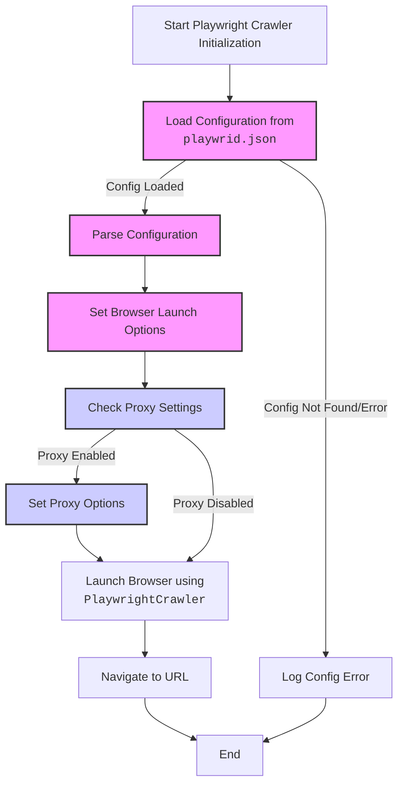

## <алгоритм>

1.  **Чтение конфигурации:**
    *   Ищется файл конфигурации `playwrid.json`.
    *   Если файл не найден или не может быть прочитан, регистрируется ошибка в лог.
    *   Если файл найден, его содержимое (JSON) десериализуется в Python-словарь.

2.  **Инициализация Playwright:**
    *   Создаётся экземпляр `PlaywrightCrawler`.
    *   Настраиваются параметры запуска браузера. Эти параметры могут включать:
        *   Тип браузера (`browser_type`): chromium, firefox, webkit (по умолчанию chromium).
        *   Запуск в headless-режиме (`headless`): True/False.
        *   Дополнительные опции командной строки (`options`).
        *   User-agent (`user_agent`).
        *   Настройки прокси (`proxy`): адрес, логин, пароль (опционально).
        *   Размер viewport (`viewport`): ширина и высота окна браузера.
        *   Таймаут (`timeout`) в миллисекундах.
        *   Игнорирование HTTPS-ошибок (`ignore_https_errors`).
    *   Если прокси включён, создаётся объект прокси, и он устанавливается в параметры запуска браузера.

3.  **Запуск браузера:**
    *   Вызывается метод `start(url)`, где `url` - целевой URL.
    *   Playwright запускает браузер с заданными параметрами.
    *   Браузер переходит по указанному `url`.
    *   В процессе выполнения все события и ошибки логируются.

4.  **Обработка ошибок:**
    *   Во время инициализации, при чтении конфигурации, или при запуске браузера могут возникнуть ошибки.
    *   Все ошибки регистрируются с помощью `logger`.
    *   Предусмотрена возможность настройки логирования для отслеживания проблем.

## <mermaid>



**Объяснение диаграммы `mermaid`:**

1.  **`Start`**: Начало процесса инициализации `PlaywrightCrawler`.
2.  **`LoadConfig`**: Загружает конфигурационный файл `playwrid.json`.
3.  **`ParseConfig`**: Разбирает JSON-конфигурацию в Python-словарь.
4.  **`SetBrowserOptions`**: Устанавливает параметры запуска браузера (тип браузера, headless-режим, опции, user-agent и т.д.) на основе загруженной конфигурации.
5.  **`CheckProxy`**: Проверяет, включен ли прокси-сервер в конфигурации.
6.  **`SetProxy`**: Если прокси включен, устанавливает его параметры.
7.  **`LaunchBrowser`**: Запускает браузер с помощью PlaywrightCrawler и всеми установленными опциями.
8. **`NavigateURL`**:  Переходит к указанному URL адресу.
9.  **`End`**: Завершение процесса.
10. **`ConfigError`**: Завершение процесса в случае ошибки конфигурации
11.  **`configClass`**:  Класс для визуального выделения блоков, связанных с конфигурацией.
12.  **`proxyClass`**: Класс для визуального выделения блоков, связанных с прокси-сервером.

## <объяснение>

### Импорты:

*   **`src.logger`**: Используется для логирования ошибок, предупреждений и отладочной информации. Это обеспечивает централизованное ведение журналов в проекте.

### Классы:

*   **`Playwrid`**:
    *   **Роль:** Главный класс модуля, реализующий обертку для `PlaywrightCrawler`. Инициализирует и управляет браузером.
    *   **Атрибуты:**
        *   `config`: Словарь, содержащий настройки браузера, прочитанные из `playwrid.json`.
        *  `logger`: Объект для логирования.
    *   **Методы:**
        *   `__init__(self, **kwargs)`: Конструктор класса. Читает конфигурацию из `playwrid.json`, настраивает Playwright, и инициализирует логгер. Параметр `kwargs` позволяет переопределить опции из json.
        *   `start(self, url)`: Запускает браузер и переходит по заданному URL.
    *   **Взаимодействие:** Этот класс использует `playwright` и `src.logger`.

### Функции:

*   **`__init__(self, **kwargs)`** (метод класса `Playwrid`):
    *   **Аргументы:**
        *   `self`: Ссылка на экземпляр класса.
        *   `kwargs`: Произвольные ключевые аргументы для переопределения параметров из файла конфигурации.
    *   **Возвращаемое значение:** Нет.
    *   **Назначение:** Инициализация класса. Загружает настройки из `playwrid.json`, устанавливает параметры браузера, настраивает логгер, и обрабатывает ошибки загрузки или парсинга конфигурации. Примеры:
    ```python
    browser = Playwrid() # Используется конфигурация из playwrid.json
    browser = Playwrid(headless=False) # Переопределение headless
    ```

*   **`start(self, url)`** (метод класса `Playwrid`):
    *   **Аргументы:**
        *   `self`: Ссылка на экземпляр класса.
        *   `url`: URL, на который нужно перейти в браузере.
    *   **Возвращаемое значение:** Нет.
    *   **Назначение:** Запускает браузер, переходит по заданному URL, и обрабатывает ошибки запуска браузера.
    ```python
    browser.start("https://www.example.com")
    ```

### Переменные:

*   `config`: Словарь, содержащий настройки браузера, прочитанные из `playwrid.json`.
*   `logger`: Объект для логирования.
*  `browser_type`: тип браузера для запуска.
*  `headless`: флаг для запуска браузера в режиме без GUI.
* `options`: список командных строк для браузера.
* `user_agent`: строка, содержащая User-Agent.
* `proxy`: словарь с настройками прокси сервера.
* `viewport`: словарь с настройками размера экрана.
* `timeout`: время ожидания для вебдрайвера.
* `ignore_https_errors`: флаг для игнорирования SSL ошибок.

### Потенциальные ошибки и области для улучшения:

1.  **Отсутствие файла `playwrid.json`**:
    *   Текущий код обрабатывает эту ошибку, записывая её в лог.
    *   Можно добавить создание файла по умолчанию, если он отсутствует.
2.  **Некорректный формат `playwrid.json`**:
    *   Код обрабатывает эту ошибку и записывает ее в лог.
    *   Можно добавить более детальную проверку формата `json` и валидацию полей.
3.  **Ошибки во время запуска Playwright**:
    *   Код логирует ошибки запуска, но не предоставляет возможность их перехватить.
    *   Можно расширить обработку ошибок при запуске браузера, чтобы дать возможность пользователю отреагировать.
4.  **Жестко заданное имя файла `playwrid.json`**:
    *   Можно добавить возможность указать имя файла конфигурации в качестве параметра при создании экземпляра `Playwrid`.
5.  **Обработка прокси**:
   *   Можно улучшить обработку разных видов прокси (socks4, socks5 и т.д.).
6.  **Типизация:**
    * Добавить typing для аргументов и возвращаемых значений, что улучшит читаемость и предотвратит некоторые ошибки.

### Цепочка взаимосвязей:

1.  `src.webdriver.playwright.Playwrid` зависит от `src.logger` для логирования.
2.  `Playwrid` использует библиотеку `playwright` для управления браузером.
3.  Настройки браузера берутся из `playwrid.json`, что позволяет централизованно настраивать вебдрайвер.
4.  `Playwrid` используется в других частях проекта для автоматизации браузерных задач.