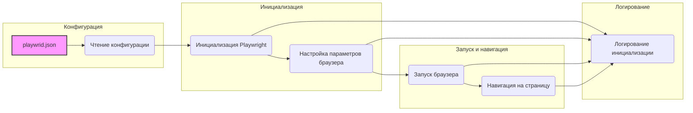

## Анализ кода `src/webdriver/playwright/README.MD`

### 1. <алгоритм>

**Блок-схема:**

1. **Чтение конфигурации:**
   - Читает данные из файла `playwrid.json`.
   - *Пример*: Загружает настройки браузера, такие как `browser_type: "chromium"`, `headless: true`, `user_agent: "Mozilla/5.0..."`.
   - Если `playwrid.json` отсутствует или содержит некорректные данные, записывает ошибку в лог и использует настройки по умолчанию.

2. **Инициализация Playwright:**
   - Использует значения из конфигурационного файла для инициализации экземпляра `Playwright`.
   - *Пример*: Запускает браузер `chromium` в headless режиме, устанавливает `user-agent` и размеры viewport.
   - Добавляет прокси-сервер, если он включен в конфигурации.

3. **Запуск браузера:**
    - Запускает браузер с заданными параметрами из конфигурационного файла.
    - *Пример*: Запускает браузер с опцией `--disable-gpu`.

4. **Навигация:**
    - Открывает URL, переданный в метод `start`.
    - *Пример*: Открывает страницу `https://www.example.com`.

5. **Логирование:**
   - Во время инициализации, настройки и исполнения скриптов, все ошибки и предупреждения записываются в лог.
   - *Пример*: Записывает в лог "Ошибка при инициализации Playwright Crawler" или "Настройки успешно загружены".

**Поток данных:**

- Файл `playwrid.json` -> (Чтение конфигурации) -> Настройки -> (Инициализация Playwright) -> Playwright (браузер) -> (Навигация) -> Веб-страница
- В процессе работы -> (Логирование) -> Логи

### 2. <mermaid>

**Объяснение зависимостей:**

- **`playwrid.json`**: Представляет файл конфигурации, который содержит параметры для настройки браузера.
- **Чтение конфигурации**: Модуль, который читает и парсит файл `playwrid.json` для извлечения настроек.
- **Инициализация Playwright**: Модуль, который использует настройки для инициализации Playwright.
- **Настройка параметров браузера**: Модуль, который применяет настройки к браузеру, такие как user-agent, viewport и т.д.
- **Запуск браузера**: Модуль, который запускает браузер с заданными параметрами.
- **Навигация на страницу**: Модуль, который открывает веб-страницу по заданному URL.
- **Логирование инициализации**: Модуль, который записывает информацию о процессе инициализации, ошибках и предупреждениях.

### 3. <объяснение>

**Импорты:**

- В данном файле `README.MD` не описаны импорты, так как это файл документации. Однако, согласно описанию, предполагается, что класс `Playwrid` импортирует следующие библиотеки:
    - `playwright`: Основная библиотека для управления браузером.
    - `crawlee`: Библиотека для веб-скрапинга.
    - `src.logger`: Модуль для логирования.

**Классы:**

-   **`Playwrid`** (предполагаемый класс, описанный в README.MD, но не показанный в явном виде в файле):
    -   **Роль**: Предоставляет интерфейс для взаимодействия с браузером на основе библиотеки `Playwright`.
    -   **Атрибуты**:
        -   `browser`: Экземпляр браузера Playwright.
        -   `config`: Конфигурационные настройки из файла `playwrid.json`.
    -   **Методы**:
        -   `__init__(self, options=None)`: Конструктор, загружает настройки из файла `playwrid.json` и инициализирует браузер с заданными опциями.
        -   `start(self, url)`: Метод для запуска браузера и открытия заданной веб-страницы.
    - **Взаимодействие**: Взаимодействует с библиотеками `playwright`, `crawlee`, `src.logger` и с файлом конфигурации `playwrid.json`.

**Функции:**

-  В файле `README.MD` не представлены функции в явном виде. Однако, подразумеваются следующие функции:
    -  `__init__(self, options=None)`: Инициализирует класс `Playwrid`, принимает дополнительные опции как аргумент, загружает конфигурацию из `playwrid.json`, конфигурирует браузер и логирует процесс. Возвращает экземпляр класса `Playwrid`.
    -   `start(self, url)`: Принимает `url` как аргумент, запускает браузер и открывает веб-страницу. Возвращает `None`.

**Переменные:**

-   `config`: Словарь (dict), который хранит данные, загруженные из файла `playwrid.json`.
-   `options`: Список (list) дополнительных опций для запуска браузера.
-   `browser_type`: Строка (str), тип браузера (например, "chromium", "firefox", "webkit").
-   `headless`: Булево значение (bool), определяет, будет ли браузер работать в фоновом режиме.
-   `user_agent`: Строка (str), пользовательский агент браузера.
-   `proxy`: Словарь (dict), настройки прокси-сервера.
-   `viewport`: Словарь (dict), размеры окна браузера.
-   `timeout`: Целое число (int), время ожидания (в миллисекундах).
-  `ignore_https_errors`: Булево значение (bool), определяет, игнорировать ли ошибки HTTPS.

**Потенциальные ошибки и области для улучшения:**

-   **Отсутствие обработки ошибок при чтении файла конфигурации**:  Необходимо добавить проверку наличия файла `playwrid.json`, а также проверку корректности данных в файле. Если файла нет или его структура невалидна, следует использовать значения по умолчанию и записать ошибку в лог.
-   **Обработка ошибок при запуске браузера**: Недостаточно информации об обработке ошибок при запуске браузера. Необходимо предусмотреть catch-блоки для ошибок, которые могут возникнуть при запуске браузера или навигации по URL.
-   **Отсутствие проверок на наличие необходимых пакетов**: Необходимо проверять наличие необходимых зависимостей (`playwright` и `crawlee`) и сообщать пользователю об ошибке, если они не установлены.
-  **Улучшенная документация:** Добавить более подробные примеры использования `Playwrid` в разных сценариях.
-  **Более гибкие опции конфигурации**:  Позволить передавать не только дополнительные опции командной строки, но и полный набор параметров Playwright API.

**Взаимосвязь с другими частями проекта:**

-  **`src.logger`**: Модуль логирования используется для записи всех ошибок и предупреждений в лог. Это позволяет упростить отладку и мониторинг.
-  **`src.webdriver.playwright`**: Этот модуль является частью более крупного проекта, который может использовать его для автоматизации веб-скрапинга или тестирования веб-приложений.