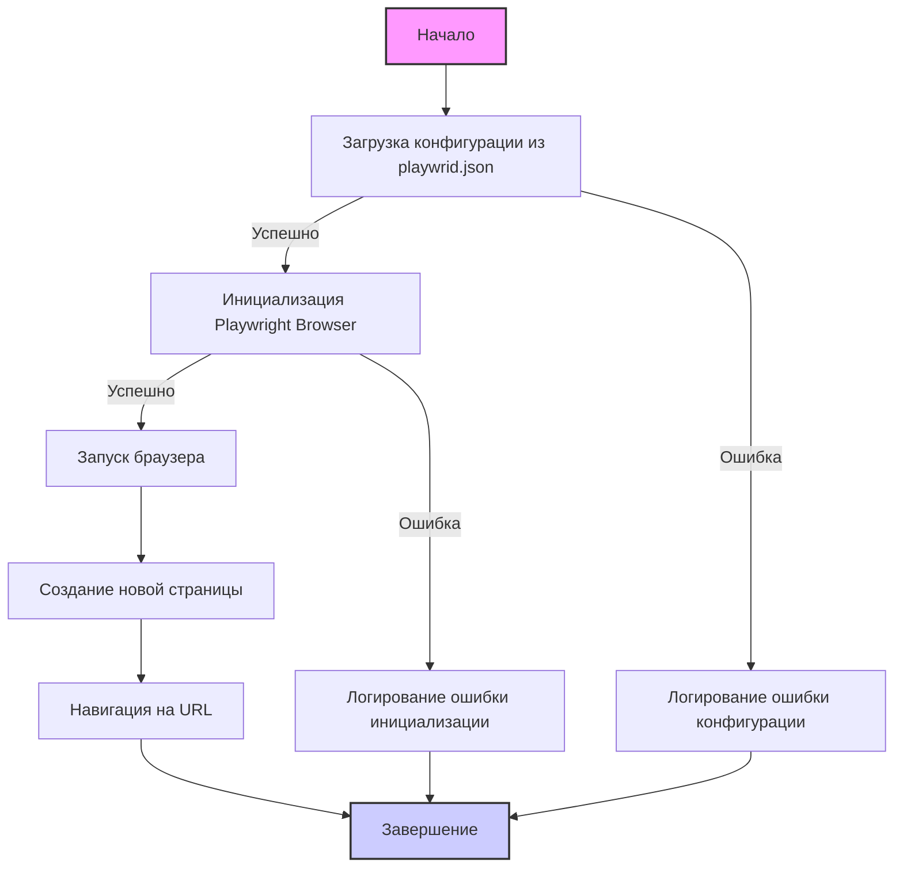

## ИНСТРУКЦИЯ:

Анализируй предоставленный код подробно и объясни его функциональность. Ответ должен включать три раздела:  

1. **<алгоритм>**: Опиши рабочий процесс в виде пошаговой блок-схемы, включая примеры для каждого логического блока, и проиллюстрируй поток данных между функциями, классами или методами.  
2. **<mermaid>**: Напиши код для диаграммы в формате `mermaid`, проанализируй и объясни все зависимости, 
    которые импортируются при создании диаграммы. 
    **ВАЖНО!** Убедитесь, что все имена переменных, используемые в диаграмме `mermaid`, 
    имеют осмысленные и описательные имена. Имена переменных вроде `A`, `B`, `C`, и т.д., не допускаются!  
    
    **Дополнительно**: Если в коде есть импорт `import header`, добавьте блок `mermaid` flowchart, объясняющий `header.py`:\
    ```mermaid
    flowchart TD
        Start --> Header[<code>header.py</code><br> Determine Project Root]
    
        Header --> import[Import Global Settings: <br><code>from src import gs</code>] 
    ```

3. **<объяснение>**: Предоставьте подробные объяснения:  
   - **Импорты**: Их назначение и взаимосвязь с другими пакетами `src.`.  
   - **Классы**: Их роль, атрибуты, методы и взаимодействие с другими компонентами проекта.  
   - **Функции**: Их аргументы, возвращаемые значения, назначение и примеры.  
   - **Переменные**: Их типы и использование.  
   - Выделите потенциальные ошибки или области для улучшения.  

Дополнительно, постройте цепочку взаимосвязей с другими частями проекта (если применимо).  

Это обеспечивает всесторонний и структурированный анализ кода.
## Формат ответа: `.md` (markdown)
**КОНЕЦ ИНСТРУКЦИИ**
```
## <алгоритм>
 
1. **Начало**: 
   - Пользователь инициирует использование модуля `Playwrid`, импортируя его из `src.webdriver.playwright`.
   - Пример: `from src.webdriver.playwright import Playwrid`
2. **Загрузка конфигурации**: 
   - При инициализации класса `Playwrid` (например, `browser = Playwrid()`) модуль пытается прочитать настройки из файла `playwrid.json`.
   - Если файл не найден или возникли ошибки, происходит запись в лог.
   - Пример: `config = self._load_config()`
3. **Инициализация Playwright**:
    - Создание объекта `PlaywrightBrowser` на основе `browser_type` из файла `playwrid.json` (`chromium`, `firefox`, `webkit`).
    - Передача настроек из файла, таких как `headless`, `options` (аргументы командной строки), `user_agent`, `proxy`, `viewport`, `timeout`, `ignore_https_errors`.
    - Логирование процесса инициализации.
    - Пример: `self.browser = playwright[browser_type].launch(**options)`
4. **Запуск браузера**:
    - Вызов метода `start` для открытия браузера и навигации на указанный URL.
    - Пример: `browser.start("https://www.example.com")`
5. **Навигация**:
    - Создание новой страницы в браузере.
    - Навигация на запрошенный URL.
    - Пример: `self.page = self.browser.new_page(); self.page.goto(url)`
6. **Обработка ошибок**:
    - В случае возникновения ошибок в процессе загрузки конфигурации, инициализации или навигации происходит запись в лог.
    - Пример: `logger.error(f"Error during WebDriver initialization: {e}")`
7. **Завершение**:
    - Браузер остается открытым до явного закрытия.
 
## <mermaid>

 

**Описание диаграммы:**
 

-   `Start`: Начало процесса.
-   `LoadConfig`: Загрузка конфигурации из файла `playwrid.json`.
-   `InitPlaywright`: Инициализация Playwright с настройками из конфигурации.
-   `LaunchBrowser`: Запуск браузера.
-   `CreatePage`: Создание новой страницы в браузере.
-   `Navigate`: Навигация по заданному URL.
-   `End`: Завершение процесса.
-   `LogConfigError`: Запись ошибки загрузки конфигурации в лог.
-   `LogInitError`: Запись ошибки инициализации браузера в лог.

**Зависимости**

В данной диаграмме нет явных импортов, она описывает последовательность операций. Однако,  есть подразумеваемые зависимости от библиотек Playwright и Crawlee.  Она иллюстрирует поток данных и логику выполнения, которые определяются кодом, описанным в README.MD
 

## <объяснение>
 

**Импорты:**
 

-   В данном файле нет явных импортов. Однако, текст подразумевает использование библиотек:
    -   **Playwright**: для управления браузером (chromium, firefox, webkit).
    -   **Crawlee**: для создания и управления веб-скраперами (хотя напрямую не используется в тексте, подразумевается ее использование при создании `PlaywrightCrawler`, который упоминается в самом начале README.MD).
    -   **`src.logger`**: используется для логирования ошибок, предупреждений и информации.
 

**Классы:**
 

-   `Playwrid`: Этот класс является основной сущностью модуля, обеспечивающей взаимодействие с Playwright.
    -   **Атрибуты**:
        -   `browser`: Объект Playwright Browser, представляющий экземпляр браузера.
        -   `page`:  Объект Playwright Page, представляющий открытую страницу в браузере.
        -   `config`: Словарь с настройками, загруженными из файла `playwrid.json`.
        -   `logger`: Объект `Logger`, для логирования.
    -   **Методы**:
        -   `__init__(self, **kwargs)`: Конструктор класса, который загружает настройки из `playwrid.json`, инициализирует Playwright и настраивает браузер. Принимает дополнительные параметры (custom options).
        -   `_load_config(self)`: Загружает конфигурацию из файла `playwrid.json`, обрабатывая возможные ошибки.
        -   `start(self, url)`: Запускает браузер, создает новую страницу и переходит на заданный URL.
 

**Функции:**
 

-   `__init__(self, **kwargs)`: 
    -   Аргументы: `kwargs` (произвольные ключевые аргументы для пользовательских настроек).
    -   Возвращаемое значение: None.
    -   Назначение: Инициализация экземпляра класса, загрузка конфигурации и инициализация браузера Playwright.
    -   Пример: `browser = Playwrid(options=["--headless"], user_agent="MyCustomAgent")`
-    `_load_config(self)`:
    -   Аргументы: None.
    -   Возвращаемое значение: Словарь с настройками.
    -   Назначение: Загружает и возвращает настройки из `playwrid.json`, обрабатывая исключения.
    -   Пример: `config = self._load_config()`
-   `start(self, url)`:
    -   Аргументы: `url` (строка, URL для навигации).
    -   Возвращаемое значение: None.
    -   Назначение: Запускает браузер, открывает новую страницу и переходит по указанному URL.
    -   Пример: `browser.start("https://www.example.com")`
 

**Переменные:**
 

-   `browser_type`: Тип браузера (`chromium`, `firefox`, `webkit`). Загружается из `playwrid.json`.
-   `headless`:  Булевское значение, определяет запуск браузера в headless режиме. Загружается из `playwrid.json`.
-   `options`: Список строковых аргументов командной строки для запуска браузера. Загружается из `playwrid.json`.
-   `user_agent`: Строка, представляющая user-agent для браузера. Загружается из `playwrid.json`.
-   `proxy`: Словарь с настройками прокси-сервера. Загружается из `playwrid.json`.
    -   `enabled`: Булевское значение, определяющее, включен ли прокси.
    -   `server`: Строка, представляющая адрес прокси-сервера.
    -   `username`: Строка, представляющая имя пользователя для аутентификации прокси.
    -   `password`: Строка, представляющая пароль для аутентификации прокси.
-    `viewport`: Словарь с размерами окна браузера. Загружается из `playwrid.json`.
    -   `width`: Ширина окна.
    -   `height`: Высота окна.
-    `timeout`: Максимальное время ожидания операций в миллисекундах. Загружается из `playwrid.json`.
-   `ignore_https_errors`: Булевское значение, определяет игнорирование HTTPS ошибок. Загружается из `playwrid.json`.
- `url`: Строка, представляющая URL для навигации, передается в метод `start()`.
 

**Потенциальные ошибки и области для улучшения:**
 

1.  **Обработка отсутствия `playwrid.json`**: В README.md не предусмотрено явной обработки ситуации, когда файл `playwrid.json` отсутствует. Это может привести к ошибке при инициализации. Следует добавить проверку наличия файла и обработку исключения.
2.  **Более гибкая конфигурация**: В данный момент конфигурация загружается только из `playwrid.json`. Было бы полезно иметь возможность задавать настройки через переменные окружения или передавать в класс `Playwrid` словарь с настройками напрямую.
3.  **Более подробное логирование**: Хотя логирование есть, было бы полезно добавить логирование действий с браузером (например, успешная навигация, загрузка контента).
4.  **Закрытие браузера**: В примере использования отсутствует явное закрытие браузера, что может привести к утечке ресурсов. Следует добавить метод для закрытия браузера.
5. **Улучшения валидации конфигурации**:
   -   Добавить валидацию для числовых значений (`timeout`, `viewport.width`, `viewport.height`).
   -   Обеспечить проверку на допустимые значения для `browser_type` (`chromium`, `firefox`, `webkit`).

**Цепочка взаимосвязей:**
 

-   Модуль `src.webdriver.playwright` зависит от библиотек `playwright` и `crawlee`.
-   Модуль использует `src.logger` для логирования.
-   Модуль читает настройки из файла `playwrid.json`.
-   Настройки, загруженные из `playwrid.json`, влияют на инициализацию и поведение браузера Playwright.
-   Модуль может использоваться в других частях проекта, где требуется автоматизация браузера с Playwright.