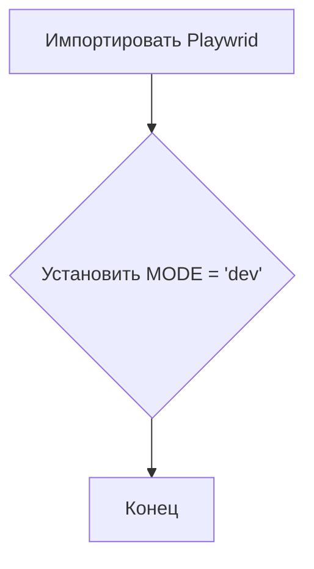
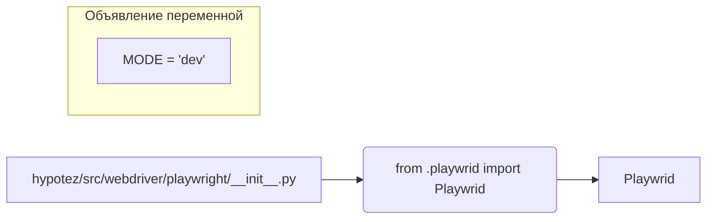

# <input code>

```python
## \file hypotez/src/webdriver/playwright/__init__.py
# -*- coding: utf-8 -*-
#! venv/Scripts/python.exe
#! venv/bin/python/python3.12

"""
.. module: src.webdriver.playwright 
	:platform: Windows, Unix
	:synopsis:
https://chatgpt.com/share/67428d3f-6b18-800d-a585-eb414eef60e2
"""
MODE = 'dev'

from .playwrid import Playwrid
```

# <algorithm>

Этот код представляет собой инициализацию модуля `src.webdriver.playwright`.  Алгоритм работы очень простой:

1. **Импортирование:** Модуль импортирует класс `Playwrid` из подмодуля `playwrid`.
2. **Установка переменной конфигурации:** Устанавливается строковая переменная `MODE` со значением 'dev'.  Это, скорее всего, конфигурационная переменная для режима работы (например, разработки или производства).

Поскольку нет циклов или сложных условных операторов, блок-схема в данном случае состоит из двух шагов:



Пример: При запуске кода, переменная `MODE` будет установлена в значение 'dev', а модуль `Playwrid` будет импортирован для дальнейшего использования.


# <mermaid>



**Объяснение диаграммы:**

Модуль `hypotez/src/webdriver/playwright/__init__.py` импортирует класс `Playwrid` из подмодуля `playwrid`.  Внутри модуля инициализируется переменная `MODE` со значением 'dev'.  Эта диаграмма иллюстрирует простую структуру импорта и инициализации.


# <explanation>

**Импорты:**

`from .playwrid import Playwrid`:  Этот импорт подключает класс `Playwrid` из подмодуля `playwrid` внутри того же пакета `webdriver/playwright`.  Таким образом, код предполагает наличие файла `playwrid.py` в папке `hypotez/src/webdriver/playwright/`.  Важно, что импорт происходит с использованием `.`, что указывает на поиск внутри текущего пакета. Это ключевой элемент модульной структуры Python.

**Классы:**

`Playwrid`: Этот класс, скорее всего, определен в файле `playwrid.py` и содержит методы и атрибуты, связанные с управлением веб-драйвером Playwright.  Подробности о функциональности `Playwrid`  неизвестны без анализа `playwrid.py`.

**Функции:**

Нет определённых функций в данном файле.  Все действия сводятся к импорту и инициализации.

**Переменные:**

`MODE`:  Строковая переменная, вероятно, используется для определения режима работы (например, 'dev' для разработки или 'prod' для производства).  Значение может влиять на поведение других частей кода.

**Возможные ошибки и улучшения:**

* **Отсутствие документации:** Отсутствуют docstrings для `Playwrid` и `MODE`.  Добавление документации существенно улучшит читабельность и понимание кода.
* **Неясный смысл имени `playwrid`:**  Имя `playwrid`  вместо ожидаемого `playwright` может указывать на ошибку в именовании или на использование устаревшего имени для `Playwright`.
* **Недостаточная информация о `Playwrid`:** Необходимо ознакомиться с кодом класса `Playwrid` в файле `playwrid.py` для понимания его предназначения и функциональности.

**Взаимосвязь с другими частями проекта:**

Модуль `webdriver/playwright`  представляет собой  часть инфраструктуры тестирования или автоматизации, скорее всего, интегрированную с другими компонентами проекта, такими как фреймворк для тестов (например, pytest или unittest), система управления конфигурациями, или другие модули для подготовки и запуска тестов.


```