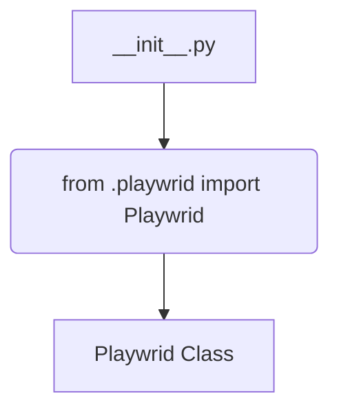

```MD
# <input code>

```python
## \file hypotez/src/webdriver/playwright/__init__.py
# -*- coding: utf-8 -*-
#! venv/Scripts/python.exe
#! venv/bin/python/python3.12

"""
.. module: src.webdriver.playwright 
	:platform: Windows, Unix
	:synopsis:
https://chatgpt.com/share/67428d3f-6b18-800d-a585-eb414eef60e2
"""
MODE = 'dev'

from .playwrid import Playwrid
```

# <algorithm>

Этот код представляет собой инициализационный модуль для подмодуля `playwright` пакета `webdriver`.  Алгоритм работы достаточно прост: он импортирует класс `Playwrid` из подмодуля `playwrid`.  Нет циклов, условий или вызовов сторонних функций, кроме импорта.



В этом случае данные не перемещаются между функциями/классами, а просто происходит импорт определения класса `Playwrid` в текущий модуль.


# <mermaid>


# <explanation>

* **Импорты**:
    - `from .playwrid import Playwrid`: Этот импорт подключает определение класса `Playwrid` из модуля `playwrid`, который, предположительно, находится в той же директории (`.playwrid.py` или подобном).  Связь между `src` и другими частями проекта косвенна. `src` это, вероятно, основной пакет проекта, а `webdriver.playwright` является его подпакет, отвечающий за работу с браузером Playwright.

* **Классы**:
    - `Playwrid`:  Данный класс, определенный в файле `.playwrid.py`, не отображается в данном файле, но он импортируется, что означает, что `Playwrid` определенно нужен для работы кода, который его использует.  Без знания `Playwrid` нельзя с уверенностью сказать, для чего он предназначен и как он взаимодействует с другими частями проекта.

* **Функции**:
    - Нет определённых функций в данном файле.  Всё сводится к импорту определения класса.

* **Переменные**:
    - `MODE = 'dev'`:  Эта переменная, вероятно, определяет режим работы, например, 'dev' (разработка) или 'prod' (производство).  Это может влиять на поведение других частей кода.  Тип данных – строка.


* **Возможные ошибки/улучшения**:
    - Отсутствует документация к классу `Playwrid`.  Необходимо добавить документацию, чтобы другие разработчики понимали назначение и использование класса.
    - Не ясна роль переменной `MODE`.  Следует добавить комментарий, описывающий ее влияние и возможные значения.

**Цепочка взаимосвязей**:
Этот модуль (`hypotez/src/webdriver/playwright/__init__.py`) импортирует класс `Playwrid`,  который, скорее всего, реализует взаимодействие с браузером Playwright.  В свою очередь, этот браузерный взаимодействие используется в других частях проекта `hypotez` для автоматизации веб-тестирования или других задач, связанных с веб-драйвером.  Так как конкретные детали реализации класса `Playwrid` не представлены, то дальнейшие связи невозможно определить с точностью.  Без доступа к файлу `.playwrid.py` нельзя точно сказать, как он взаимодействует с другими частями проекта.