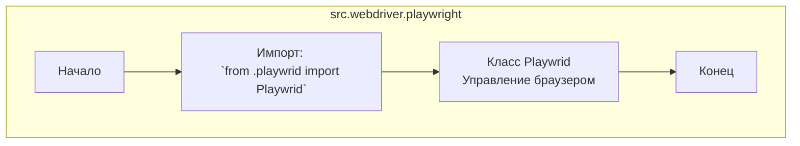

## <алгоритм>

1. **Импорт модуля:**
   - Начинаем с импорта класса `Playwrid` из модуля `playwrid` (который находится в той же директории).
   - Пример: `from .playwrid import Playwrid`

2. **Использование класса `Playwrid`:**
   - В данном коде, после импорта, класс `Playwrid` может быть использован для создания экземпляров и вызова его методов.
   - Пример: `browser_instance = Playwrid()`
   - Пример: `browser_instance.launch_browser()`

## <mermaid>

**Объяснение зависимостей `mermaid`:**

- `src.webdriver.playwright`: Представляет текущий модуль, который содержит этот файл (`__init__.py`).
- `Start`: Начальная точка диаграммы, представляющая начало выполнения кода.
- `ImportPlaywrid`: Указывает на операцию импорта класса `Playwrid` из модуля `playwrid`.
- `PlaywridClass`: Представляет класс `Playwrid`, который импортируется и отвечает за управление браузером.
- `End`: Конечная точка диаграммы, представляющая завершение выполнения кода.

## <объяснение>

**Импорты:**

-   `from .playwrid import Playwrid`:
    -   **Назначение**: Импортирует класс `Playwrid` из модуля `playwrid.py`, находящегося в той же директории (`.`). Это позволяет использовать класс `Playwrid` для управления браузером Playwright.
    -   **Взаимосвязь**: Этот импорт устанавливает зависимость от конкретной реализации `Playwrid`, определенной в файле `playwrid.py`.

**Классы:**

-   `Playwrid`:
    -   **Роль**: Класс `Playwrid`, вероятно, содержит логику для управления браузером Playwright, включая запуск браузера, навигацию по страницам, взаимодействие с элементами и так далее.
    -   **Атрибуты и методы**: Детали атрибутов и методов `Playwrid` не видны в этом файле, но, исходя из названия, можно предположить наличие методов, таких как `launch_browser()`, `goto_page()`, `click_element()`, и так далее.
    -   **Взаимодействие**: Класс `Playwrid` будет взаимодействовать непосредственно с API Playwright для выполнения браузерных операций.

**Функции:**

-   В данном файле нет явно определенных функций, но он служит как точка входа для модуля `src.webdriver.playwright` и импортирует класс для дальнейшего использования.

**Переменные:**

-   В файле нет явно определенных переменных, но после импорта класс `Playwrid` может быть присвоен переменной при создании его экземпляра, например: `browser_instance = Playwrid()`.

**Потенциальные ошибки и области для улучшения:**

-   **Отсутствие документации**: Не хватает docstrings или комментариев для `Playwrid` класса в `playwrid.py`, что делает код менее понятным.
-   **Неполнота кода**: Этот файл (`__init__.py`) только импортирует `Playwrid`; он не содержит логику использования класса.
-   **Неявные зависимости**: Зависимость от `playwrid.py` не видна явно из этого файла.
-   **Отсутствие обработки ошибок**: Не видно механизмов обработки исключений при работе с браузером.

**Цепочка взаимосвязей с другими частями проекта:**

-   Этот модуль `src.webdriver.playwright` является частью большего пакета `src.webdriver`, который, вероятно, отвечает за взаимодействие с веб-браузерами.
-   Предположительно, другие модули проекта будут использовать класс `Playwrid` для автоматизации веб-тестов, сбора данных или выполнения других задач, связанных с браузером.

В целом, этот файл (`__init__.py`) выполняет функцию объявления модуля `src.webdriver.playwright` и обеспечивает доступ к классу `Playwrid`. Для полноценного понимания необходимо изучить реализацию класса `Playwrid` в файле `playwrid.py`.