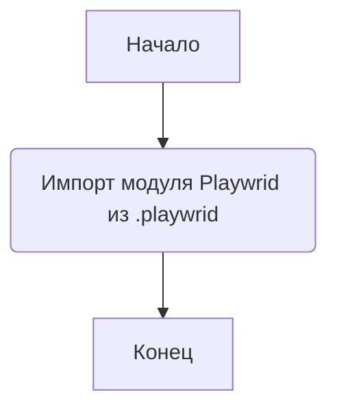
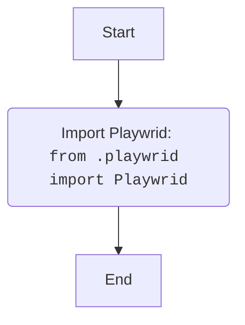

## Анализ кода `src/webdriver/playwright/__init__.py`

### 1. <алгоритм>

**Блок-схема:**

**Пример:**
1.  **Начало:**  Программа начинает выполнение.
2.  **Импорт модуля Playwrid:** Импортируется класс `Playwrid` из модуля `playwrid.py`, находящегося в той же директории.
3.  **Конец:** Завершение выполнения импорта.

### 2. <mermaid>

**Зависимости:**

*   Импортируется `Playwrid` из локального модуля `playwrid.py`.
*   Других зависимостей в этом файле нет.

### 3. <объяснение>

**Импорты:**
*   `from .playwrid import Playwrid`:  Импортируется класс `Playwrid` из модуля `playwrid.py`. Точка (`.`) в `from .playwrid` означает, что модуль `playwrid` находится в той же директории, что и файл `__init__.py`.  `Playwrid` вероятно, является основным классом для управления браузером с использованием Playwright.

**Классы:**
*   `Playwrid`: Судя по импорту, это класс, который предположительно предоставляет интерфейс для управления браузером через Playwright. Файл `__init__.py` не содержит его реализации, а лишь импортирует. 

**Функции:**
*   В данном файле нет объявленных функций.

**Переменные:**
*   В данном файле нет объявленных переменных.

**Объяснение:**

Файл `__init__.py`  в Python используется для того, чтобы директорию можно было рассматривать как пакет (папку с модулями). В данном случае, он делает директорию `webdriver.playwright` пакетом и позволяет импортировать  `Playwrid` напрямую из пакета. Этот подход упрощает доступ к классам и другим элементам модуля.

**Цепочка взаимосвязей с другими частями проекта:**

1.  `src.webdriver.playwright`:  Этот пакет является частью более широкого пакета `src.webdriver`, что указывает на то, что он отвечает за взаимодействие с веб-браузерами.
2.  `playwrid.py`: Класс `Playwrid`, импортированный из `playwrid.py`, вероятно, содержит основную логику управления Playwright. Этот файл не представлен, поэтому полная картина его работы неясна.

**Потенциальные ошибки и области для улучшения:**

*   **Отсутствие документации:** Файл содержит только импорт и docstring. Было бы полезно добавить информацию о том, что конкретно делает этот пакет и как он связан с остальной частью проекта.
*   **Предположительное назначение:** Назначение и реализация `Playwrid` класса только предполагаются, поскольку его код не предоставлен. В будущем необходимо предоставить код `playwrid.py` для полноценного анализа.
*   **Нет примеров использования:** Отсутствие примеров кода и вариантов использования затрудняет понимание назначения пакета.