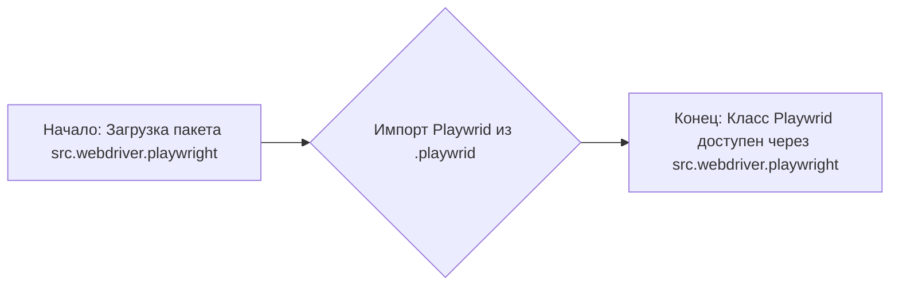
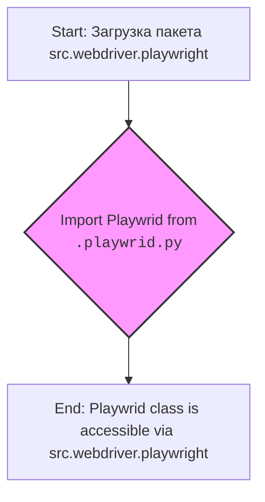

## АНАЛИЗ КОДА: `src/webdriver/playwright/__init__.py`

### 1. <алгоритм>

**Описание:**

Этот файл `__init__.py` в пакете `src.webdriver.playwright` играет роль точки входа для этого модуля. Его основная функция - импортировать и сделать доступным класс `Playwrid` из модуля `playwrid.py` внутри того же пакета. 

**Пошаговая блок-схема:**

**Примеры:**
*   **`Начало`**: Когда код импортирует `src.webdriver.playwright`, этот файл `__init__.py` выполняется.
*   **`Импорт Playwrid из .playwrid`**: Строка `from .playwrid import Playwrid` импортирует класс из модуля `playwrid.py` находящегося в текущем каталоге пакета.
*   **`Конец`**: Теперь, когда импорт завершен, можно использовать `Playwrid` через `src.webdriver.playwright.Playwrid`.

### 2. <mermaid>

**Объяснение зависимостей:**

*   `Start`: Обозначает начало процесса, когда модуль `src.webdriver.playwright` загружается.
*   `Import Playwrid from .playwrid.py`: Указывает на импорт класса `Playwrid` из файла `playwrid.py`, который находится в том же каталоге пакета `src.webdriver.playwright`. 
*   `End`: Обозначает, что класс `Playwrid` теперь доступен через `src.webdriver.playwright.Playwrid`.
*   `classDef import`:  Задает стиль для блока импорта.

### 3. <объяснение>

**Импорты:**

*   `from .playwrid import Playwrid`: Эта строка импортирует класс `Playwrid` из модуля `playwrid.py`, который расположен в том же каталоге. Точка (`.`) перед `playwrid` указывает на относительный импорт внутри текущего пакета. Это позволяет использовать класс `Playwrid` при вызове модуля  `src.webdriver.playwright`.

**Классы:**
*   В данном файле класса не объявляются. Он выступает как точка входа для модуля и делает класс `Playwrid`, импортированный из `playwrid.py`, доступным.

**Функции:**
*   Файл `__init__.py` не содержит функций.

**Переменные:**
*   Файл `__init__.py` не содержит переменных.

**Потенциальные ошибки и области для улучшения:**

*   В данном файле отсутствуют потенциальные ошибки.
*   В текущей реализации `__init__.py` выполняет только импорт класса `Playwrid`. В будущем может потребоваться импортирование дополнительных классов или функций, поэтому этот файл нужно будет расширить.

**Цепочка взаимосвязей с другими частями проекта:**

1.  **Использование:** Другие части проекта, например, тесты или другие модули, могут использовать `src.webdriver.playwright.Playwrid` для взаимодействия с браузером через Playwright.
2.  **Зависимости:** Модуль `src.webdriver.playwright` зависит от Playwright, который, в свою очередь, должен быть установлен как зависимость проекта.
3.  **Архитектура:** `src.webdriver.playwright` является частью общего веб-драйверного модуля проекта и предоставляет специфические инструменты для работы с Playwright.
4.  **Интеграция:** Интеграция происходит через импорт класса `Playwrid` в другие модули.

**Дополнительные Заметки**
*   Строка `#! .pyenv/bin/python3` указывает на путь к интерпретатору Python, но в этом контексте она является избыточной, так как файл `__init__.py` не выполняется как скрипт.
*   Документация в формате docstring: `"""..."""` предоставляет краткое описание модуля и ссылки на внешние ресурсы.