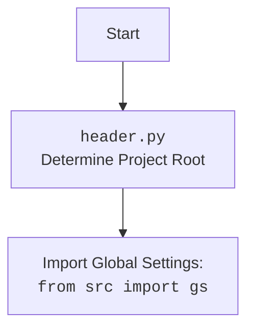

## ИНСТРУКЦИЯ:

Анализируй предоставленный код подробно и объясни его функциональность. Ответ должен включать три раздела:  

1. **<алгоритм>**: Опиши рабочий процесс в виде пошаговой блок-схемы, включая примеры для каждого логического блока, и проиллюстрируй поток данных между функциями, классами или методами.  
2. **<mermaid>**: Напиши код для диаграммы в формате `mermaid`, проанализируй и объясни все зависимости, 
    которые импортируются при создании диаграммы. 
    **ВАЖНО!** Убедитесь, что все имена переменных, используемые в диаграмме `mermaid`, 
    имеют осмысленные и описательные имена. Имена переменных вроде `A`, `B`, `C`, и т.д., не допускаются!  
    
    **Дополнительно**: Если в коде есть импорт `import header`, добавьте блок `mermaid` flowchart, объясняющий `header.py`:\
    ```mermaid
    flowchart TD
        Start --> Header[<code>header.py</code><br> Determine Project Root]
    
        Header --> import[Import Global Settings: <br><code>from src import gs</code>] 
    ```

3. **<объяснение>**: Предоставьте подробные объяснения:  
   - **Импорты**: Их назначение и взаимосвязь с другими пакетами `src.`.  
   - **Классы**: Их роль, атрибуты, методы и взаимодействие с другими компонентами проекта.  
   - **Функции**: Их аргументы, возвращаемые значения, назначение и примеры.  
   - **Переменные**: Их типы и использование.  
   - Выделите потенциальные ошибки или области для улучшения.  

Дополнительно, постройте цепочку взаимосвязей с другими частями проекта (если применимо).  

Это обеспечивает всесторонний и структурированный анализ кода.
## Формат ответа: `.md` (markdown)
**КОНЕЦ ИНСТРУКЦИИ**
```

## <алгоритм>
1. **Начало**: Скрипт начинает выполнение.
2. **Определение корня проекта (`set_project_root`)**:
   - Инициализируется `current_path` как абсолютный путь к директории, где расположен текущий файл `header.py`.
   - Инициализируется `__root__` как `current_path`.
   - Цикл по родительским директориям, начиная с `current_path` до корня диска.
     - Проверка, существует ли в текущей родительской директории один из `marker_files` (по умолчанию `__root__` или `.git`).
     - Если любой из `marker_files` найден, `__root__` обновляется до этой родительской директории и цикл прерывается.
   - Если `__root__` нет в `sys.path`, он добавляется в начало `sys.path` для обеспечения корректного импорта модулей проекта.
   - Функция возвращает `__root__`.
   - **Пример**: Предположим, что `header.py` находится в `hypotez/src/webdriver/playwright`, а корневая папка проекта `hypotez`, тогда  `current_path` будет `hypotez/src/webdriver/playwright`, а функция будет искать в `hypotez/src/webdriver/playwright`, `hypotez/src/webdriver`, `hypotez/src`, `hypotez`,  и если `.git`  есть в `hypotez`, то вернет путь `hypotez`.
3. **Инициализация `__root__`**: Вызывает функцию `set_project_root()` для определения корня проекта и сохраняет результат в переменную `__root__`.
4. **Импорт `gs`**: Импортирует глобальные настройки из модуля `src.gs`.
5. **Чтение `settings.json`**:
   - Пытается открыть и прочитать файл `settings.json` из `src` директории, относительно корня проекта.
   - Если файл успешно прочитан, загружает его содержимое в переменную `settings` как словарь.
   - Если возникают `FileNotFoundError` или `json.JSONDecodeError`, обработка ошибок выполняется с помощью `...` (пропускается).
6. **Чтение `README.MD`**:
    - Пытается открыть и прочитать файл `README.MD` из `src` директории, относительно корня проекта.
   - Если файл успешно прочитан, загружает его содержимое в переменную `doc_str` как строку.
   - Если возникают `FileNotFoundError` или `json.JSONDecodeError`, обработка ошибок выполняется с помощью `...` (пропускается).
7. **Инициализация глобальных переменных**:
    -  Инициализируются `__project_name__`, `__version__`, `__doc__`, `__details__`, `__author__`, `__copyright__`, `__cofee__` на основе данных из словаря `settings`, если он есть, или значения по умолчанию.
    -  **Пример**: Если в `settings.json` есть `{"project_name": "my_project", "version": "1.0.0"}`, тогда `__project_name__` будет `"my_project"` и `__version__` будет `"1.0.0"`.
8. **Конец**: Скрипт завершает выполнение.

## <mermaid>
```mermaid
flowchart TD
    Start(Начало) --> SetProjectRoot[<code>set_project_root()</code><br>Определение корня проекта]
    SetProjectRoot --> FindRoot[Поиск корневой директории по marker_files]
    FindRoot -- Найдена корневая директория --> UpdateRoot[Обновить __root__]
    UpdateRoot --> AddToSysPath[Добавить __root__ в sys.path]
    AddToSysPath --> ReturnRoot[Возврат __root__]
    FindRoot -- Не найдена корневая директория --> UpdateRoot
    ReturnRoot --> InitRoot[Инициализация __root__]
    InitRoot --> ImportGS[Импорт глобальных настроек: <code>from src import gs</code>]
    ImportGS --> ReadSettings[Чтение settings.json]
    ReadSettings -- Успешно прочитано --> ReadDoc[Чтение README.MD]
    ReadSettings -- Ошибка --> ReadDoc
    ReadDoc -- Успешно прочитано --> InitGlobalVars[Инициализация глобальных переменных]
    ReadDoc -- Ошибка --> InitGlobalVars
    InitGlobalVars --> End(Конец)

   style Start fill:#f9f,stroke:#333,stroke-width:2px
    style End fill:#f9f,stroke:#333,stroke-width:2px
```

## <объяснение>
### Импорты
* `sys`: Модуль `sys` используется для взаимодействия с интерпретатором Python, в частности, для добавления пути к корню проекта в список путей поиска модулей (`sys.path`). Это позволяет импортировать модули из проекта.
* `json`: Модуль `json` используется для работы с данными в формате JSON, конкретно для загрузки настроек из файла `settings.json`.
* `packaging.version`: Модуль `packaging.version` используется для работы с версиями пакетов, но в этом коде он не используется напрямую. Возможно, он будет использоваться в дальнейшем.
* `pathlib.Path`: Класс `Path` из модуля `pathlib` используется для работы с файловыми путями в объектно-ориентированном стиле.

### Функция `set_project_root`
* **Аргументы**:
    * `marker_files` (tuple, необязательный): кортеж с именами файлов или папок, которые обозначают корень проекта (по умолчанию `('__root__', '.git')`).
* **Возвращаемое значение**:
    * `Path`: Объект `Path`, представляющий путь к корню проекта.
* **Назначение**: Функция определяет корень проекта, поднимаясь по родительским каталогам от текущего файла, пока не найдет один из маркерных файлов. Если маркерный файл не найден, возвращается путь к директории, где находится файл `header.py`. Функция также добавляет путь к корню проекта в `sys.path`, что позволяет импортировать модули из проекта.
* **Примеры**:
   * Если `header.py` находится в `hypotez/src/webdriver/playwright` и в `hypotez` есть `.git`, то функция вернет `Path('hypotez')`.
   * Если `header.py` находится в `hypotez/src/webdriver/playwright` и маркерные файлы не найдены, функция вернет `Path('hypotez/src/webdriver/playwright')`.

### Переменные
* `__root__` (`Path`): Путь к корню проекта. Это значение получается в результате работы функции `set_project_root()`.
* `settings` (`dict`): Словарь, содержащий настройки проекта, загруженные из `settings.json`. Если файл не найден или неверный формат, значение остается `None`.
* `doc_str` (`str`): Строка, содержащая текст из файла `README.MD`. Если файл не найден или неверный формат, значение остается `None`.
* `__project_name__` (`str`): Имя проекта. Загружается из `settings` или имеет значение по умолчанию 'hypotez'.
* `__version__` (`str`): Версия проекта. Загружается из `settings` или имеет значение по умолчанию ''.
* `__doc__` (`str`): Содержание файла `README.MD`.
* `__details__` (`str`): Детали проекта. В данном коде всегда пустая строка ''.
* `__author__` (`str`): Автор проекта. Загружается из `settings` или имеет значение по умолчанию ''.
* `__copyright__` (`str`): Информация об авторских правах. Загружается из `settings` или имеет значение по умолчанию ''.
* `__cofee__` (`str`): Сообщение о поддержке разработчика. Загружается из `settings` или имеет значение по умолчанию "Treat the developer to a cup of coffee for boosting enthusiasm in development: https://boosty.to/hypo69".

###  Взаимосвязь с другими частями проекта:
* `src.gs`: `header.py` импортирует глобальные настройки из `src.gs`. Это предполагает, что `gs` содержит пути и другие глобальные конфигурации, используемые в проекте.
* `settings.json`: Файл `settings.json` используется для хранения настроек проекта, таких как имя проекта, версия, автор и т.д.
* `README.MD`: Содержимое файла `README.MD` используется для заполнения переменной `__doc__`.

### Потенциальные ошибки и области для улучшения:
*   **Обработка ошибок**: В блоках `try-except` используется `...` для обработки исключений `FileNotFoundError` и `json.JSONDecodeError`. Это подавляет ошибки и усложняет отладку. Следует использовать более явную обработку ошибок, например, логирование или установка значений по умолчанию.
*   **Неиспользуемый импорт**: Импорт `packaging.version` не используется в текущем коде, следует либо использовать этот модуль, либо удалить этот импорт.
*   **Использование `...`**: Использование `...` для `except`  является нежелательным, следует обрабатывать ошибки явно и, при необходимости, записывать их в лог.
*   **Отсутствие типа в `__details__`**: В коде не определен тип данных для `__details__`.
*   **Неявное использование `gs.path.root`**: В коде используется `gs.path.root`, предполагая, что в `src.gs` есть свойство `path.root`, однако это не проверяется.
*  **Жестко закодированные пути**: Файлы `settings.json` и `README.MD` находятся в `src`, что может создать проблемы, если структура проекта будет изменена.

### Вывод
Код выполняет важную роль в инициализации проекта, определяя его корень и загружая настройки. Тем не менее, он требует улучшения в обработке ошибок, использовании неявных зависимостей и неиспользуемых импортах.