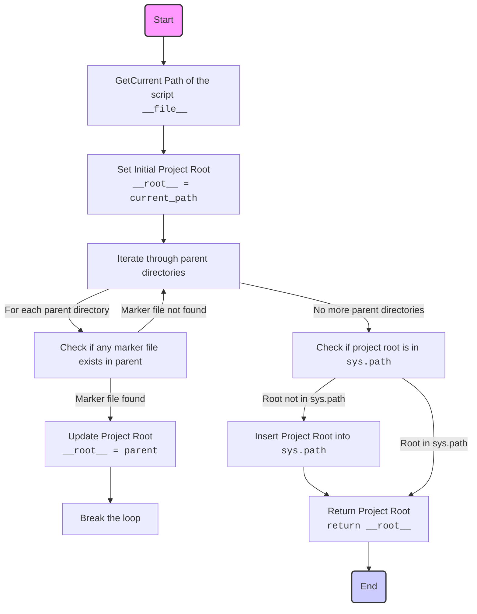

## АНАЛИЗ КОДА `hypotez/src/webdriver/playwright/header.py`

### <алгоритм>

1. **Начало**: Выполнение скрипта начинается с импорта необходимых модулей: `sys`, `json`, `Version` из `packaging.version`, и `Path` из `pathlib`.
2. **Определение `set_project_root`**:
   - Функция `set_project_root` принимает на вход кортеж `marker_files` с названиями файлов или директорий, которые служат индикаторами корневой директории проекта.
   - Инициализируется переменная `current_path` как абсолютный путь к директории, где расположен текущий файл.
   - Переменная `__root__` инициализируется значением `current_path`.
   - Цикл `for` проходит по текущему каталогу и всем его родительским каталогам.
     - Внутри цикла `if` проверяет, существует ли какой-либо из `marker_files` в текущем родительском каталоге.
     - Если маркерный файл найден, то `__root__` присваивается текущий родительский каталог, и цикл прерывается.
   - После цикла `if` проверяет, что `__root__` нет в `sys.path`. Если нет, то `__root__` добавляется в начало `sys.path`.
   - Функция возвращает переменную `__root__`.
3. **Вызов `set_project_root`**:
   - Функция `set_project_root` вызывается без аргументов, и результат сохраняется в глобальной переменной `__root__`.
4. **Конец**: Работа скрипта завершается, переменная `__root__` теперь содержит путь к корневой директории проекта.

**Примеры**:
- Пусть файл `header.py` находится в `hypotez/src/webdriver/playwright`. Если в `hypotez` есть файл `__root__`, то `__root__` будет равен `Path('hypotez')`.
- Если ни в `hypotez`, ни в его родительских директориях нет файла `__root__` или папки `.git`, то `__root__` будет равен `Path('hypotez/src/webdriver/playwright')`.
- Если в `hypotez` есть папка `.git`, то `__root__` будет равен `Path('hypotez')`.

### <mermaid>



```mermaid
flowchart TD
    Start --> Header[<code>header.py</code><br> Determine Project Root]
    
    Header --> ImportGlobalSettings[Import Global Settings: <br><code>from src import gs</code>]
    Header --> ImportFromPathLib[Import Path from <br><code>pathlib import Path</code>]
    Header --> ImportVersion[Import Version from <br><code>packaging.version import Version</code>]
    
    ImportGlobalSettings --> FunctionSetProjectRoot[<code>def set_project_root()</code>]
    ImportFromPathLib --> FunctionSetProjectRoot
    ImportVersion --> FunctionSetProjectRoot
    FunctionSetProjectRoot --> SetProjectRootVariable[<code>__root__ = set_project_root()</code>]
    
    SetProjectRootVariable --> End
    
    style Start fill:#f9f,stroke:#333,stroke-width:2px
    style End fill:#ccf,stroke:#333,stroke-width:2px
```

**Объяснение зависимостей:**

* **`sys`**: Модуль предоставляет доступ к некоторым переменным и функциям, взаимодействующим с интерпретатором Python. В данном случае используется для доступа к `sys.path` и его изменения.
* **`json`**:  Хотя Модуль импортируется, он фактически не используется в данном коде. Это может указывать на то, что он либо был импортирован по ошибке, либо планировался к использованию в будущем.
* **`packaging.version`**: Модуль `Version` используется для работы с версиями пакетов. В текущем коде импортируется, но не используется.
* **`pathlib`**: Модуль `Path` предоставляет объектно-ориентированный способ работы с путями к файлам и каталогам, упрощая манипуляции с путями.

### <объяснение>

**Импорты:**

- `sys`: Используется для доступа к `sys.path` и его модификации, что позволяет добавлять корневую директорию проекта в список путей поиска модулей.
- `json`: Импортирован, но не используется в данном коде, возможно, оставлен для будущего использования или импортирован ошибочно.
- `packaging.version`: Импортируется `Version`, но в данном коде не используется. Возможно для будущей работы с версиями пакетов.
- `pathlib`: Предоставляет класс `Path` для удобной работы с путями к файлам и директориям.

**Классы:**

- В данном коде нет классов, используется только класс `Path` из модуля `pathlib`.

**Функции:**

- `set_project_root(marker_files: tuple = ('__root__', '.git')) -> Path`:
    - **Аргументы**:
        - `marker_files` (tuple, по умолчанию `('__root__', '.git')`): Кортеж, содержащий имена файлов или каталогов, которые служат маркерами корневой директории проекта.
    - **Возвращаемое значение**:
        - `Path`: Объект `Path`, представляющий путь к корневой директории проекта.
    - **Назначение**: Функция ищет корневую директорию проекта, начиная с директории, где расположен текущий файл, и поднимаясь вверх по иерархии каталогов. Поиск прекращается, когда будет найден каталог, содержащий один из `marker_files`. Если маркерные файлы не найдены, возвращается директория, где лежит сам скрипт.
    - **Примеры**:
        - Если вызвать `set_project_root()`, то по умолчанию будут искаться файлы с именами `__root__` или `.git`.
        - Вызов `set_project_root(marker_files=('.project', 'config.ini'))` приведет к поиску файлов `.project` или `config.ini`.
        - В любом случае, путь будет возвращен в виде объекта `Path`.

**Переменные:**

- `__root__`: Глобальная переменная типа `Path`, хранит путь к корневой директории проекта. Инициализируется результатом вызова `set_project_root()`.
- `current_path`: Локальная переменная типа `Path`, представляющая путь к директории, в которой расположен текущий файл.
- `marker_files`: Локальная переменная типа `tuple`, хранит список имен файлов или каталогов, которые являются признаками корневой директории проекта.
- `parent`: Локальная переменная типа `Path` в цикле, представляющая текущий родительский каталог.
- `marker`: Локальная переменная типа `str` в цикле, представляющая маркерный файл для проверки наличия.

**Цепочка взаимосвязей:**

- Модуль (`header.py`) устанавливает корневую директорию проекта. Эта информация может использоваться другими модулями для:
    - Построения путей к файлам и директориям внутри проекта.
    - Импорта модулей и пакетов из проекта.
    - Загрузки конфигурационных файлов.

**Потенциальные ошибки и улучшения:**

- **Неиспользуемый импорт `json` и `Version`**: Следует удалить импорт `json` и `Version`, если они не используются в данном модуле.
- **Обработка исключений**: В коде не предусмотрена обработка исключений при работе с файловой системой, например, в случае ошибки доступа.
- **Переименование переменной `__root__`**: Использование двойного подчеркивания в начале имени переменной, делает ее приватной, но она используется за пределами области видимости функции. Переименовать переменную в `project_root`
- **Обобщение логики поиска корня**: Возможно добавить гибкость в логику поиска корня, например, через использование регулярных выражений для `marker_files`.

**Дополнительно:**

- Модуль `header.py` играет ключевую роль в определении структуры проекта, позволяя другим модулям динамически находить ресурсы.