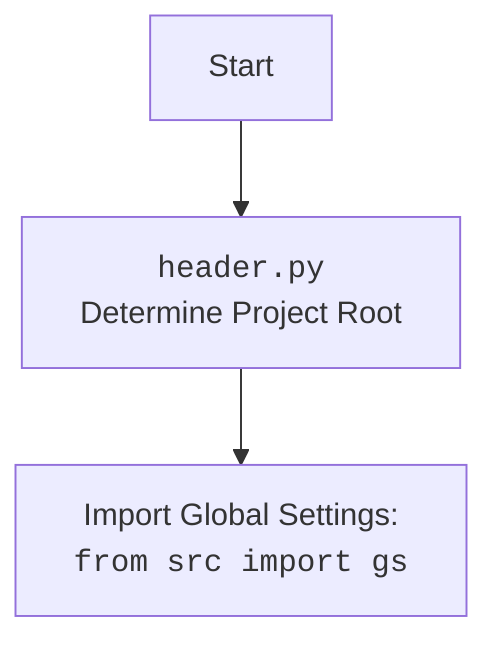

## ИНСТРУКЦИЯ:

Анализируй предоставленный код подробно и объясни его функциональность. Ответ должен включать три раздела:  

1. **<алгоритм>**: Опиши рабочий процесс в виде пошаговой блок-схемы, включая примеры для каждого логического блока, и проиллюстрируй поток данных между функциями, классами или методами.  
2. **<mermaid>**: Напиши код для диаграммы в формате `mermaid`, проанализируй и объясни все зависимости, 
    которые импортируются при создании диаграммы. 
    **ВАЖНО!** Убедитесь, что все имена переменных, используемые в диаграмме `mermaid`, 
    имеют осмысленные и описательные имена. Имена переменных вроде `A`, `B`, `C`, и т.д., не допускаются!  
    
    **Дополнительно**: Если в коде есть импорт `import header`, добавьте блок `mermaid` flowchart, объясняющий `header.py`
    ```mermaid
    flowchart TD
        Start --> Header[<code>header.py</code><br> Determine Project Root]
    
        Header --> import[Import Global Settings: <br><code>from src import gs</code>] 
    ```

3. **<объяснение>**: Предоставьте подробные объяснения:  
   - **Импорты**: Их назначение и взаимосвязь с другими пакетами `src.`.  
   - **Классы**: Их роль, атрибуты, методы и взаимодействие с другими компонентами проекта.  
   - **Функции**: Их аргументы, возвращаемые значения, назначение и примеры.  
   - **Переменные**: Их типы и использование.  
   - Выделите потенциальные ошибки или области для улучшения.  

Дополнительно, постройте цепочку взаимосвязей с другими частями проекта (если применимо).  

Это обеспечивает всесторонний и структурированный анализ кода.
## Формат ответа: `.md` (markdown)
**КОНЕЦ ИНСТРУКЦИИ**
## <алгоритм>

1.  **Инициализация `Playwrid`**:
    *   При создании экземпляра класса `Playwrid` вызывается метод `__init__`.
    *   Метод `__init__` вызывает `_load_settings` для загрузки настроек из JSON-файла.
    *   Метод `__init__` вызывает `_set_launch_options` для подготовки параметров запуска браузера Playwright.
    *   `__init__` вызывает конструктор родительского класса `PlaywrightCrawler` с подготовленными параметрами.
        *   *Пример:* `browser = Playwrid(options=["--headless"], settings_name="custom")`

2.  **Загрузка настроек `_load_settings`**:
    *   Определяется путь к файлу настроек по умолчанию (`playwrid.json`).
    *   Файл настроек по умолчанию загружается в объект `SimpleNamespace` с помощью функции `j_loads_ns`.
    *   Если указано имя файла пользовательских настроек `settings_name`, то проверяется наличие этого файла.
    *   Если файл пользовательских настроек существует, то он загружается и перезаписывает настройки по умолчанию.
        *   *Пример:*
            *   Файл `playwrid.json` содержит `{"browser_type": "chromium", "headless": false}`
            *   Файл `custom.json` содержит `{"headless": true, "options": ["--disable-gpu"]}`
            *   После загрузки настроек будет объект `SimpleNamespace` с параметрами `{"browser_type": "chromium", "headless": true, "options": ["--disable-gpu"]}`.

3.  **Установка параметров запуска `_set_launch_options`**:
    *   Создается словарь `launch_options` для передачи в Playwright.
    *   Устанавливаются значения для `headless` (из настроек или `True` по умолчанию) и `args` (из настроек или пустой список по умолчанию).
    *   Если передан `user_agent`, он добавляется в `launch_options`.
    *   Если переданы дополнительные параметры в `options`, то они добавляются в список `args`.
        *   *Пример:*
            *   `settings = SimpleNamespace(headless=True, options=["--disable-gpu"])` , `user_agent="MyUserAgent"`, `options=["--window-size=1920,1080"]`
            *   Результат `launch_options` = `{"headless": True, "args": ["--disable-gpu", "--window-size=1920,1080"], "user_agent": "MyUserAgent"}`

4.  **Запуск браузера `start`**:
    *   Метод `start` принимает URL для навигации.
    *   Выводится информационное сообщение в лог.
    *   Вызывается метод `run` родительского класса `PlaywrightCrawler` для запуска процесса краулинга.
    *   Обрабатывается возможное исключение при запуске и выводится критическое сообщение в лог.
        *   *Пример:*  `browser.start("https://www.example.com")`

5.  **Получение текущего URL `current_url`**:
    *   Метод `current_url` возвращает текущий URL открытой страницы в браузере.
    *   Проверяется, инициализирован ли контекст (`self.context`).
    *   Если контекст инициализирован, возвращается `self.context.page.url`.
    *   В противном случае возвращается `None`.
        *   *Пример:*
            *   После перехода на `https://www.example.com` через `browser.start()`, `browser.current_url` вернёт `https://www.example.com`.

## <mermaid>
```mermaid
flowchart TD
    Start[Start Playwrid Initialization] --> LoadSettings[_load_settings]
    LoadSettings --> SetLaunchOptions[_set_launch_options]
    SetLaunchOptions --> SuperInit[PlaywrightCrawler.__init__]
    SuperInit --> StartCrawler[start(url)]
    StartCrawler --> RunCrawler[PlaywrightCrawler.run()]
    RunCrawler --> GetCurrentUrl[current_url]

    
    subgraph _load_settings
        LoadSettingsStart[Start _load_settings] --> DefaultSettingsPath[Determine Default Settings Path]
         DefaultSettingsPath --> LoadDefaultSettings[Load Default Settings from JSON]
         LoadDefaultSettings --> CheckCustomSettings[Check for Custom Settings File]
         CheckCustomSettings -- "Custom Settings Exists" --> LoadCustomSettings[Load Custom Settings from JSON]
         LoadCustomSettings --> ReturnSettings[Return Settings]
         CheckCustomSettings -- "No Custom Settings" --> ReturnSettings
         ReturnSettings --> LoadSettingsEnd[End _load_settings]
     end
     
    subgraph _set_launch_options
         SetLaunchOptionsStart[Start _set_launch_options] --> CreateOptions[Create base launch_options dict]
         CreateOptions --> SetHeadless[Set headless option from settings or True]
         SetHeadless --> SetArgs[Set args from settings or empty list]
         SetArgs --> CheckUserAgent[Check if user_agent is provided]
         CheckUserAgent -- "User Agent Provided" --> AddUserAgent[Add user_agent to launch_options]
         AddUserAgent --> CheckCustomOptions[Check if custom options are provided]
         CheckUserAgent -- "No User Agent" --> CheckCustomOptions
         CheckCustomOptions -- "Custom Options Provided" --> AddCustomOptions[Extend args list with custom options]
         AddCustomOptions --> ReturnLaunchOptions[Return launch_options]
         CheckCustomOptions -- "No Custom Options" --> ReturnLaunchOptions
         ReturnLaunchOptions --> SetLaunchOptionsEnd[End _set_launch_options]
     end

     
    GetCurrentUrl --> CheckContext[Check if context exists]
    CheckContext -- "Context Exists" --> ReturnCurrentUrl[Return current page url]
    CheckContext -- "No Context" --> ReturnNone[Return None]
    
    
     subgraph Playwrid class
        SuperInit
        LoadSettings
        SetLaunchOptions
        StartCrawler
        GetCurrentUrl
    end
    

    classDef classStyle fill:#f9f,stroke:#333,stroke-width:2px
    class Playwrid classStyle
```


### **<объяснение>**

#### **Импорты:**
*   **`pathlib.Path`**: Используется для работы с путями к файлам и каталогам в операционной системе. В данном коде используется для определения путей к файлам настроек (`playwrid.json` и пользовательских настроек).
*   **`typing.Optional, typing.Dict, typing.Any, typing.List`**: Используются для аннотации типов, что улучшает читаемость и отладку кода.
    *   `Optional` указывает, что переменная может быть либо указанного типа, либо `None`.
    *   `Dict` указывает на словарь, `Any` - на любой тип данных, `List` - на список.
*  **`types.SimpleNamespace`**:  Предоставляет простой способ создания объекта, у которого можно устанавливать атрибуты как свойства. В коде используется для хранения настроек.
*   **`crawlee.playwright_crawler.PlaywrightCrawler, crawlee.playwright_crawler.PlaywrightCrawlingContext`**: Импортирует класс `PlaywrightCrawler` и `PlaywrightCrawlingContext` из библиотеки `crawlee`. `PlaywrightCrawler` является базовым классом для данного модуля, обеспечивающим функциональность веб-краулинга с использованием Playwright. `PlaywrightCrawlingContext` отвечает за контекст краулинга, содержащий информацию о текущей странице.
*   **`src.gs`**: Импортирует модуль глобальных настроек проекта, используемый для получения пути к директории `src`. Это обеспечивает доступ к переменным, используемым во всём проекте.
*   **`src.utils.jjson.j_loads_ns`**: Импортирует функцию `j_loads_ns` из модуля `src.utils.jjson`. Данная функция используется для загрузки данных из JSON-файла и преобразования их в объект `SimpleNamespace`.
*   **`src.logger.logger.logger`**: Импортирует логгер из модуля `src.logger.logger`, используется для записи информации о работе программы в логи.

#### **Класс `Playwrid`:**

*   **Роль**: Класс `Playwrid` является расширением `PlaywrightCrawler` и предназначен для упрощения настройки и запуска веб-краулера с помощью Playwright. Он инкапсулирует логику загрузки настроек, установки опций запуска и предоставляет методы для запуска краулера и получения текущего URL.
*   **Атрибуты**:
    *   `driver_name` (str): Имя драйвера, по умолчанию `'playwrid'`.
    *   `context`: Объект контекста `PlaywrightCrawlingContext`, который будет инициализирован во время выполнения `PlaywrightCrawler`.
*   **Методы:**
    *   `__init__(self, settings_name: Optional[str] = None, user_agent: Optional[str] = None, options: Optional[List[str]] = None, *args, **kwargs) -> None`:
        *   Конструктор класса. Принимает опциональные параметры: `settings_name` (имя файла настроек), `user_agent` (строка user-agent), `options` (список опций Playwright) и дополнительные параметры `args` и `kwargs` для передачи в родительский класс `PlaywrightCrawler`.
        *   Загружает настройки с помощью метода `_load_settings`.
        *   Устанавливает параметры запуска браузера Playwright с помощью метода `_set_launch_options`.
        *   Инициализирует родительский класс `PlaywrightCrawler` с полученными настройками и опциями.
    *   `_load_settings(self, settings_name: Optional[str] = None) -> SimpleNamespace`:
        *   Загружает настройки из JSON-файла.
        *   Сначала пытается загрузить настройки по умолчанию из `playwrid.json`.
        *   Если передано имя файла пользовательских настроек, то пытается загрузить настройки из этого файла, перезаписывая настройки по умолчанию, если файл существует.
        *   Возвращает объект `SimpleNamespace`, содержащий загруженные настройки.
    *   `_set_launch_options(self, settings: SimpleNamespace, user_agent: Optional[str] = None, options: Optional[List[str]] = None) -> Dict[str, Any]`:
        *   Формирует словарь с параметрами запуска Playwright.
        *   Устанавливает `headless` из настроек, если он есть, иначе `True` по умолчанию.
        *   Устанавливает `args` из настроек, если они есть, иначе пустой список по умолчанию.
        *   Добавляет user-agent, если он передан.
        *   Добавляет дополнительные опции, если они переданы.
        *   Возвращает словарь `launch_options` с параметрами запуска.
    *   `start(self, url: str) -> None`:
        *   Принимает URL для навигации.
        *   Запускает процесс краулинга, вызывая метод `run` родительского класса `PlaywrightCrawler`.
        *   Перехватывает исключения и регистрирует критическую ошибку в лог.
    *   `current_url(self) -> Optional[str]`:
        *   Возвращает текущий URL страницы.
        *   Возвращает `None`, если контекст еще не инициализирован.

#### **Функции:**
*   `__init__`: (см. описание в разделе "Классы").
*   `_load_settings`: (см. описание в разделе "Классы").
*   `_set_launch_options`: (см. описание в разделе "Классы").
*    `start`: (см. описание в разделе "Классы").
*   `current_url`: (см. описание в разделе "Классы").

#### **Переменные:**
*   `settings_path`: (`pathlib.Path`):  Путь к файлу настроек `playwrid.json`.
*   `settings`: (`SimpleNamespace`): Объект, хранящий загруженные настройки.
*   `custom_settings_path`: (`pathlib.Path`): Путь к файлу пользовательских настроек.
*   `launch_options`: (`Dict[str, Any]`): Словарь с параметрами запуска Playwright.
*   `url`: (`str`): URL, на который необходимо перейти при запуске краулера.

#### **Взаимосвязи с другими частями проекта:**

*   Модуль `playwrid.py` зависит от модуля `crawlee` для основной функциональности краулера.
*   Использует модуль `src.gs` для получения пути к файлам проекта.
*   Использует модуль `src.utils.jjson` для загрузки настроек из JSON-файлов.
*   Использует модуль `src.logger` для ведения логов.
*   Может использоваться в других частях проекта для создания и запуска веб-краулеров.

#### **Потенциальные ошибки и области для улучшения:**
*   **Отсутствие обработки ошибок при загрузке настроек**: В `_load_settings` не обрабатывается случай, когда файл настроек не может быть загружен или имеет неправильный формат.
*   **Жестко заданные пути**: Путь к файлу настроек `playwrid.json` жестко задан и не является достаточно гибким. Желательно использовать более гибкую конфигурацию путей.
*   **Отсутствие явной обработки ошибок `PlaywrightCrawler`**: Метод `start` перехватывает любые исключения, но не предоставляет более подробной информации о них.
*   **Не используется `PlaywrightCrawlingContext`**: Класс `Playwrid` не использует объект `PlaywrightCrawlingContext`.
*   **Не используется асинхронность** Код не использует асинхронную функциональность Playwright.

#### **Пример использования:**
```python
    if __name__ == "__main__":
        # Создание экземпляра Playwrid с пользовательскими опциями и именем файла настроек
        browser = Playwrid(options=["--headless", "--disable-gpu"], settings_name="custom_settings", user_agent="CustomUserAgent")
        # Запуск краулера на указанном URL
        browser.start("https://www.example.com")
        # Вывод текущего URL
        print(f"Current URL: {browser.current_url}")
```
В этом примере создается экземпляр класса `Playwrid` с пользовательскими опциями, именем файла настроек и пользовательским user-agent. Затем запускается краулер на указанном URL, а также выводится текущий URL открытой страницы.