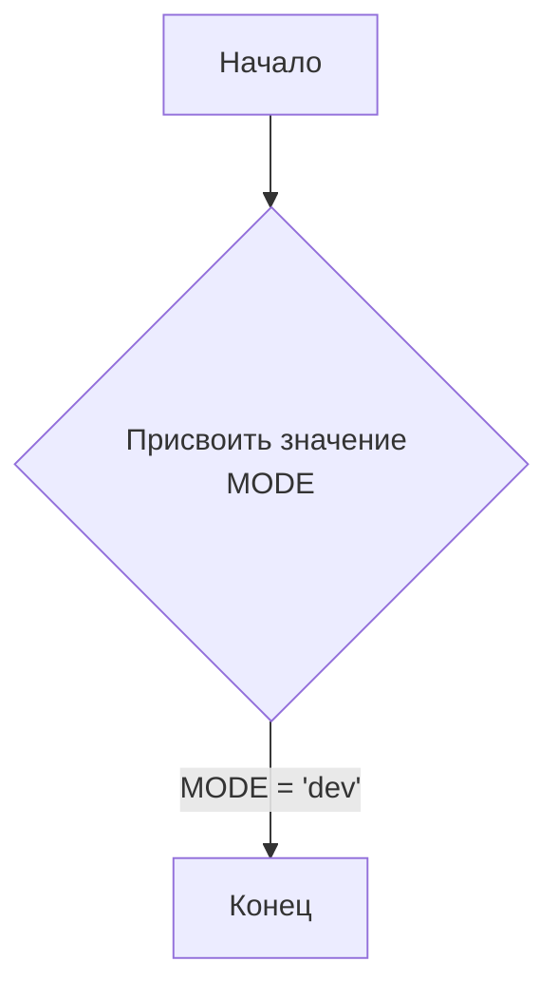
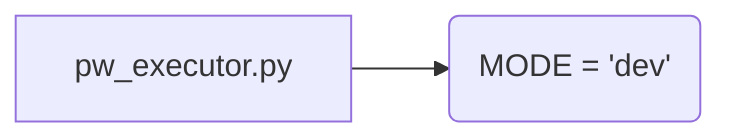

```MD
# <input code>

```python
## \file hypotez/src/webdriver/playwright/pw_executor.py
# -*- coding: utf-8 -*-\
#! venv/Scripts/python.exe
#! venv/bin/python/python3.12

"""
.. module: src.webdriver.playwright 
	:platform: Windows, Unix
	:synopsis:

"""
MODE = 'dev'
```

# <algorithm>

Этот код представляет собой фрагмент Python-скрипта, скорее всего, являющийся началом модуля.  Он устанавливает переменную `MODE`, которая, судя по имени, определяет режим работы (например, `dev`, `prod` и т.п.).  Алгоритм состоит из единого шага — присвоения значения строковой переменной.  Блок-схема очень простая:



Пример:
Если скрипт запущен, переменная `MODE` будет иметь значение `'dev'`.


# <mermaid>



**Объяснение диаграммы:**

Диаграмма показывает, что файл `pw_executor.py` содержит только одну переменную `MODE` с присвоенным значением.  Зависимостей от других файлов/модулей нет.


# <explanation>

* **Импорты:** В данном фрагменте кода отсутствуют импорты. Это значит, что он не использует другие модули или классы из внешних библиотек.  Всё, что ему нужно, — это внутренние возможности Python.

* **Классы:** Нет классов.  Код определяет только одну переменную.

* **Функции:** Нет функций.

* **Переменные:**
    * `MODE`: Строковая переменная, хранящая значение режима работы. В данном случае, `'dev'`.  Её тип — строка.

* **Возможные ошибки или области для улучшений:**

    * **Недостаток информации:**  Фрагмент кода не содержит достаточной информации для полного анализа.  Неизвестно, для чего предназначена эта переменная `MODE`.  Для полноценного понимания нужно посмотреть, как она используется в других частях проекта.

* **Цепочка взаимосвязей:**

    *  Без импортов и классов, нет прямых взаимосвязей с другими частями проекта.  Чтобы определить взаимосвязи, нужно проанализировать файлы, которые импортируются или вызываются из этого файла.  Например, есть ли в последующих файлах `pw_executor.py` вызовы функций или использование данных, определенных здесь.


**Дополнительные заметки:**

Комментарии в коде (`"""..."""`) — это документация для модуля, но в данном случае она не содержит полезных сведений для анализа. Строки `#! venv/Scripts/python.exe` и `#! venv/bin/python/python3.12` являются директивами интерпретатора, которые не определяют функциональность самого кода. Они указывают, какой интерпретатор Python использовать при выполнении файла.  В целом, код очень простой и не содержит сложной логики.  Чтобы лучше понять его роль в проекте, необходимо проанализировать остальной код и контекст, в котором он используется.