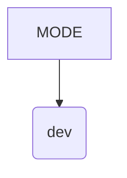
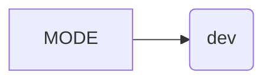

# <input code>

```python
## \file hypotez/src/webdriver/playwright/pw_executor.py
# -*- coding: utf-8 -*-
#! venv/Scripts/python.exe
#! venv/bin/python/python3.12

"""
.. module: src.webdriver.playwright 
	:platform: Windows, Unix
	:synopsis:

"""
MODE = 'dev'
```

# <algorithm>

Этот код представляет собой лишь определение константы `MODE`.  Алгоритм здесь тривиален -  простое присваивание значения строке.  Нет циклов, условных операторов, вызовов функций.  Данные не перемещаются, т.к. нет взаимодействующих сущностей.



# <mermaid>



# <explanation>

Этот файл, `pw_executor.py`, определяет константу `MODE` со значением 'dev'.

* **Импорты:**  В данном фрагменте кода отсутствуют импорты.  Это значит, что код не использует какие-либо функции или классы из других модулей.  Если бы в коде были импорты, необходимо было бы проанализировать, откуда эти модули берутся (`src.` намекает на структуру проекта, где `src` - корневая директория проекта), какие классы/функции из этих модулей используются и как эти классы/функции связаны друг с другом.  В данном случае анализ связей с другими частями проекта невозможен, так как нет импортов и вызовов функций.

* **Классы:** Нет классов.

* **Функции:** Нет функций.

* **Переменные:** Единственная переменная - `MODE`.  Тип переменной - строка.  Это константа, означающая режим работы (в данном случае 'dev').  Значение 'dev' возможно представляет собой конфигурационный параметр, указывающий, что код работает в режиме разработки.

* **Возможные ошибки или области для улучшений:** Нет ошибок.  Простое определение константы - очень простой код.  Возможно, в последующих частях этого файла или в других частях проекта будут использоваться значения этой константы для принятия решений, например, для включения или выключения функциональности.


**Цепочка взаимосвязей с другими частями проекта:**

В текущем виде код не имеет взаимосвязей с другими частями проекта, т.к. не использует никакие функции или классы из других модулей, но данная константа вероятно используется где-то еще в проекте `hypotez`.  Для определения этих связей нужен контекст всего проекта.