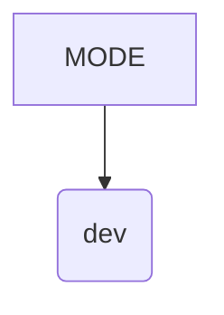

# <input code>

```python
## \file hypotez/src/webdriver/playwright/pw_executor.py
# -*- coding: utf-8 -*-\
#! venv/Scripts/python.exe
#! venv/bin/python/python3.12

"""
.. module: src.webdriver.playwright 
	:platform: Windows, Unix
	:synopsis:

"""
MODE = 'dev'
```

# <algorithm>

Этот код представляет собой фрагмент файла Python, скорее всего, часть модуля, отвечающего за взаимодействие с веб-драйвером Playwright.  Он содержит только одну строковую переменную `MODE` со значением 'dev'.  Из-за отсутствия функций, циклов и условий, алгоритмической блок-схемы нет. Данные не передаются между функциями, классами или методами.

# <mermaid>



# <explanation>

Этот фрагмент кода определяет переменную `MODE` со значением 'dev'.  

- **`MODE = 'dev'`**:  Это глобальная переменная, которая, вероятно, используется для определения режима работы скрипта (например, 'dev' для разработки, 'prod' для производства).  Конкретное использование этой переменной будет зависеть от других частей проекта.


**Импорты**: В данном фрагменте кода нет импортов. Это обычная ситуация для файлов, которые определяют переменные конфигурации или устанавливают глобальные параметры, но не выполняют непосредственной функциональности.

**Классы**:  Нет классов.

**Функции**: Нет функций.

**Переменные**: Переменная `MODE` имеет строковый тип и используется для хранения конфигурационного значения.

**Возможные ошибки или области для улучшений**:  Отсутствие дальнейшего кода не позволяет оценить все возможные ошибки или улучшения.  В реальном проекте, эта переменная `MODE` должна использоваться в других функциях или классах для выбора определенного поведения (например, вывода логов или использования различных настроек).


**Цепочка взаимосвязей**:  Переменная `MODE` будет использована в других частях проекта для реализации условного выполнения. Например, она может влиять на то, какие тесты будут запущены или какие конфигурационные файлы будут загружены.  Без дальнейшего кода конкретные взаимосвязи установить сложно.  Эта переменная, скорее всего, служит для настройки (или настройки переменной среды) запуска или выполнения скрипта.

**Заключение**:  Код представляет собой небольшой фрагмент, который задает конфигурацию режима работы, и без контекста дальнейшего кода сложно оценить его полную функциональность и взаимодействие с другими частями проекта.