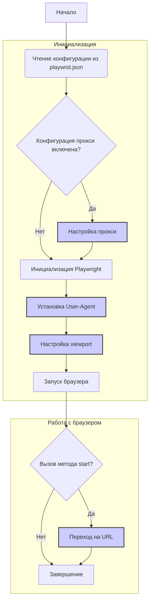

## Анализ кода модуля Playwright Crawler

### <алгоритм>
1. **Чтение конфигурации из `playwrid.json`**:
   - Модуль начинает работу с чтения конфигурации из файла `playwrid.json`.
   - **Пример**: Файл `playwrid.json` содержит настройки для `browser_type`, `headless`, `options`, `user_agent`, `proxy`, `viewport`, `timeout` и `ignore_https_errors`.
2. **Инициализация Playwright**:
   - На основе прочитанных настроек, модуль инициализирует экземпляр `Playwright` с использованием указанного `browser_type` (например, Chromium).
   - **Пример**: Выбирается тип браузера `chromium`, при этом используется режим `headless: true`.
3. **Настройка опций браузера**:
   - Применяются опции командной строки из `options`, если они есть (например, `--disable-dev-shm-usage`).
   - **Пример**: Добавление опции `--no-sandbox` отключает режим песочницы браузера.
4. **Установка прокси (если включен)**:
    - Если в конфигурации `proxy.enabled` установлено в `true`, модуль настраивает прокси-сервер, используя `server`, `username` и `password`.
    - **Пример**: Включение прокси с адресом `http://proxy.example.com:8080`, логином `user` и паролем `password`.
5. **Установка User-Agent**:
    - Устанавливается пользовательский `user_agent`, если он указан в конфигурации.
    - **Пример**: Установка `user_agent` в `Mozilla/5.0 ... Chrome/96.0.4664.110 Safari/537.36`.
6. **Настройка viewport**:
    - Устанавливается размер окна браузера, если указан в `viewport` (ширина и высота).
    - **Пример**: Установка ширины окна в `1280` пикселей и высоты в `720` пикселей.
7. **Запуск браузера**:
   - Запускается браузер с указанными настройками.
   - **Пример**: Браузер Chromium запускается в режиме `headless`.
8. **Переход на страницу (метод `start`)**:
    - Метод `start` получает URL и открывает страницу в браузере.
    - **Пример**: Браузер переходит на страницу `https://www.example.com`.
9. **Логирование**:
   - В процессе инициализации и работы модуля все ошибки и важные события логируются с помощью `src.logger`.
   - **Пример**: Ошибка инициализации записывается в лог: "Ошибка при инициализации Playwright Crawler: <детали ошибки>".
10. **Обработка ошибок**:
    - Модуль обрабатывает ошибки инициализации, конфигурации и работы браузера.
    - **Пример**: Ошибка в файле `playwrid.json` выводится в лог: "Ошибка в файле playwrid.json: <детали проблемы>".

### <mermaid>

### <объяснение>

#### Импорты
- Модуль не содержит явных импортов, однако подразумевается использование библиотек `playwright` и `crawlee` (согласно документации), а так же  `src.logger` для логирования.
- **`playwright`**: Основная библиотека для управления браузером. Она используется для создания и настройки экземпляра браузера, открытия страниц, управления сессиями и т.д. 
- **`crawlee`**:  Предполагается использование как базового класса `PlaywrightCrawler`, что позволяет интегрировать `Playwright` в систему парсинга.
- **`src.logger`**: Используется для логирования ошибок, предупреждений и информационных сообщений в процессе работы модуля. Это позволяет удобно отслеживать состояние модуля и упрощает отладку.

#### Классы
- **`Playwrid`**:
    - **Роль**: Это кастомный класс, представляющий собой обёртку над `Playwright`. Он ответственен за настройку и управление браузером.
    - **Атрибуты**:
        - Конфигурация браузера, полученная из `playwrid.json`.
        - Экземпляр Playwright.
        - Логгер для записи событий.
    - **Методы**:
        - `__init__(self, options=None)`: Конструктор класса. Загружает конфигурацию из файла, инициализирует логгер, применяет пользовательские опции.
        - `start(self, url)`: Метод для запуска браузера и перехода на заданный URL.
    - **Взаимодействие**:
        - Взаимодействует с библиотекой `Playwright` для управления браузером.
        - Использует `src.logger` для логирования.
        - Использует файл `playwrid.json` для конфигурации.

#### Функции
-   Метод `start(self, url)`:
    -   **Аргументы**: `url` (строка) - URL для перехода.
    -   **Возвращаемое значение**: Отсутствует (метод возвращает None)
    -   **Назначение**:  Запускает браузер и переходит на указанный URL.
    -   **Пример**: Вызов `browser.start("https://www.example.com")` откроет браузер и перейдет на сайт example.com.

#### Переменные
- **Переменные конфигурации (из `playwrid.json`)**:
  - `browser_type` (строка): Тип браузера (например, `chromium`, `firefox`, `webkit`).
  - `headless` (булево): Запуск в безголовом режиме (`true` или `false`).
  - `options` (список строк): Дополнительные опции командной строки для браузера.
  - `user_agent` (строка): Пользовательский User-Agent.
  - `proxy` (словарь): Настройки прокси-сервера.
      - `enabled` (булево): Включен ли прокси.
      - `server` (строка): Адрес прокси-сервера.
      - `username` (строка): Имя пользователя для прокси.
      - `password` (строка): Пароль для прокси.
  - `viewport` (словарь): Размеры окна браузера.
      - `width` (целое): Ширина окна.
      - `height` (целое): Высота окна.
  - `timeout` (целое): Максимальное время ожидания в миллисекундах.
  - `ignore_https_errors` (булево): Игнорировать ошибки HTTPS.

#### Потенциальные ошибки и области для улучшения
1. **Обработка ошибок чтения файла конфигурации**:
    -  Если файл `playwrid.json` не найден или имеет неверный формат, необходимо корректно обработать эту ситуацию и вывести информативное сообщение в лог.
2. **Валидация конфигурации**:
    - Стоит добавить валидацию значений, полученных из файла `playwrid.json` (например, проверить, что `browser_type` является допустимым значением, что размеры `viewport` являются числами, и т.д.).
3. **Управление экземпляром браузера**:
    - Необходимо добавить методы для закрытия браузера, очистки куков и прочего, если это потребуется в будущем.
4. **Управление прокси**:
   - Возможность динамического изменения прокси в процессе работы.

#### Цепочка взаимосвязей с другими частями проекта
- Модуль `src.webdriver.playwright` зависит от `src.logger` для логирования.
- Также он является частью `src.webdriver`, которая, вероятно, является частью более крупного проекта для автоматизации веб-скрапинга или тестирования.

Этот подробный анализ обеспечивает полное понимание модуля `Playwright Crawler`, его функциональности, зависимостей и потенциальных областей для улучшения.